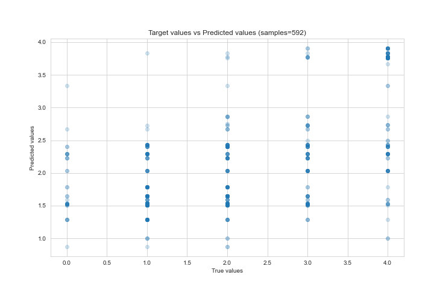
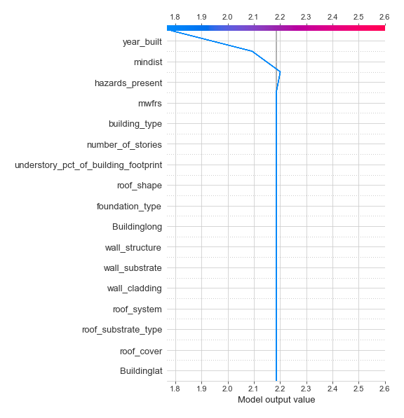

# Summary of 2_DecisionTree

[<< Go back](../README.md)

## Decision Tree
- **n_jobs**: -1
- **criterion**: mse
- **max_depth**: 3
- **explain_level**: 2

## Validation
 - **validation_type**: kfold
 - **k_folds**: 5
 - **shuffle**: True

## Optimized metric
rmse

## Training time

21.4 seconds

### Metric details:
| Metric   |     Score |
|:---------|----------:|
| MAE      | 0.790036  |
| MSE      | 0.993011  |
| RMSE     | 0.996499  |
| R2       | 0.336331  |
| MAPE     | 4.886e+14 |

## Learning curves

## Decision Tree 

### Tree #1

### Rules

if (mindist > 10.507) and (year_built > 1995.5) and (roof_substrate_type > 1.5) then response: 1.507 | based on 211 samples

if (mindist > 10.507) and (year_built <= 1995.5) and (Buildinglong <= -85.373) then response: 2.434 | based on 122 samples

if (mindist <= 10.507) and (year_built <= 1996.5) and (wall_structure > 6.0) then response: 3.836 | based on 73 samples

if (mindist > 10.507) and (year_built <= 1995.5) and (Buildinglong > -85.373) then response: 1.595 | based on 42 samples

if (mindist <= 10.507) and (year_built > 1996.5) and (hazards_present > 1.0) then response: 2.867 | based on 15 samples

if (mindist > 10.507) and (year_built > 1995.5) and (roof_substrate_type <= 1.5) then response: 2.857 | based on 7 samples

if (mindist <= 10.507) and (year_built <= 1996.5) and (wall_structure <= 6.0) then response: 2.5 | based on 2 samples

if (mindist <= 10.507) and (year_built > 1996.5) and (hazards_present <= 1.0) then response: 0.0 | based on 1 samples

### Tree #2

### Rules

if (mindist > 10.486) and (year_built > 1995.5) and (roof_substrate_type > 2.5) then response: 1.524 | based on 212 samples

if (mindist > 10.486) and (year_built <= 1995.5) and (Buildinglong <= -85.048) then response: 2.297 | based on 155 samples

if (mindist <= 10.486) and (year_built <= 1996.5) and (hazards_present <= 19.5) then response: 3.783 | based on 69 samples

if (mindist <= 10.486) and (year_built > 1996.5) and (hazards_present > 1.0) then response: 2.737 | based on 19 samples

if (mindist > 10.486) and (year_built > 1995.5) and (roof_substrate_type <= 2.5) then response: 2.75 | based on 8 samples

if (mindist > 10.486) and (year_built <= 1995.5) and (Buildinglong > -85.048) then response: 0.875 | based on 8 samples

if (mindist <= 10.486) and (year_built > 1996.5) and (hazards_present <= 1.0) then response: 0.0 | based on 1 samples

if (mindist <= 10.486) and (year_built <= 1996.5) and (hazards_present > 19.5) then response: 1.0 | based on 1 samples

### Tree #3

### Rules

if (mindist > 10.564) and (year_built > 1995.5) and (Buildinglong <= -85.377) then response: 1.645 | based on 172 samples

if (mindist > 10.564) and (year_built <= 1995.5) and (foundation_type <= 8.5) then response: 2.031 | based on 160 samples

if (mindist <= 10.564) and (hazards_present <= 12.5) and (hazards_present > 3.5) then response: 3.903 | based on 62 samples

if (mindist > 10.564) and (year_built > 1995.5) and (Buildinglong > -85.377) then response: 1.0 | based on 38 samples

if (mindist <= 10.564) and (hazards_present > 12.5) and (roof_cover <= 2.5) then response: 2.722 | based on 18 samples

if (mindist > 10.564) and (year_built <= 1995.5) and (foundation_type > 8.5) then response: 3.333 | based on 12 samples

if (mindist <= 10.564) and (hazards_present > 12.5) and (roof_cover > 2.5) then response: 3.667 | based on 9 samples

if (mindist <= 10.564) and (hazards_present <= 12.5) and (hazards_present <= 3.5) then response: 2.667 | based on 3 samples

### Tree #4

### Rules

if (mindist > 10.507) and (year_built > 1995.5) and (roof_substrate_type > 3.0) then response: 1.536 | based on 209 samples

if (mindist > 10.507) and (year_built <= 1995.5) and (Buildinglong <= -85.373) then response: 2.4 | based on 120 samples

if (mindist <= 10.507) and (year_built <= 1996.5) and (hazards_present <= 21.0) then response: 3.764 | based on 72 samples

if (mindist > 10.507) and (year_built <= 1995.5) and (Buildinglong > -85.373) then response: 1.523 | based on 44 samples

if (mindist <= 10.507) and (year_built > 1996.5) and (hazards_present > 1.0) then response: 2.737 | based on 19 samples

if (mindist > 10.507) and (year_built > 1995.5) and (roof_substrate_type <= 3.0) then response: 2.75 | based on 8 samples

if (mindist <= 10.507) and (year_built > 1996.5) and (hazards_present <= 1.0) then response: 0.0 | based on 1 samples

if (mindist <= 10.507) and (year_built <= 1996.5) and (hazards_present > 21.0) then response: 1.0 | based on 1 samples

### Tree #5

### Rules

if (mindist > 11.174) and (year_built <= 1995.5) and (hazards_present > 0.5) then response: 2.229 | based on 179 samples

if (mindist > 11.174) and (year_built > 1995.5) and (mindist > 18.747) then response: 1.785 | based on 121 samples

if (mindist > 11.174) and (year_built > 1995.5) and (mindist <= 18.747) then response: 1.282 | based on 78 samples

if (mindist <= 11.174) and (year_built <= 1996.5) and (hazards_present <= 20.5) then response: 3.771 | based on 70 samples

if (mindist <= 11.174) and (year_built > 1996.5) and (hazards_present > 1.5) then response: 2.667 | based on 21 samples

if (mindist > 11.174) and (year_built <= 1995.5) and (hazards_present <= 0.5) then response: 0.0 | based on 3 samples

if (mindist <= 11.174) and (year_built > 1996.5) and (hazards_present <= 1.5) then response: 0.0 | based on 1 samples

if (mindist <= 11.174) and (year_built <= 1996.5) and (hazards_present > 20.5) then response: 1.0 | based on 1 samples

## Permutation-based Importance

## True vs Predicted

## Predicted vs Residuals

## SHAP Importance

## SHAP Dependence plots

### Dependence (Fold 1)

### Dependence (Fold 2)

### Dependence (Fold 3)

### Dependence (Fold 4)

### Dependence (Fold 5)

## SHAP Decision plots

### Top-10 Worst decisions (Fold 1)

### Top-10 Worst decisions (Fold 2)

### Top-10 Worst decisions (Fold 3)

### Top-10 Worst decisions (Fold 4)

### Top-10 Worst decisions (Fold 5)

### Top-10 Best decisions (Fold 1)

### Top-10 Best decisions (Fold 2)

### Top-10 Best decisions (Fold 3)

### Top-10 Best decisions (Fold 4)

### Top-10 Best decisions (Fold 5)

[<< Go back](../README.md)
