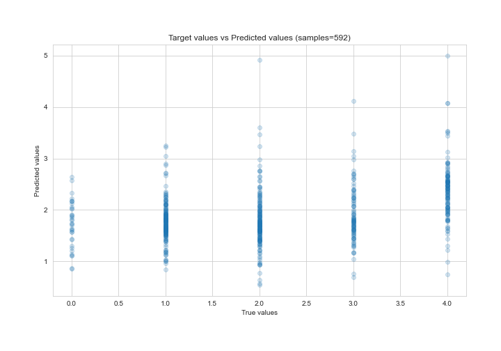
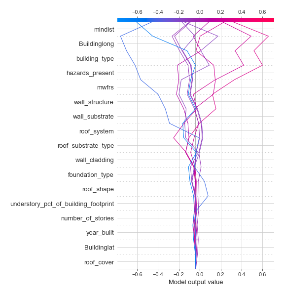
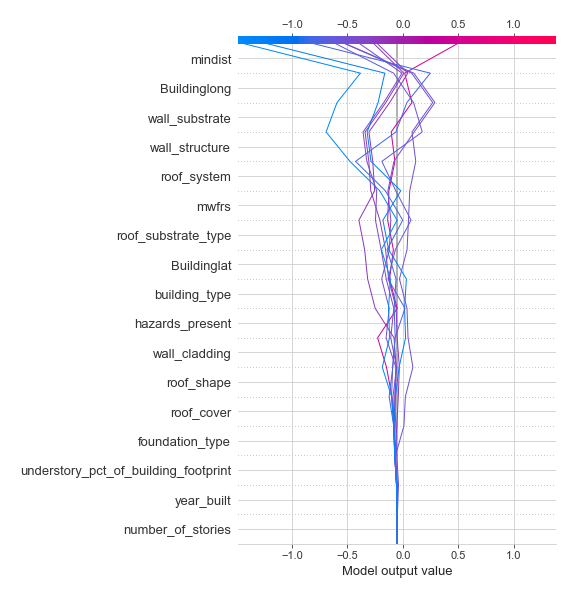

# Summary of 3_Linear

[<< Go back](../README.md)

## Linear Regression (Linear)
- **n_jobs**: -1
- **explain_level**: 2

## Validation
 - **validation_type**: kfold
 - **k_folds**: 5
 - **shuffle**: True

## Optimized metric
rmse

## Training time

6.3 seconds

### Metric details:
| Metric   |       Score |
|:---------|------------:|
| MAE      | 0.980625    |
| MSE      | 1.36649     |
| RMSE     | 1.16897     |
| R2       | 0.0867237   |
| MAPE     | 4.60754e+14 |

## Learning curves

## Coefficients
| feature                              |    Learner_1 |    Learner_2 |   Learner_3 |   Learner_4 |    Learner_5 |
|:-------------------------------------|-------------:|-------------:|------------:|------------:|-------------:|
| wall_substrate                       |  0.0659079   |  0.067689    |  0.0950125  |  0.0647416  |  0.0365725   |
| roof_system                          |  0.110948    |  0.0718334   |  0.0923092  |  0.00383504 | -0.00207194  |
| foundation_type                      |  0.0415712   |  0.0686955   |  0.051254   |  0.0645133  |  0.0464359   |
| understory_pct_of_building_footprint |  0.0633612   |  0.035856    |  0.0516881  |  0.0510928  |  0.0419609   |
| mwfrs                                | -0.0301584   |  0.0765217   |  0.0492614  | -0.0183718  |  0.0404444   |
| roof_cover                           | -0.00562136  |  0.00808653  |  0.0342812  |  0.0321031  | -0.0210315   |
| intercept                            |  1.87768e-15 |  6.80829e-15 |  1.3339e-14 | -1.1905e-15 |  3.19355e-15 |
| number_of_stories                    |  0.00299122  | -0.0271473   |  0.005622   |  0.00642416 | -0.0218009   |
| year_built                           | -0.0306208   | -0.0395025   | -0.0393041  | -0.00846888 |  0.00565452  |
| roof_shape                           | -0.0531545   | -0.0232201   | -0.038474   | -0.0271939  | -0.00777387  |
| Buildinglat                          | -0.00160804  | -0.00820236  | -0.0413246  | -0.0446825  | -0.0654819   |
| wall_cladding                        | -0.0264118   | -0.0462923   | -0.0426706  | -0.0402869  | -0.048783    |
| hazards_present                      | -0.0529915   | -0.0887587   | -0.0582048  | -0.0853173  | -0.0736062   |
| roof_substrate_type                  | -0.108691    | -0.102424    | -0.0413705  | -0.117809   | -0.0501693   |
| wall_structure                       | -0.162216    | -0.129192    | -0.118283   | -0.0901809  | -0.110953    |
| Buildinglong                         | -0.13471     | -0.117534    | -0.161472   | -0.148197   | -0.107194    |
| building_type                        | -0.127128    | -0.17678     | -0.176739   | -0.167192   | -0.215122    |
| mindist                              | -0.400358    | -0.349715    | -0.380103   | -0.389575   | -0.314576    |

## Permutation-based Importance

## True vs Predicted

## Predicted vs Residuals

## SHAP Importance

## SHAP Dependence plots

### Dependence (Fold 1)

### Dependence (Fold 2)

### Dependence (Fold 3)

### Dependence (Fold 4)

### Dependence (Fold 5)

## SHAP Decision plots

### Top-10 Worst decisions (Fold 1)

### Top-10 Worst decisions (Fold 2)

### Top-10 Worst decisions (Fold 3)

### Top-10 Worst decisions (Fold 4)

### Top-10 Worst decisions (Fold 5)

### Top-10 Best decisions (Fold 1)

### Top-10 Best decisions (Fold 2)

### Top-10 Best decisions (Fold 3)

### Top-10 Best decisions (Fold 4)

### Top-10 Best decisions (Fold 5)

[<< Go back](../README.md)
