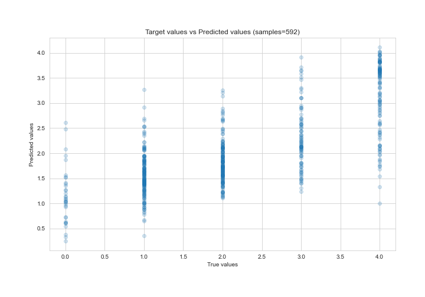

# Summary of Ensemble

[<< Go back](../README.md)

## Ensemble structure
| Model                                                             |   Weight |
|:------------------------------------------------------------------|---------:|
| 13_DecisionTree                                                   |        1 |
| 19_Xgboost_GoldenFeatures_SelectedFeatures                        |        5 |
| 4_Default_Xgboost                                                 |        1 |
| 4_Default_Xgboost_categorical_mix_GoldenFeatures_SelectedFeatures |        2 |
| 5_Default_NeuralNetwork_SelectedFeatures                          |        2 |
| 7_Xgboost_GoldenFeatures_SelectedFeatures                         |        7 |

### Metric details:
| Metric   |       Score |
|:---------|------------:|
| MAE      | 0.661915    |
| MSE      | 0.714549    |
| RMSE     | 0.84531     |
| R2       | 0.522439    |
| MAPE     | 3.07404e+14 |

## Learning curves

## True vs Predicted

## Predicted vs Residuals

[<< Go back](../README.md)
