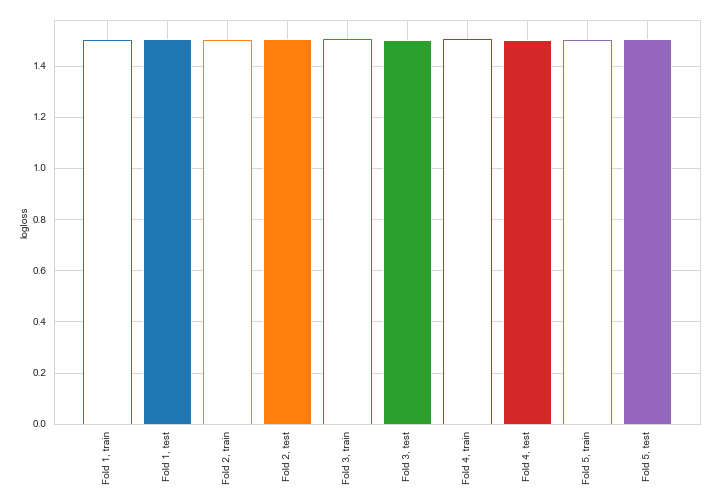
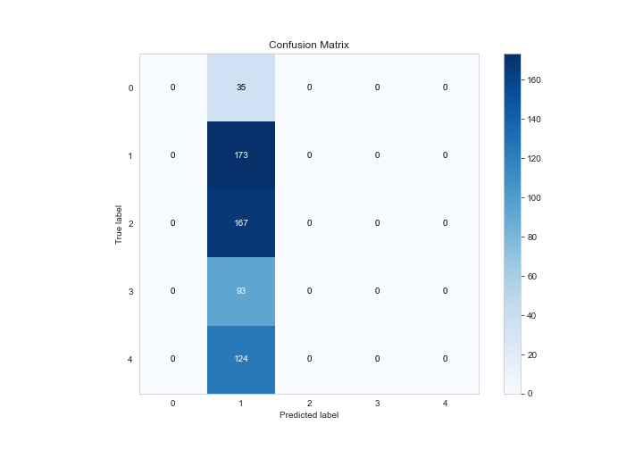
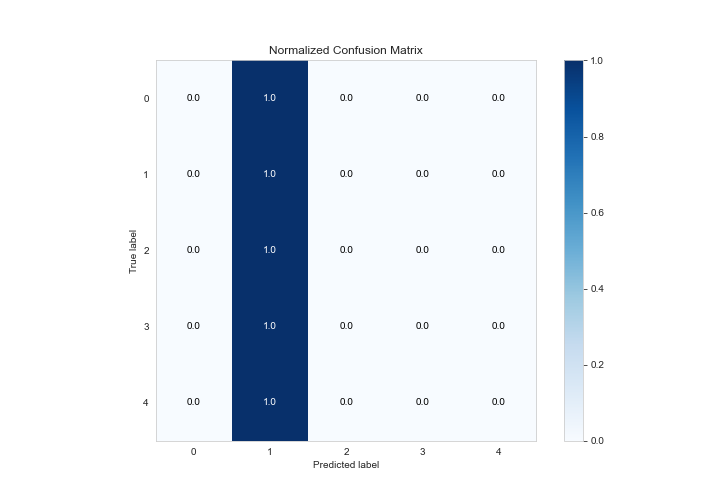
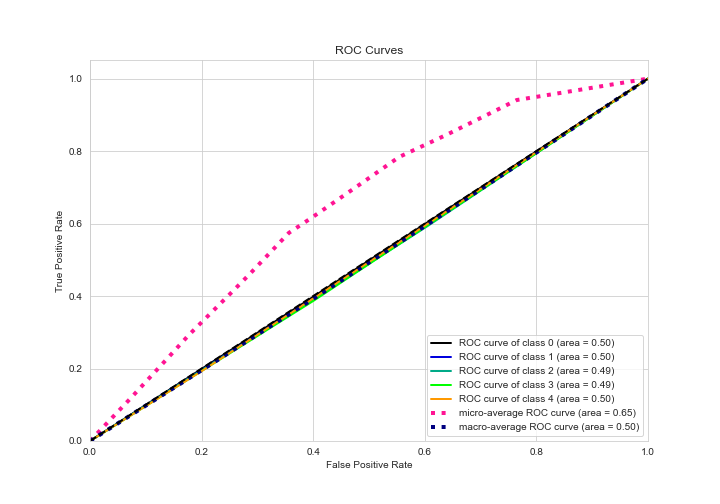
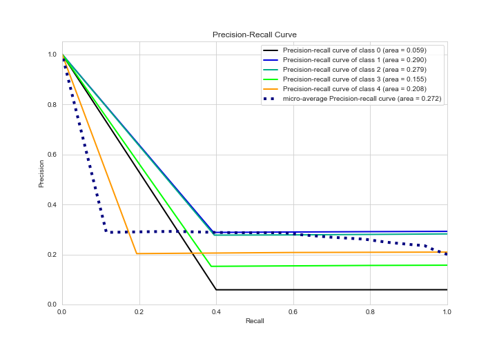

# Summary of 1_Baseline

[<< Go back](../README.md)

## Baseline Classifier (Baseline)
- **n_jobs**: -1
- **num_class**: 5
- **explain_level**: 2

## Validation
 - **validation_type**: kfold
 - **k_folds**: 5
 - **shuffle**: True
 - **stratify**: True

## Optimized metric
logloss

## Training time

14.3 seconds

### Metric details
|           |   0 |          1 |   2 |   3 |   4 |   accuracy |   macro avg |   weighted avg |   logloss |
|:----------|----:|-----------:|----:|----:|----:|-----------:|------------:|---------------:|----------:|
| precision |   0 |   0.29223  |   0 |   0 |   0 |    0.29223 |   0.0584459 |      0.0853982 |   1.50198 |
| recall    |   0 |   1        |   0 |   0 |   0 |    0.29223 |   0.2       |      0.29223   |   1.50198 |
| f1-score  |   0 |   0.452288 |   0 |   0 |   0 |    0.29223 |   0.0904575 |      0.132172  |   1.50198 |
| support   |  35 | 173        | 167 |  93 | 124 |    0.29223 | 592         |    592         |   1.50198 |

## Confusion matrix
|              |   Predicted as 0 |   Predicted as 1 |   Predicted as 2 |   Predicted as 3 |   Predicted as 4 |
|:-------------|-----------------:|-----------------:|-----------------:|-----------------:|-----------------:|
| Labeled as 0 |                0 |               35 |                0 |                0 |                0 |
| Labeled as 1 |                0 |              173 |                0 |                0 |                0 |
| Labeled as 2 |                0 |              167 |                0 |                0 |                0 |
| Labeled as 3 |                0 |               93 |                0 |                0 |                0 |
| Labeled as 4 |                0 |              124 |                0 |                0 |                0 |

## Learning curves

## Confusion Matrix

## Normalized Confusion Matrix

## ROC Curve

## Precision Recall Curve

[<< Go back](../README.md)
