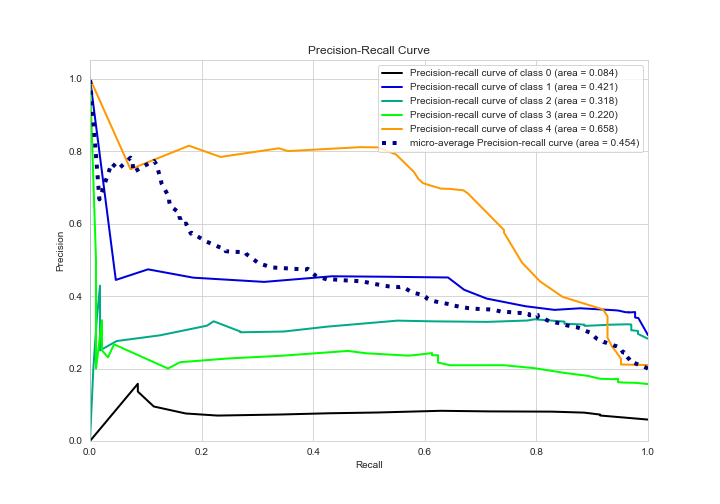

# Summary of 2_DecisionTree

[<< Go back](../README.md)

## Decision Tree
- **n_jobs**: -1
- **criterion**: gini
- **max_depth**: 3
- **num_class**: 5
- **explain_level**: 2

## Validation
 - **validation_type**: kfold
 - **k_folds**: 5
 - **shuffle**: True
 - **stratify**: True

## Optimized metric
logloss

## Training time

41.2 seconds

### Metric details
|           |   0 |          1 |          2 |          3 |          4 |   accuracy |   macro avg |   weighted avg |   logloss |
|:----------|----:|-----------:|-----------:|-----------:|-----------:|-----------:|------------:|---------------:|----------:|
| precision |   0 |   0.454545 |   0.304348 |  0.230769  |   0.695652 |   0.420608 |    0.337063 |       0.40065  |    1.5861 |
| recall    |   0 |   0.433526 |   0.54491  |  0.0322581 |   0.645161 |   0.420608 |    0.331171 |       0.420608 |    1.5861 |
| f1-score  |   0 |   0.443787 |   0.390558 |  0.0566038 |   0.669456 |   0.420608 |    0.312081 |       0.388978 |    1.5861 |
| support   |  35 | 173        | 167        | 93         | 124        |   0.420608 |  592        |     592        |    1.5861 |

## Confusion matrix
|              |   Predicted as 0 |   Predicted as 1 |   Predicted as 2 |   Predicted as 3 |   Predicted as 4 |
|:-------------|-----------------:|-----------------:|-----------------:|-----------------:|-----------------:|
| Labeled as 0 |                0 |               14 |               20 |                0 |                1 |
| Labeled as 1 |                0 |               75 |               90 |                1 |                7 |
| Labeled as 2 |                0 |               60 |               91 |                4 |               12 |
| Labeled as 3 |                0 |               11 |               64 |                3 |               15 |
| Labeled as 4 |                0 |                5 |               34 |                5 |               80 |

## Learning curves

## Decision Tree 

### Tree #1

### Rules

if (mindist > 10.507) and (year_built > 1995.5) and (Buildinglat <= 30.283) then class: 1 (proba: 48.74%) | based on 199 samples

if (mindist > 10.507) and (year_built <= 1995.5) and (mindist > 15.143) then class: 2 (proba: 30.56%) | based on 144 samples

if (mindist <= 10.507) and (year_built <= 1996.5) and (roof_system > 1.5) then class: 4 (proba: 83.58%) | based on 67 samples

if (mindist > 10.507) and (year_built <= 1995.5) and (mindist <= 15.143) then class: 4 (proba: 51.72%) | based on 29 samples

if (mindist <= 10.507) and (year_built > 1996.5) and (foundation_type <= 10.0) then class: 2 (proba: 57.14%) | based on 14 samples

if (mindist > 10.507) and (year_built > 1995.5) and (Buildinglat > 30.283) then class: 2 (proba: 84.62%) | based on 13 samples

if (mindist <= 10.507) and (year_built > 1996.5) and (foundation_type > 10.0) then class: 3 (proba: 100.0%) | based on 4 samples

if (mindist <= 10.507) and (year_built <= 1996.5) and (roof_system <= 1.5) then class: 3 (proba: 66.67%) | based on 3 samples

### Tree #2

### Rules

if (mindist > 10.316) and (year_built > 1995.75) and (hazards_present <= 17.5) then class: 1 (proba: 49.73%) | based on 183 samples

if (mindist > 10.316) and (year_built <= 1995.75) and (mindist > 15.143) then class: 2 (proba: 33.57%) | based on 143 samples

if (mindist <= 10.316) and (hazards_present <= 14.0) and (hazards_present > 4.5) then class: 4 (proba: 94.74%) | based on 57 samples

if (mindist > 10.316) and (year_built > 1995.75) and (hazards_present > 17.5) then class: 2 (proba: 51.43%) | based on 35 samples

if (mindist > 10.316) and (year_built <= 1995.75) and (mindist <= 15.143) then class: 4 (proba: 60.87%) | based on 23 samples

if (mindist <= 10.316) and (hazards_present > 14.0) and (roof_cover <= 2.5) then class: 3 (proba: 47.62%) | based on 21 samples

if (mindist <= 10.316) and (hazards_present > 14.0) and (roof_cover > 2.5) then class: 4 (proba: 85.71%) | based on 7 samples

if (mindist <= 10.316) and (hazards_present <= 14.0) and (hazards_present <= 4.5) then class: 3 (proba: 50.0%) | based on 4 samples

### Tree #3

### Rules

if (mindist > 10.507) and (year_built > 1995.5) and (Buildinglat <= 30.283) then class: 1 (proba: 46.89%) | based on 209 samples

if (mindist > 10.507) and (year_built <= 1995.5) and (mindist > 14.949) then class: 2 (proba: 30.0%) | based on 130 samples

if (mindist <= 10.507) and (year_built <= 1988.5) and (mindist <= 9.188) then class: 4 (proba: 100.0%) | based on 39 samples

if (mindist > 10.507) and (year_built <= 1995.5) and (mindist <= 14.949) then class: 4 (proba: 51.85%) | based on 27 samples

if (mindist <= 10.507) and (year_built <= 1988.5) and (mindist > 9.188) then class: 4 (proba: 68.0%) | based on 25 samples

if (mindist <= 10.507) and (year_built > 1988.5) and (hazards_present <= 13.5) then class: 4 (proba: 58.82%) | based on 17 samples

if (mindist > 10.507) and (year_built > 1995.5) and (Buildinglat > 30.283) then class: 2 (proba: 68.75%) | based on 16 samples

if (mindist <= 10.507) and (year_built > 1988.5) and (hazards_present > 13.5) then class: 3 (proba: 54.55%) | based on 11 samples

### Tree #4

### Rules

if (mindist > 10.564) and (year_built <= 1995.5) and (Buildinglat > 29.802) then class: 2 (proba: 26.67%) | based on 165 samples

if (mindist > 10.564) and (year_built > 1995.5) and (year_built <= 2013.5) then class: 2 (proba: 41.33%) | based on 150 samples

if (mindist > 10.564) and (year_built > 1995.5) and (year_built > 2013.5) then class: 1 (proba: 57.63%) | based on 59 samples

if (mindist <= 10.564) and (year_built <= 1995.0) and (hazards_present <= 10.5) then class: 4 (proba: 92.16%) | based on 51 samples

if (mindist <= 10.564) and (year_built <= 1995.0) and (hazards_present > 10.5) then class: 4 (proba: 57.89%) | based on 19 samples

if (mindist > 10.564) and (year_built <= 1995.5) and (Buildinglat <= 29.802) then class: 2 (proba: 81.82%) | based on 11 samples

if (mindist <= 10.564) and (year_built > 1995.0) and (hazards_present > 9.5) then class: 2 (proba: 60.0%) | based on 10 samples

if (mindist <= 10.564) and (year_built > 1995.0) and (hazards_present <= 9.5) then class: 4 (proba: 55.56%) | based on 9 samples

### Tree #5

### Rules

if (mindist > 10.507) and (year_built <= 1995.5) and (mindist > 15.151) then class: 2 (proba: 29.73%) | based on 148 samples

if (mindist > 10.507) and (year_built > 1995.5) and (Buildinglong <= -85.399) then class: 2 (proba: 42.86%) | based on 140 samples

if (mindist > 10.507) and (year_built > 1995.5) and (Buildinglong > -85.399) then class: 1 (proba: 60.61%) | based on 66 samples

if (mindist <= 10.507) and (mindist <= 9.188) and (year_built <= 2013.0) then class: 4 (proba: 93.62%) | based on 47 samples

if (mindist <= 10.507) and (mindist > 9.188) and (Buildinglong <= -85.416) then class: 3 (proba: 45.16%) | based on 31 samples

if (mindist > 10.507) and (year_built <= 1995.5) and (mindist <= 15.151) then class: 4 (proba: 53.57%) | based on 28 samples

if (mindist <= 10.507) and (mindist > 9.188) and (Buildinglong > -85.416) then class: 4 (proba: 83.33%) | based on 12 samples

if (mindist <= 10.507) and (mindist <= 9.188) and (year_built > 2013.0) then class: 2 (proba: 100.0%) | based on 2 samples

## Permutation-based Importance

## Confusion Matrix

## Normalized Confusion Matrix

## ROC Curve

## Precision Recall Curve

## SHAP Importance

## SHAP Dependence plots

### Dependence 0 (Fold 1)

### Dependence 1 (Fold 1)

### Dependence 2 (Fold 1)

### Dependence 3 (Fold 1)

### Dependence 4 (Fold 1)

### Dependence 0 (Fold 2)

### Dependence 1 (Fold 2)

### Dependence 2 (Fold 2)

### Dependence 3 (Fold 2)

### Dependence 4 (Fold 2)

### Dependence 0 (Fold 3)

### Dependence 1 (Fold 3)

### Dependence 2 (Fold 3)

### Dependence 3 (Fold 3)

### Dependence 4 (Fold 3)

### Dependence 0 (Fold 4)

### Dependence 1 (Fold 4)

### Dependence 2 (Fold 4)

### Dependence 3 (Fold 4)

### Dependence 4 (Fold 4)

### Dependence 0 (Fold 5)

### Dependence 1 (Fold 5)

### Dependence 2 (Fold 5)

### Dependence 3 (Fold 5)

### Dependence 4 (Fold 5)

## SHAP Decision plots

### Worst decisions for selected sample 1 (Fold 1)

### Worst decisions for selected sample 1 (Fold 2)

### Worst decisions for selected sample 1 (Fold 3)

### Worst decisions for selected sample 1 (Fold 4)

### Worst decisions for selected sample 1 (Fold 5)

### Worst decisions for selected sample 2 (Fold 1)

### Worst decisions for selected sample 2 (Fold 2)

### Worst decisions for selected sample 2 (Fold 3)

### Worst decisions for selected sample 2 (Fold 4)

### Worst decisions for selected sample 2 (Fold 5)

### Worst decisions for selected sample 3 (Fold 1)

### Worst decisions for selected sample 3 (Fold 2)

### Worst decisions for selected sample 3 (Fold 3)

### Worst decisions for selected sample 3 (Fold 4)

### Worst decisions for selected sample 3 (Fold 5)

### Worst decisions for selected sample 4 (Fold 1)

### Worst decisions for selected sample 4 (Fold 2)

### Worst decisions for selected sample 4 (Fold 3)

### Worst decisions for selected sample 4 (Fold 4)

### Worst decisions for selected sample 4 (Fold 5)

### Best decisions for selected sample 1 (Fold 1)

### Best decisions for selected sample 1 (Fold 2)

### Best decisions for selected sample 1 (Fold 3)

### Best decisions for selected sample 1 (Fold 4)

### Best decisions for selected sample 1 (Fold 5)

### Best decisions for selected sample 2 (Fold 1)

### Best decisions for selected sample 2 (Fold 2)

### Best decisions for selected sample 2 (Fold 3)

### Best decisions for selected sample 2 (Fold 4)

### Best decisions for selected sample 2 (Fold 5)

### Best decisions for selected sample 3 (Fold 1)

### Best decisions for selected sample 3 (Fold 2)

### Best decisions for selected sample 3 (Fold 3)

### Best decisions for selected sample 3 (Fold 4)

### Best decisions for selected sample 3 (Fold 5)

### Best decisions for selected sample 4 (Fold 1)

### Best decisions for selected sample 4 (Fold 2)

### Best decisions for selected sample 4 (Fold 3)

### Best decisions for selected sample 4 (Fold 4)

### Best decisions for selected sample 4 (Fold 5)

[<< Go back](../README.md)
