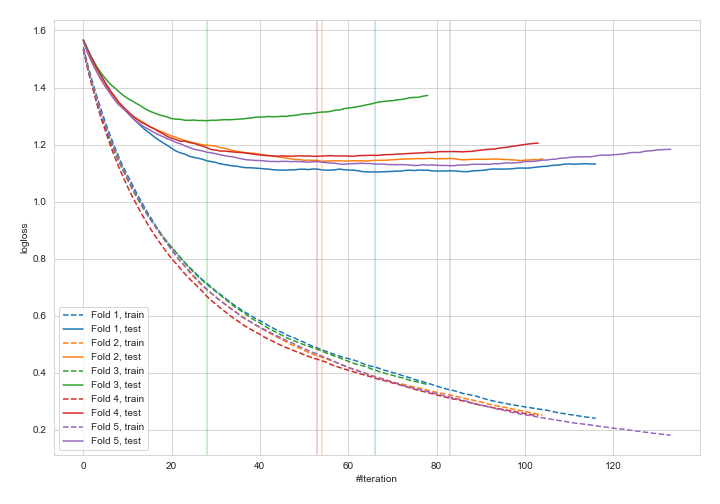
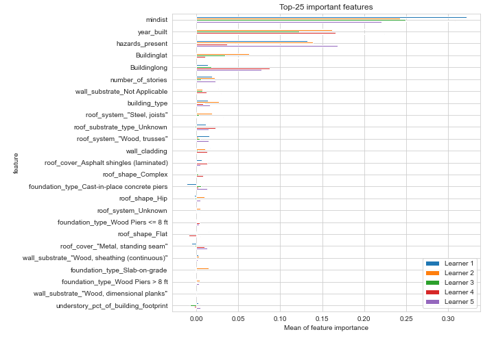
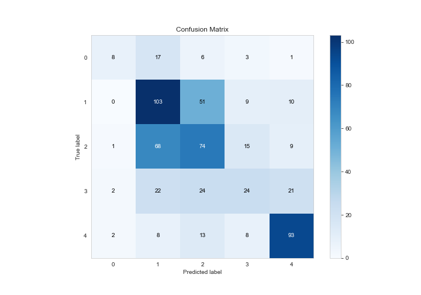
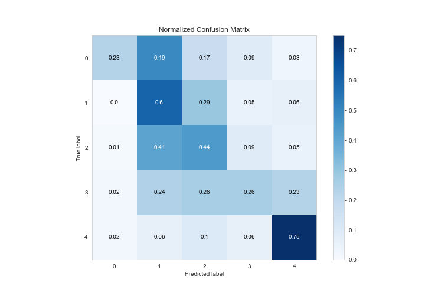
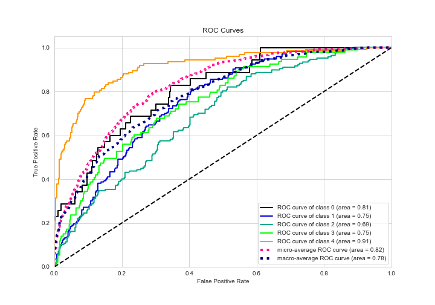
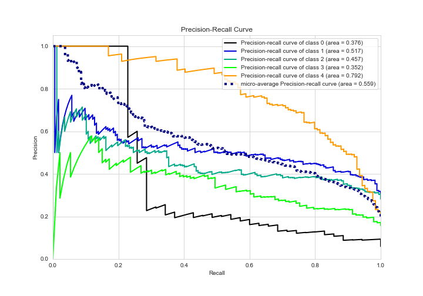

# Summary of 4_Default_Xgboost_categorical_mix

[<< Go back](../README.md)

## Extreme Gradient Boosting (Xgboost)
- **n_jobs**: -1
- **objective**: multi:softprob
- **eta**: 0.075
- **max_depth**: 6
- **min_child_weight**: 1
- **subsample**: 1.0
- **colsample_bytree**: 1.0
- **eval_metric**: mlogloss
- **num_class**: 5
- **explain_level**: 2

## Validation
 - **validation_type**: kfold
 - **k_folds**: 5
 - **shuffle**: True
 - **stratify**: True

## Optimized metric
logloss

## Training time

98.1 seconds

### Metric details
|           |         0 |          1 |          2 |         3 |         4 |   accuracy |   macro avg |   weighted avg |   logloss |
|:----------|----------:|-----------:|-----------:|----------:|----------:|-----------:|------------:|---------------:|----------:|
| precision |  0.615385 |   0.472477 |   0.440476 |  0.40678  |   0.69403 |   0.510135 |    0.525829 |       0.507984 |   1.16256 |
| recall    |  0.228571 |   0.595376 |   0.443114 |  0.258065 |   0.75    |   0.510135 |    0.455025 |       0.510135 |   1.16256 |
| f1-score  |  0.333333 |   0.526854 |   0.441791 |  0.315789 |   0.72093 |   0.510135 |    0.46774  |       0.498911 |   1.16256 |
| support   | 35        | 173        | 167        | 93        | 124       |   0.510135 |  592        |     592        |   1.16256 |

## Confusion matrix
|              |   Predicted as 0 |   Predicted as 1 |   Predicted as 2 |   Predicted as 3 |   Predicted as 4 |
|:-------------|-----------------:|-----------------:|-----------------:|-----------------:|-----------------:|
| Labeled as 0 |                8 |               17 |                6 |                3 |                1 |
| Labeled as 1 |                0 |              103 |               51 |                9 |               10 |
| Labeled as 2 |                1 |               68 |               74 |               15 |                9 |
| Labeled as 3 |                2 |               22 |               24 |               24 |               21 |
| Labeled as 4 |                2 |                8 |               13 |                8 |               93 |

## Learning curves

## Permutation-based Importance

## Confusion Matrix

## Normalized Confusion Matrix

## ROC Curve

## Precision Recall Curve

[<< Go back](../README.md)
