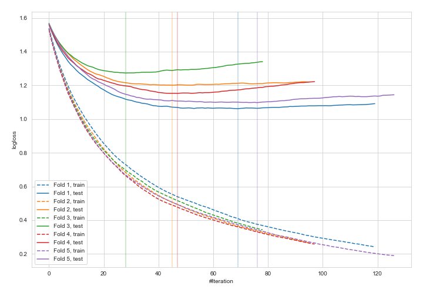
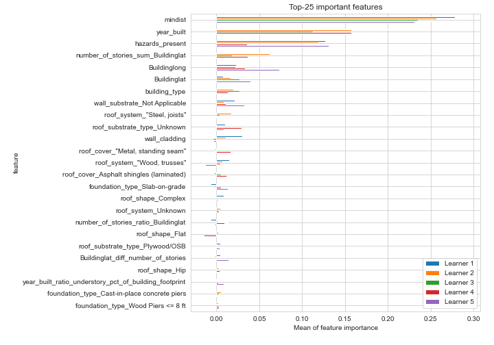
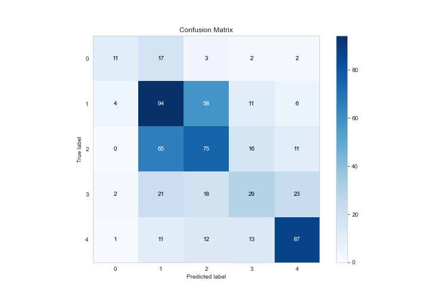
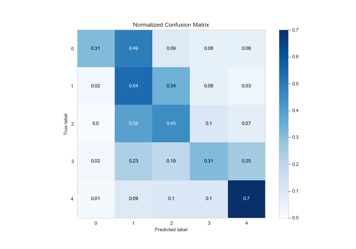
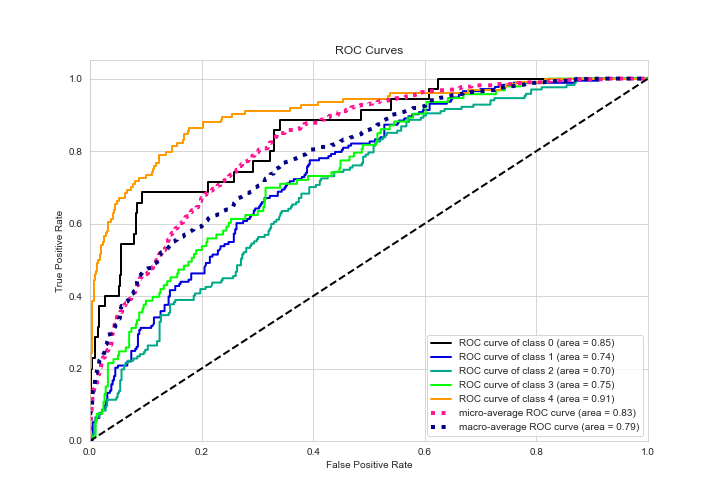
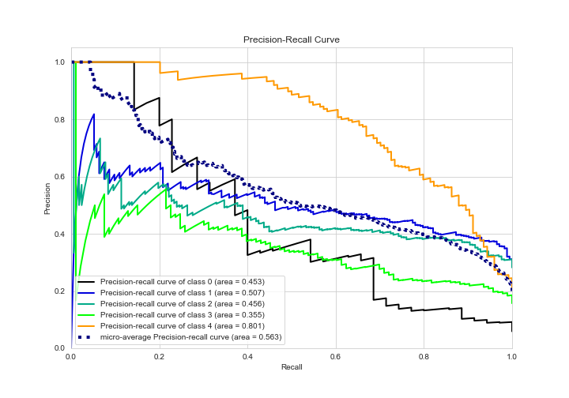

# Summary of 4_Default_Xgboost_categorical_mix_GoldenFeatures

[<< Go back](../README.md)

## Extreme Gradient Boosting (Xgboost)
- **n_jobs**: -1
- **objective**: multi:softprob
- **eta**: 0.075
- **max_depth**: 6
- **min_child_weight**: 1
- **subsample**: 1.0
- **colsample_bytree**: 1.0
- **eval_metric**: mlogloss
- **num_class**: 5
- **explain_level**: 2

## Validation
 - **validation_type**: kfold
 - **k_folds**: 5
 - **shuffle**: True
 - **stratify**: True

## Optimized metric
logloss

## Training time

51.7 seconds

### Metric details
|           |         0 |          1 |          2 |         3 |          4 |   accuracy |   macro avg |   weighted avg |   logloss |
|:----------|----------:|-----------:|-----------:|----------:|-----------:|-----------:|------------:|---------------:|----------:|
| precision |  0.611111 |   0.451923 |   0.451807 |  0.408451 |   0.674419 |        0.5 |    0.519542 |       0.501076 |    1.1572 |
| recall    |  0.314286 |   0.543353 |   0.449102 |  0.311828 |   0.701613 |        0.5 |    0.464036 |       0.5      |    1.1572 |
| f1-score  |  0.415094 |   0.493438 |   0.45045  |  0.353659 |   0.687747 |        0.5 |    0.480078 |       0.495421 |    1.1572 |
| support   | 35        | 173        | 167        | 93        | 124        |        0.5 |  592        |     592        |    1.1572 |

## Confusion matrix
|              |   Predicted as 0 |   Predicted as 1 |   Predicted as 2 |   Predicted as 3 |   Predicted as 4 |
|:-------------|-----------------:|-----------------:|-----------------:|-----------------:|-----------------:|
| Labeled as 0 |               11 |               17 |                3 |                2 |                2 |
| Labeled as 1 |                4 |               94 |               58 |               11 |                6 |
| Labeled as 2 |                0 |               65 |               75 |               16 |               11 |
| Labeled as 3 |                2 |               21 |               18 |               29 |               23 |
| Labeled as 4 |                1 |               11 |               12 |               13 |               87 |

## Learning curves

## Permutation-based Importance

## Confusion Matrix

## Normalized Confusion Matrix

## ROC Curve

## Precision Recall Curve

[<< Go back](../README.md)
