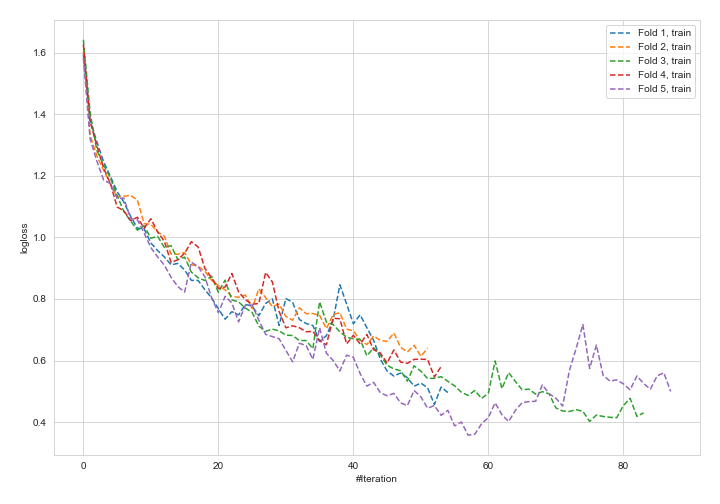
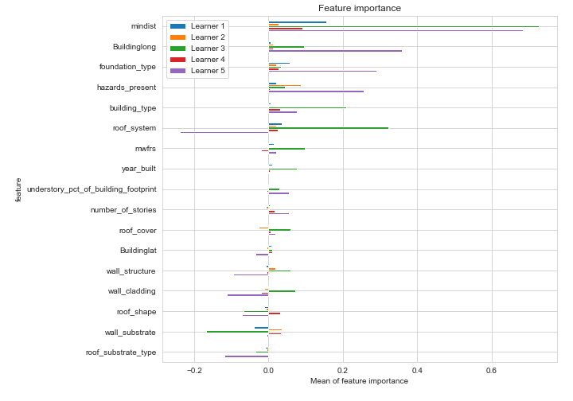
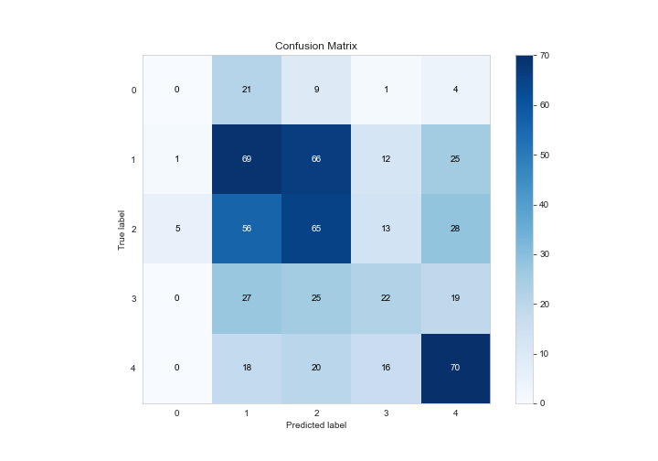
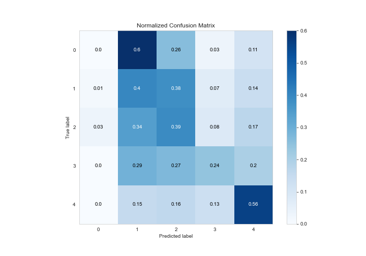
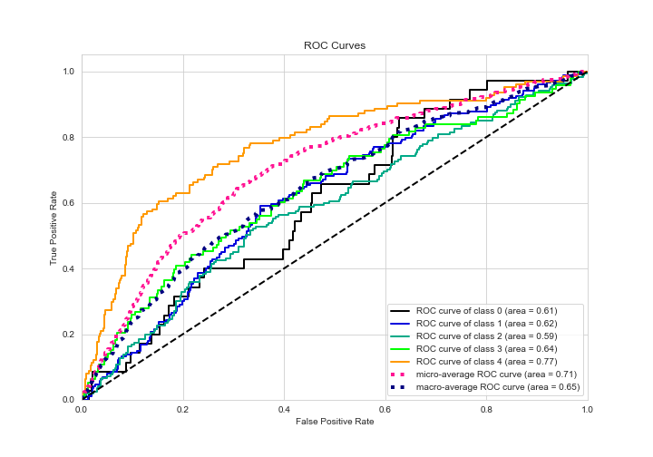
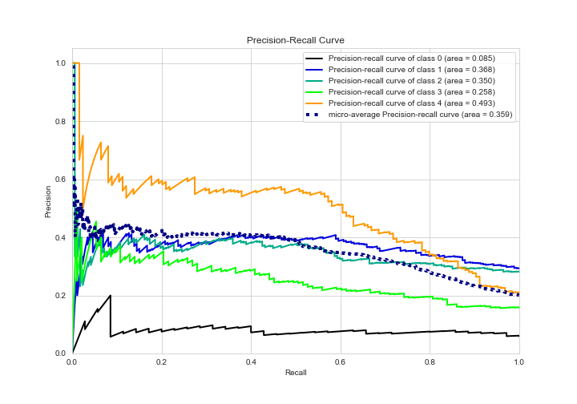

# Summary of 5_Default_NeuralNetwork

[<< Go back](../README.md)

## Neural Network
- **n_jobs**: -1
- **dense_1_size**: 32
- **dense_2_size**: 16
- **learning_rate**: 0.05
- **num_class**: 5
- **explain_level**: 2

## Validation
 - **validation_type**: kfold
 - **k_folds**: 5
 - **shuffle**: True
 - **stratify**: True

## Optimized metric
logloss

## Training time

21.4 seconds

### Metric details
|           |   0 |          1 |          2 |         3 |          4 |   accuracy |   macro avg |   weighted avg |   logloss |
|:----------|----:|-----------:|-----------:|----------:|-----------:|-----------:|------------:|---------------:|----------:|
| precision |   0 |   0.361257 |   0.351351 |  0.34375  |   0.479452 |   0.381757 |    0.307162 |       0.359111 |   2.05284 |
| recall    |   0 |   0.398844 |   0.389222 |  0.236559 |   0.564516 |   0.381757 |    0.317828 |       0.381757 |   2.05284 |
| f1-score  |   0 |   0.379121 |   0.369318 |  0.280255 |   0.518519 |   0.381757 |    0.309442 |       0.367608 |   2.05284 |
| support   |  35 | 173        | 167        | 93        | 124        |   0.381757 |  592        |     592        |   2.05284 |

## Confusion matrix
|              |   Predicted as 0 |   Predicted as 1 |   Predicted as 2 |   Predicted as 3 |   Predicted as 4 |
|:-------------|-----------------:|-----------------:|-----------------:|-----------------:|-----------------:|
| Labeled as 0 |                0 |               21 |                9 |                1 |                4 |
| Labeled as 1 |                1 |               69 |               66 |               12 |               25 |
| Labeled as 2 |                5 |               56 |               65 |               13 |               28 |
| Labeled as 3 |                0 |               27 |               25 |               22 |               19 |
| Labeled as 4 |                0 |               18 |               20 |               16 |               70 |

## Learning curves

## Permutation-based Importance

## Confusion Matrix

## Normalized Confusion Matrix

## ROC Curve

## Precision Recall Curve

[<< Go back](../README.md)
