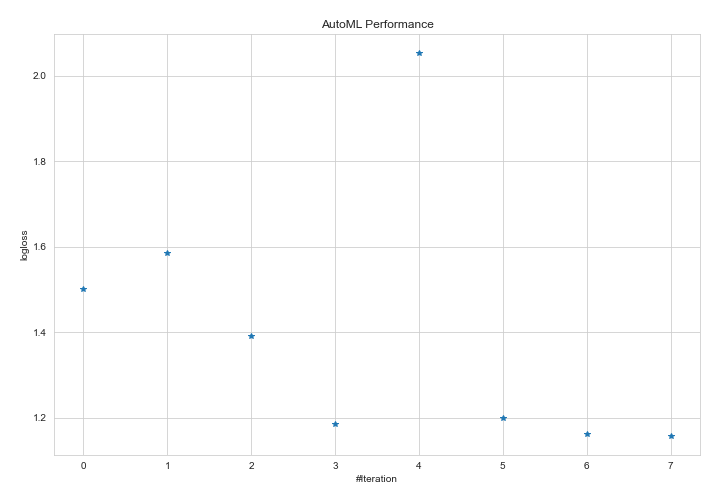
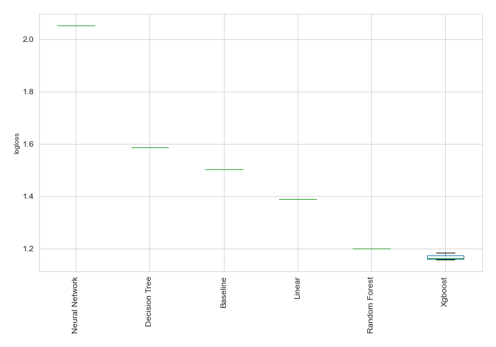

# AutoML Leaderboard

| Best model   | name                                                                                                           | model_type     | metric_type   |   metric_value |   train_time |
|:-------------|:---------------------------------------------------------------------------------------------------------------|:---------------|:--------------|---------------:|-------------:|
|              | [1_Baseline](1_Baseline/README.md)                                                                             | Baseline       | logloss       |        1.50198 |        14.57 |
|              | [2_DecisionTree](2_DecisionTree/README.md)                                                                     | Decision Tree  | logloss       |        1.5861  |        41.87 |
|              | [3_Linear](3_Linear/README.md)                                                                                 | Linear         | logloss       |        1.39066 |        29.56 |
|              | [4_Default_Xgboost](4_Default_Xgboost/README.md)                                                               | Xgboost        | logloss       |        1.18489 |       155.43 |
|              | [5_Default_NeuralNetwork](5_Default_NeuralNetwork/README.md)                                                   | Neural Network | logloss       |        2.05284 |        22.28 |
|              | [6_Default_RandomForest](6_Default_RandomForest/README.md)                                                     | Random Forest  | logloss       |        1.19922 |        78.57 |
|              | [4_Default_Xgboost_categorical_mix](4_Default_Xgboost_categorical_mix/README.md)                               | Xgboost        | logloss       |        1.16256 |        98.66 |
| **the best** | [4_Default_Xgboost_categorical_mix_GoldenFeatures](4_Default_Xgboost_categorical_mix_GoldenFeatures/README.md) | Xgboost        | logloss       |        1.1572  |        51.74 |

### AutoML Performance

### AutoML Performance Boxplot
