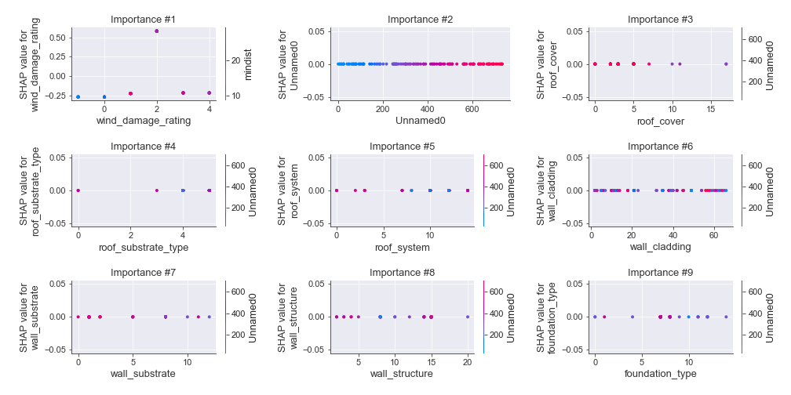
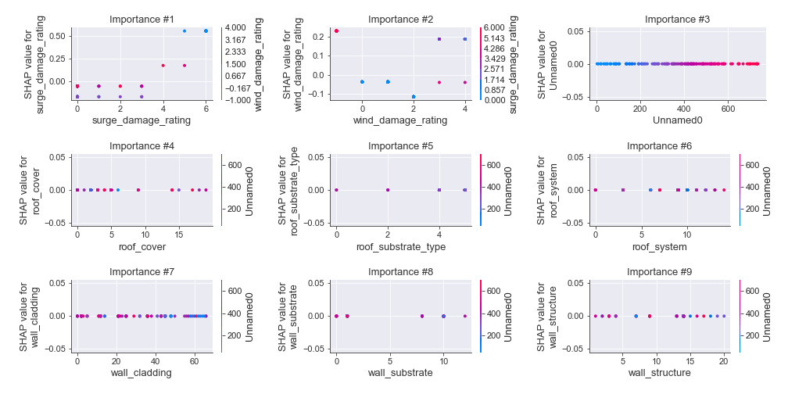
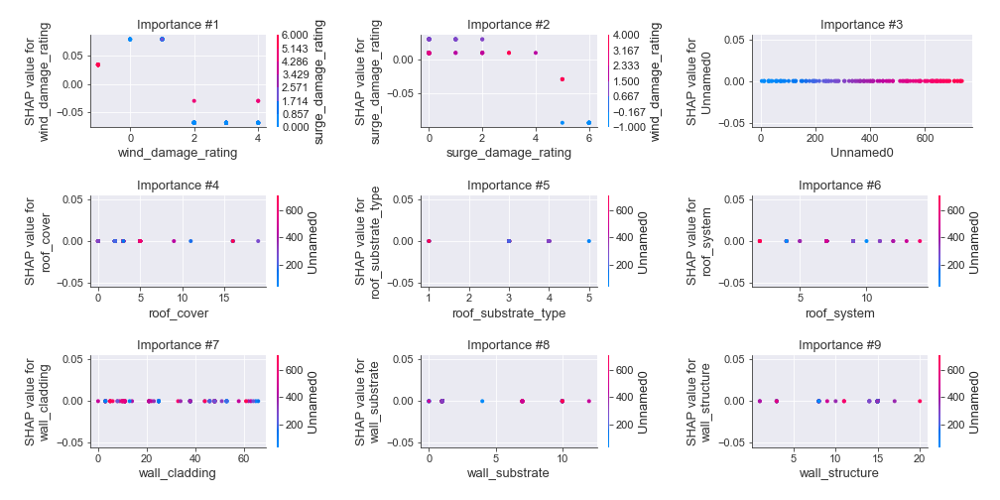

# Summary of 11_DecisionTree

[<< Go back](../README.md)

## Decision Tree
- **n_jobs**: -1
- **criterion**: gini
- **max_depth**: 2
- **num_class**: 5
- **explain_level**: 2

## Validation
 - **validation_type**: kfold
 - **k_folds**: 5
 - **shuffle**: True
 - **stratify**: True

## Optimized metric
logloss

## Training time

133.2 seconds

### Metric details
|           |   0 |          1 |          2 |         3 |          4 |   accuracy |   macro avg |   weighted avg |   logloss |
|:----------|----:|-----------:|-----------:|----------:|-----------:|-----------:|------------:|---------------:|----------:|
| precision |   0 |   0.818653 |   0.874251 |  0.555556 |   0.78481  |   0.761824 |    0.606654 |       0.737517 |   0.66824 |
| recall    |   0 |   0.913295 |   0.874251 |  0.913978 |   0.5      |   0.761824 |    0.640305 |       0.761824 |   0.66824 |
| f1-score  |   0 |   0.863388 |   0.874251 |  0.691057 |   0.610837 |   0.761824 |    0.607907 |       0.735436 |   0.66824 |
| support   |  35 | 173        | 167        | 93        | 124        |   0.761824 |  592        |     592        |   0.66824 |

## Confusion matrix
|              |   Predicted as 0 |   Predicted as 1 |   Predicted as 2 |   Predicted as 3 |   Predicted as 4 |
|:-------------|-----------------:|-----------------:|-----------------:|-----------------:|-----------------:|
| Labeled as 0 |                0 |               21 |                0 |                0 |               14 |
| Labeled as 1 |                0 |              158 |               10 |                2 |                3 |
| Labeled as 2 |                0 |               11 |              146 |               10 |                0 |
| Labeled as 3 |                0 |                2 |                6 |               85 |                0 |
| Labeled as 4 |                0 |                1 |                5 |               56 |               62 |

## Learning curves

## Decision Tree 

### Tree #1

### Rules

if (wind_damage_rating > 1.5) and (wind_damage_rating <= 2.5) then class: 2 (proba: 86.67%) | based on 135 samples

if (wind_damage_rating <= 1.5) and (wind_damage_rating > 0.5) then class: 1 (proba: 91.85%) | based on 135 samples

if (wind_damage_rating > 1.5) and (wind_damage_rating > 2.5) then class: 3 (proba: 54.47%) | based on 123 samples

if (wind_damage_rating <= 1.5) and (wind_damage_rating <= 0.5) then class: 4 (proba: 61.25%) | based on 80 samples

### Tree #2

### Rules

if (wind_damage_rating <= 1.5) and (wind_damage_rating > 0.5) then class: 1 (proba: 92.7%) | based on 137 samples

if (wind_damage_rating > 1.5) and (wind_damage_rating <= 2.5) then class: 2 (proba: 88.06%) | based on 134 samples

if (wind_damage_rating > 1.5) and (wind_damage_rating > 2.5) then class: 3 (proba: 55.83%) | based on 120 samples

if (wind_damage_rating <= 1.5) and (wind_damage_rating <= 0.5) then class: 4 (proba: 60.98%) | based on 82 samples

### Tree #3

### Rules

if (wind_damage_rating <= 1.5) and (surge_damage_rating <= 3.5) then class: 1 (proba: 77.84%) | based on 167 samples

if (wind_damage_rating > 1.5) and (wind_damage_rating <= 2.5) then class: 2 (proba: 87.79%) | based on 131 samples

if (wind_damage_rating > 1.5) and (wind_damage_rating > 2.5) then class: 3 (proba: 56.8%) | based on 125 samples

if (wind_damage_rating <= 1.5) and (surge_damage_rating > 3.5) then class: 4 (proba: 100.0%) | based on 51 samples

### Tree #4

### Rules

if (wind_damage_rating <= 1.5) and (surge_damage_rating <= 4.0) then class: 1 (proba: 76.19%) | based on 168 samples

if (wind_damage_rating > 1.5) and (wind_damage_rating <= 2.5) then class: 2 (proba: 86.36%) | based on 132 samples

if (wind_damage_rating > 1.5) and (wind_damage_rating > 2.5) then class: 3 (proba: 54.4%) | based on 125 samples

if (wind_damage_rating <= 1.5) and (surge_damage_rating > 4.0) then class: 4 (proba: 100.0%) | based on 49 samples

### Tree #5

### Rules

if (wind_damage_rating <= 1.5) and (surge_damage_rating <= 4.0) then class: 1 (proba: 76.65%) | based on 167 samples

if (wind_damage_rating > 1.5) and (wind_damage_rating <= 2.5) then class: 2 (proba: 88.24%) | based on 136 samples

if (wind_damage_rating > 1.5) and (wind_damage_rating > 2.5) then class: 3 (proba: 56.3%) | based on 119 samples

if (wind_damage_rating <= 1.5) and (surge_damage_rating > 4.0) then class: 4 (proba: 100.0%) | based on 52 samples

## Permutation-based Importance

## Confusion Matrix

## Normalized Confusion Matrix

## ROC Curve

## Precision Recall Curve

## SHAP Importance

## SHAP Dependence plots

### Dependence 0 (Fold 1)

### Dependence 1 (Fold 1)

### Dependence 2 (Fold 1)

### Dependence 3 (Fold 1)

### Dependence 4 (Fold 1)

### Dependence 0 (Fold 2)

### Dependence 1 (Fold 2)

### Dependence 2 (Fold 2)

### Dependence 3 (Fold 2)

### Dependence 4 (Fold 2)

### Dependence 0 (Fold 3)

### Dependence 1 (Fold 3)

### Dependence 2 (Fold 3)

### Dependence 3 (Fold 3)

### Dependence 4 (Fold 3)

### Dependence 0 (Fold 4)

### Dependence 1 (Fold 4)

### Dependence 2 (Fold 4)

### Dependence 3 (Fold 4)

### Dependence 4 (Fold 4)

### Dependence 0 (Fold 5)

### Dependence 1 (Fold 5)

### Dependence 2 (Fold 5)

### Dependence 3 (Fold 5)

### Dependence 4 (Fold 5)

## SHAP Decision plots

### Worst decisions for selected sample 1 (Fold 1)

### Worst decisions for selected sample 1 (Fold 2)

### Worst decisions for selected sample 1 (Fold 3)

### Worst decisions for selected sample 1 (Fold 4)

### Worst decisions for selected sample 1 (Fold 5)

### Worst decisions for selected sample 2 (Fold 1)

### Worst decisions for selected sample 2 (Fold 2)

### Worst decisions for selected sample 2 (Fold 3)

### Worst decisions for selected sample 2 (Fold 4)

### Worst decisions for selected sample 2 (Fold 5)

### Worst decisions for selected sample 3 (Fold 1)

### Worst decisions for selected sample 3 (Fold 2)

### Worst decisions for selected sample 3 (Fold 3)

### Worst decisions for selected sample 3 (Fold 4)

### Worst decisions for selected sample 3 (Fold 5)

### Worst decisions for selected sample 4 (Fold 1)

### Worst decisions for selected sample 4 (Fold 2)

### Worst decisions for selected sample 4 (Fold 3)

### Worst decisions for selected sample 4 (Fold 4)

### Worst decisions for selected sample 4 (Fold 5)

### Best decisions for selected sample 1 (Fold 1)

### Best decisions for selected sample 1 (Fold 2)

### Best decisions for selected sample 1 (Fold 3)

### Best decisions for selected sample 1 (Fold 4)

### Best decisions for selected sample 1 (Fold 5)

### Best decisions for selected sample 2 (Fold 1)

### Best decisions for selected sample 2 (Fold 2)

### Best decisions for selected sample 2 (Fold 3)

### Best decisions for selected sample 2 (Fold 4)

### Best decisions for selected sample 2 (Fold 5)

### Best decisions for selected sample 3 (Fold 1)

### Best decisions for selected sample 3 (Fold 2)

### Best decisions for selected sample 3 (Fold 3)

### Best decisions for selected sample 3 (Fold 4)

### Best decisions for selected sample 3 (Fold 5)

### Best decisions for selected sample 4 (Fold 1)

### Best decisions for selected sample 4 (Fold 2)

### Best decisions for selected sample 4 (Fold 3)

### Best decisions for selected sample 4 (Fold 4)

### Best decisions for selected sample 4 (Fold 5)

[<< Go back](../README.md)
