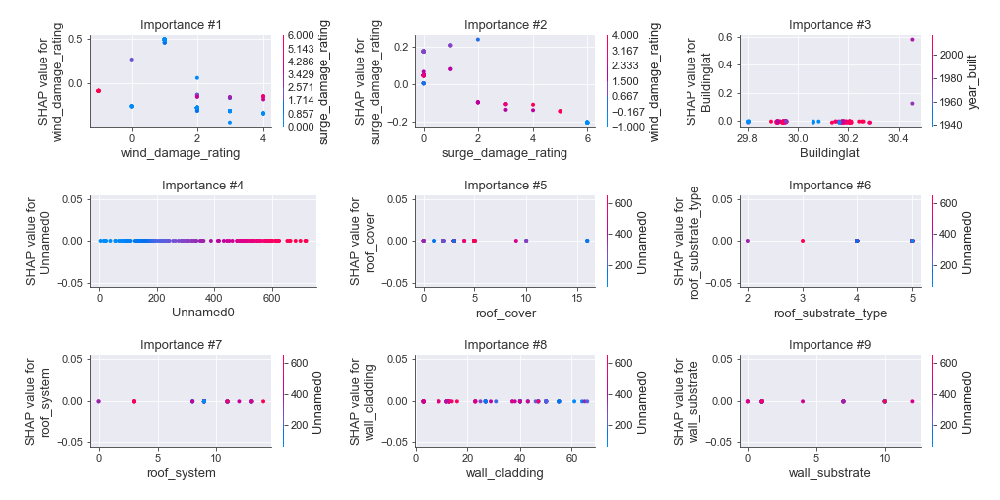

# Summary of 12_DecisionTree

[<< Go back](../README.md)

## Decision Tree
- **n_jobs**: -1
- **criterion**: gini
- **max_depth**: 4
- **num_class**: 5
- **explain_level**: 2

## Validation
 - **validation_type**: kfold
 - **k_folds**: 5
 - **shuffle**: True
 - **stratify**: True

## Optimized metric
logloss

## Training time

152.3 seconds

### Metric details
|           |         0 |          1 |          2 |         3 |          4 |   accuracy |   macro avg |   weighted avg |   logloss |
|:----------|----------:|-----------:|-----------:|----------:|-----------:|-----------:|------------:|---------------:|----------:|
| precision |  0.970588 |   0.957831 |   0.87931  |  0.896907 |   0.933884 |   0.920608 |    0.927704 |       0.921848 |  0.535536 |
| recall    |  0.942857 |   0.919075 |   0.916168 |  0.935484 |   0.91129  |   0.920608 |    0.924975 |       0.920608 |  0.535536 |
| f1-score  |  0.956522 |   0.938053 |   0.897361 |  0.915789 |   0.922449 |   0.920608 |    0.926035 |       0.9209   |  0.535536 |
| support   | 35        | 173        | 167        | 93        | 124        |   0.920608 |  592        |     592        |  0.535536 |

## Confusion matrix
|              |   Predicted as 0 |   Predicted as 1 |   Predicted as 2 |   Predicted as 3 |   Predicted as 4 |
|:-------------|-----------------:|-----------------:|-----------------:|-----------------:|-----------------:|
| Labeled as 0 |               33 |                2 |                0 |                0 |                0 |
| Labeled as 1 |                1 |              159 |               11 |                2 |                0 |
| Labeled as 2 |                0 |                4 |              153 |                4 |                6 |
| Labeled as 3 |                0 |                1 |                3 |               87 |                2 |
| Labeled as 4 |                0 |                0 |                7 |                4 |              113 |

## Learning curves

## Decision Tree 

### Tree #1

### Rules

if (wind_damage_rating > 1.5) and (wind_damage_rating <= 2.5) and (surge_damage_rating <= 2.5) and (Unnamed0 <= 720.0) then class: 2 (proba: 92.86%) | based on 126 samples

if (wind_damage_rating <= 1.5) and (wind_damage_rating > 0.5) and (surge_damage_rating <= 1.5) and (Unnamed0 > 9.0) then class: 1 (proba: 98.41%) | based on 126 samples

if (wind_damage_rating > 1.5) and (wind_damage_rating > 2.5) and (wind_damage_rating <= 3.5) and (surge_damage_rating <= 3.5) then class: 3 (proba: 90.41%) | based on 73 samples

if (wind_damage_rating <= 1.5) and (wind_damage_rating <= 0.5) and (wind_damage_rating <= -0.5) then class: 4 (proba: 100.0%) | based on 49 samples

if (wind_damage_rating > 1.5) and (wind_damage_rating > 2.5) and (wind_damage_rating > 3.5) and (mindist <= 32.574) then class: 4 (proba: 91.49%) | based on 47 samples

if (wind_damage_rating <= 1.5) and (wind_damage_rating <= 0.5) and (wind_damage_rating > -0.5) and (surge_damage_rating <= 0.5) then class: 0 (proba: 96.3%) | based on 27 samples

if (wind_damage_rating <= 1.5) and (wind_damage_rating > 0.5) and (surge_damage_rating > 1.5) and (surge_damage_rating <= 4.0) then class: 2 (proba: 85.71%) | based on 7 samples

if (wind_damage_rating > 1.5) and (wind_damage_rating <= 2.5) and (surge_damage_rating > 2.5) and (surge_damage_rating <= 3.5) then class: 3 (proba: 100.0%) | based on 4 samples

if (wind_damage_rating <= 1.5) and (wind_damage_rating <= 0.5) and (wind_damage_rating > -0.5) and (surge_damage_rating > 0.5) then class: 1 (proba: 50.0%) | based on 4 samples

if (wind_damage_rating > 1.5) and (wind_damage_rating <= 2.5) and (surge_damage_rating > 2.5) and (surge_damage_rating > 3.5) then class: 4 (proba: 100.0%) | based on 3 samples

if (wind_damage_rating > 1.5) and (wind_damage_rating > 2.5) and (wind_damage_rating <= 3.5) and (surge_damage_rating > 3.5) then class: 4 (proba: 100.0%) | based on 2 samples

if (wind_damage_rating > 1.5) and (wind_damage_rating <= 2.5) and (surge_damage_rating <= 2.5) and (Unnamed0 > 720.0) then class: 1 (proba: 100.0%) | based on 2 samples

if (wind_damage_rating > 1.5) and (wind_damage_rating > 2.5) and (wind_damage_rating > 3.5) and (mindist > 32.574) then class: 3 (proba: 100.0%) | based on 1 samples

if (wind_damage_rating <= 1.5) and (wind_damage_rating > 0.5) and (surge_damage_rating > 1.5) and (surge_damage_rating > 4.0) then class: 4 (proba: 100.0%) | based on 1 samples

if (wind_damage_rating <= 1.5) and (wind_damage_rating > 0.5) and (surge_damage_rating <= 1.5) and (Unnamed0 <= 9.0) then class: 2 (proba: 100.0%) | based on 1 samples

### Tree #2

### Rules

if (wind_damage_rating <= 1.5) and (wind_damage_rating > 0.5) and (surge_damage_rating <= 1.5) and (Unnamed0 > 14.5) then class: 1 (proba: 98.44%) | based on 128 samples

if (wind_damage_rating > 1.5) and (wind_damage_rating <= 2.5) and (surge_damage_rating <= 2.5) and (Unnamed0 <= 720.0) then class: 2 (proba: 95.16%) | based on 124 samples

if (wind_damage_rating > 1.5) and (wind_damage_rating > 2.5) and (wind_damage_rating <= 3.5) and (surge_damage_rating <= 3.5) then class: 3 (proba: 91.67%) | based on 72 samples

if (wind_damage_rating <= 1.5) and (wind_damage_rating <= 0.5) and (wind_damage_rating <= -0.5) then class: 4 (proba: 100.0%) | based on 50 samples

if (wind_damage_rating > 1.5) and (wind_damage_rating > 2.5) and (wind_damage_rating > 3.5) and (mindist <= 33.425) then class: 4 (proba: 88.89%) | based on 45 samples

if (wind_damage_rating <= 1.5) and (wind_damage_rating <= 0.5) and (wind_damage_rating > -0.5) and (surge_damage_rating <= 0.5) then class: 0 (proba: 100.0%) | based on 27 samples

if (wind_damage_rating > 1.5) and (wind_damage_rating <= 2.5) and (surge_damage_rating > 2.5) and (surge_damage_rating > 3.5) then class: 4 (proba: 100.0%) | based on 5 samples

if (wind_damage_rating <= 1.5) and (wind_damage_rating > 0.5) and (surge_damage_rating > 1.5) and (year_built > 1982.5) then class: 2 (proba: 100.0%) | based on 5 samples

if (wind_damage_rating <= 1.5) and (wind_damage_rating <= 0.5) and (wind_damage_rating > -0.5) and (surge_damage_rating > 0.5) then class: 1 (proba: 80.0%) | based on 5 samples

if (wind_damage_rating > 1.5) and (wind_damage_rating <= 2.5) and (surge_damage_rating > 2.5) and (surge_damage_rating <= 3.5) then class: 3 (proba: 100.0%) | based on 3 samples

if (wind_damage_rating <= 1.5) and (wind_damage_rating > 0.5) and (surge_damage_rating <= 1.5) and (Unnamed0 <= 14.5) then class: 2 (proba: 66.67%) | based on 3 samples

if (wind_damage_rating > 1.5) and (wind_damage_rating > 2.5) and (wind_damage_rating <= 3.5) and (surge_damage_rating > 3.5) then class: 4 (proba: 100.0%) | based on 2 samples

if (wind_damage_rating > 1.5) and (wind_damage_rating <= 2.5) and (surge_damage_rating <= 2.5) and (Unnamed0 > 720.0) then class: 1 (proba: 100.0%) | based on 2 samples

if (wind_damage_rating > 1.5) and (wind_damage_rating > 2.5) and (wind_damage_rating > 3.5) and (mindist > 33.425) then class: 3 (proba: 100.0%) | based on 1 samples

if (wind_damage_rating <= 1.5) and (wind_damage_rating > 0.5) and (surge_damage_rating > 1.5) and (year_built <= 1982.5) then class: 3 (proba: 100.0%) | based on 1 samples

### Tree #3

### Rules

if (wind_damage_rating <= 1.5) and (surge_damage_rating <= 3.5) and (wind_damage_rating > 0.5) and (surge_damage_rating <= 1.5) then class: 1 (proba: 96.92%) | based on 130 samples

if (wind_damage_rating > 1.5) and (wind_damage_rating <= 2.5) and (surge_damage_rating <= 2.5) and (Buildinglat <= 30.454) then class: 2 (proba: 93.5%) | based on 123 samples

if (wind_damage_rating > 1.5) and (wind_damage_rating > 2.5) and (wind_damage_rating <= 3.5) and (surge_damage_rating <= 3.5) then class: 3 (proba: 91.03%) | based on 78 samples

if (wind_damage_rating <= 1.5) and (surge_damage_rating > 3.5) then class: 4 (proba: 100.0%) | based on 51 samples

if (wind_damage_rating > 1.5) and (wind_damage_rating > 2.5) and (wind_damage_rating > 3.5) and (Buildinglong > -85.672) then class: 4 (proba: 90.48%) | based on 42 samples

if (wind_damage_rating <= 1.5) and (surge_damage_rating <= 3.5) and (wind_damage_rating <= 0.5) and (surge_damage_rating <= 0.5) then class: 0 (proba: 96.3%) | based on 27 samples

if (wind_damage_rating > 1.5) and (wind_damage_rating <= 2.5) and (surge_damage_rating > 2.5) and (surge_damage_rating > 3.5) then class: 4 (proba: 100.0%) | based on 5 samples

if (wind_damage_rating <= 1.5) and (surge_damage_rating <= 3.5) and (wind_damage_rating > 0.5) and (surge_damage_rating > 1.5) then class: 2 (proba: 100.0%) | based on 5 samples

if (wind_damage_rating <= 1.5) and (surge_damage_rating <= 3.5) and (wind_damage_rating <= 0.5) and (surge_damage_rating > 0.5) then class: 1 (proba: 60.0%) | based on 5 samples

if (wind_damage_rating > 1.5) and (wind_damage_rating > 2.5) and (wind_damage_rating > 3.5) and (Buildinglong <= -85.672) then class: 2 (proba: 66.67%) | based on 3 samples

if (wind_damage_rating > 1.5) and (wind_damage_rating > 2.5) and (wind_damage_rating <= 3.5) and (surge_damage_rating > 3.5) then class: 4 (proba: 100.0%) | based on 2 samples

if (wind_damage_rating > 1.5) and (wind_damage_rating <= 2.5) and (surge_damage_rating > 2.5) and (surge_damage_rating <= 3.5) then class: 3 (proba: 100.0%) | based on 2 samples

if (wind_damage_rating > 1.5) and (wind_damage_rating <= 2.5) and (surge_damage_rating <= 2.5) and (Buildinglat > 30.454) then class: 1 (proba: 100.0%) | based on 1 samples

### Tree #4

### Rules

if (wind_damage_rating <= 1.5) and (surge_damage_rating <= 4.0) and (wind_damage_rating > 0.5) and (surge_damage_rating <= 1.5) then class: 1 (proba: 96.09%) | based on 128 samples

if (wind_damage_rating > 1.5) and (wind_damage_rating <= 2.5) and (surge_damage_rating <= 2.5) and (Buildinglat <= 30.454) then class: 2 (proba: 92.68%) | based on 123 samples

if (wind_damage_rating > 1.5) and (wind_damage_rating > 2.5) and (wind_damage_rating <= 3.5) and (surge_damage_rating <= 3.5) then class: 3 (proba: 90.54%) | based on 74 samples

if (wind_damage_rating <= 1.5) and (surge_damage_rating > 4.0) then class: 4 (proba: 100.0%) | based on 49 samples

if (wind_damage_rating > 1.5) and (wind_damage_rating > 2.5) and (wind_damage_rating > 3.5) and (roof_shape <= 8.5) then class: 4 (proba: 90.48%) | based on 42 samples

if (wind_damage_rating <= 1.5) and (surge_damage_rating <= 4.0) and (wind_damage_rating <= 0.5) and (surge_damage_rating <= 0.5) then class: 0 (proba: 96.3%) | based on 27 samples

if (wind_damage_rating <= 1.5) and (surge_damage_rating <= 4.0) and (wind_damage_rating > 0.5) and (surge_damage_rating > 1.5) then class: 2 (proba: 87.5%) | based on 8 samples

if (wind_damage_rating > 1.5) and (wind_damage_rating > 2.5) and (wind_damage_rating > 3.5) and (roof_shape > 8.5) then class: 2 (proba: 50.0%) | based on 6 samples

if (wind_damage_rating <= 1.5) and (surge_damage_rating <= 4.0) and (wind_damage_rating <= 0.5) and (surge_damage_rating > 0.5) then class: 1 (proba: 80.0%) | based on 5 samples

if (wind_damage_rating > 1.5) and (wind_damage_rating <= 2.5) and (surge_damage_rating > 2.5) and (Unnamed0 <= 313.0) then class: 4 (proba: 100.0%) | based on 4 samples

if (wind_damage_rating > 1.5) and (wind_damage_rating > 2.5) and (wind_damage_rating <= 3.5) and (surge_damage_rating > 3.5) then class: 4 (proba: 100.0%) | based on 3 samples

if (wind_damage_rating > 1.5) and (wind_damage_rating <= 2.5) and (surge_damage_rating > 2.5) and (Unnamed0 > 313.0) then class: 3 (proba: 100.0%) | based on 3 samples

if (wind_damage_rating > 1.5) and (wind_damage_rating <= 2.5) and (surge_damage_rating <= 2.5) and (Buildinglat > 30.454) then class: 1 (proba: 100.0%) | based on 2 samples

### Tree #5

### Rules

if (wind_damage_rating > 1.5) and (wind_damage_rating <= 2.5) and (surge_damage_rating <= 2.5) and (Buildinglat <= 30.614) then class: 2 (proba: 93.75%) | based on 128 samples

if (wind_damage_rating <= 1.5) and (surge_damage_rating <= 4.0) and (wind_damage_rating > 0.5) and (surge_damage_rating <= 1.5) then class: 1 (proba: 96.88%) | based on 128 samples

if (wind_damage_rating > 1.5) and (wind_damage_rating > 2.5) and (wind_damage_rating <= 3.5) and (surge_damage_rating <= 3.5) then class: 3 (proba: 92.96%) | based on 71 samples

if (wind_damage_rating <= 1.5) and (surge_damage_rating > 4.0) then class: 4 (proba: 100.0%) | based on 52 samples

if (wind_damage_rating > 1.5) and (wind_damage_rating > 2.5) and (wind_damage_rating > 3.5) and (mwfrs <= 17.5) then class: 4 (proba: 93.18%) | based on 44 samples

if (wind_damage_rating <= 1.5) and (surge_damage_rating <= 4.0) and (wind_damage_rating <= 0.5) and (surge_damage_rating <= 0.5) then class: 0 (proba: 96.43%) | based on 28 samples

if (wind_damage_rating <= 1.5) and (surge_damage_rating <= 4.0) and (wind_damage_rating > 0.5) and (surge_damage_rating > 1.5) then class: 2 (proba: 83.33%) | based on 6 samples

if (wind_damage_rating <= 1.5) and (surge_damage_rating <= 4.0) and (wind_damage_rating <= 0.5) and (surge_damage_rating > 0.5) then class: 1 (proba: 60.0%) | based on 5 samples

if (wind_damage_rating > 1.5) and (wind_damage_rating <= 2.5) and (surge_damage_rating > 2.5) and (surge_damage_rating <= 3.5) then class: 3 (proba: 100.0%) | based on 4 samples

if (wind_damage_rating > 1.5) and (wind_damage_rating > 2.5) and (wind_damage_rating <= 3.5) and (surge_damage_rating > 3.5) then class: 4 (proba: 100.0%) | based on 3 samples

if (wind_damage_rating > 1.5) and (wind_damage_rating <= 2.5) and (surge_damage_rating > 2.5) and (surge_damage_rating > 3.5) then class: 4 (proba: 100.0%) | based on 3 samples

if (wind_damage_rating > 1.5) and (wind_damage_rating > 2.5) and (wind_damage_rating > 3.5) and (mwfrs > 17.5) then class: 3 (proba: 100.0%) | based on 1 samples

if (wind_damage_rating > 1.5) and (wind_damage_rating <= 2.5) and (surge_damage_rating <= 2.5) and (Buildinglat > 30.614) then class: 1 (proba: 100.0%) | based on 1 samples

## Permutation-based Importance

## Confusion Matrix

## Normalized Confusion Matrix

## ROC Curve

## Precision Recall Curve

## SHAP Importance

## SHAP Dependence plots

### Dependence 0 (Fold 1)

### Dependence 1 (Fold 1)

### Dependence 2 (Fold 1)

### Dependence 3 (Fold 1)

### Dependence 4 (Fold 1)

### Dependence 0 (Fold 2)

### Dependence 1 (Fold 2)

### Dependence 2 (Fold 2)

### Dependence 3 (Fold 2)

### Dependence 4 (Fold 2)

### Dependence 0 (Fold 3)

### Dependence 1 (Fold 3)

### Dependence 2 (Fold 3)

### Dependence 3 (Fold 3)

### Dependence 4 (Fold 3)

### Dependence 0 (Fold 4)

### Dependence 1 (Fold 4)

### Dependence 2 (Fold 4)

### Dependence 3 (Fold 4)

### Dependence 4 (Fold 4)

### Dependence 0 (Fold 5)

### Dependence 1 (Fold 5)

### Dependence 2 (Fold 5)

### Dependence 3 (Fold 5)

### Dependence 4 (Fold 5)

## SHAP Decision plots

### Worst decisions for selected sample 1 (Fold 1)

### Worst decisions for selected sample 1 (Fold 2)

### Worst decisions for selected sample 1 (Fold 3)

### Worst decisions for selected sample 1 (Fold 4)

### Worst decisions for selected sample 1 (Fold 5)

### Worst decisions for selected sample 2 (Fold 1)

### Worst decisions for selected sample 2 (Fold 2)

### Worst decisions for selected sample 2 (Fold 3)

### Worst decisions for selected sample 2 (Fold 4)

### Worst decisions for selected sample 2 (Fold 5)

### Worst decisions for selected sample 3 (Fold 1)

### Worst decisions for selected sample 3 (Fold 2)

### Worst decisions for selected sample 3 (Fold 3)

### Worst decisions for selected sample 3 (Fold 4)

### Worst decisions for selected sample 3 (Fold 5)

### Worst decisions for selected sample 4 (Fold 1)

### Worst decisions for selected sample 4 (Fold 2)

### Worst decisions for selected sample 4 (Fold 3)

### Worst decisions for selected sample 4 (Fold 4)

### Worst decisions for selected sample 4 (Fold 5)

### Best decisions for selected sample 1 (Fold 1)

### Best decisions for selected sample 1 (Fold 2)

### Best decisions for selected sample 1 (Fold 3)

### Best decisions for selected sample 1 (Fold 4)

### Best decisions for selected sample 1 (Fold 5)

### Best decisions for selected sample 2 (Fold 1)

### Best decisions for selected sample 2 (Fold 2)

### Best decisions for selected sample 2 (Fold 3)

### Best decisions for selected sample 2 (Fold 4)

### Best decisions for selected sample 2 (Fold 5)

### Best decisions for selected sample 3 (Fold 1)

### Best decisions for selected sample 3 (Fold 2)

### Best decisions for selected sample 3 (Fold 3)

### Best decisions for selected sample 3 (Fold 4)

### Best decisions for selected sample 3 (Fold 5)

### Best decisions for selected sample 4 (Fold 1)

### Best decisions for selected sample 4 (Fold 2)

### Best decisions for selected sample 4 (Fold 3)

### Best decisions for selected sample 4 (Fold 4)

### Best decisions for selected sample 4 (Fold 5)

[<< Go back](../README.md)
