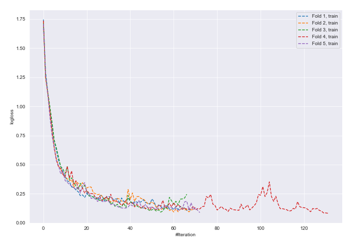
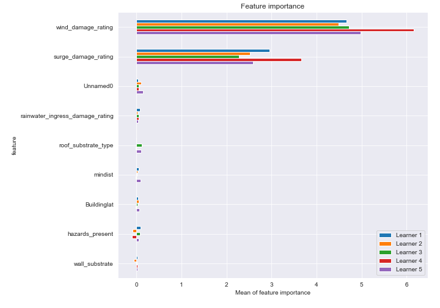
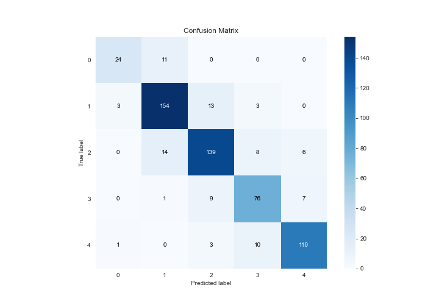
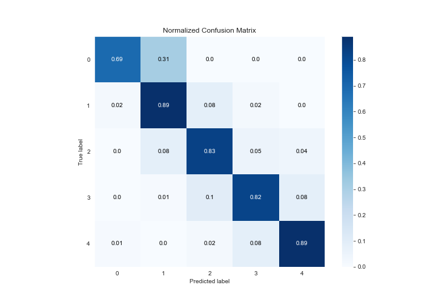
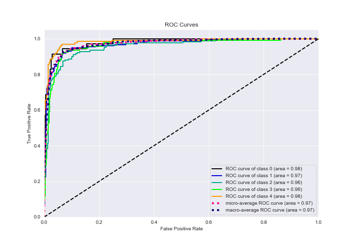
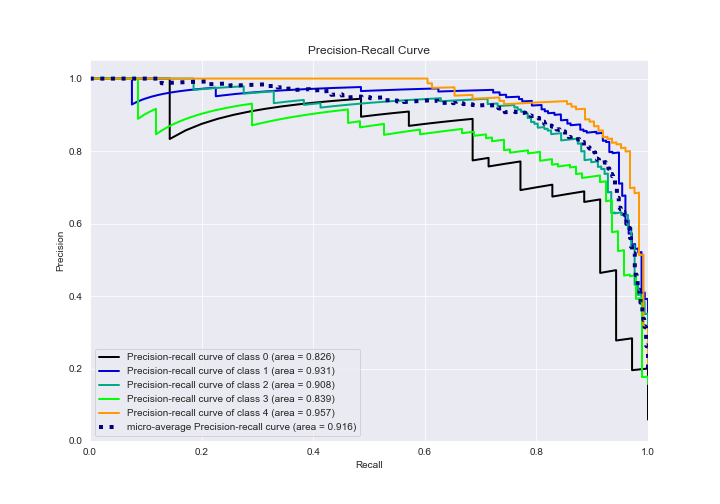

# Summary of 13_NeuralNetwork_SelectedFeatures

[<< Go back](../README.md)

## Neural Network
- **n_jobs**: -1
- **dense_1_size**: 16
- **dense_2_size**: 16
- **learning_rate**: 0.05
- **num_class**: 5
- **explain_level**: 2

## Validation
 - **validation_type**: kfold
 - **k_folds**: 5
 - **shuffle**: True
 - **stratify**: True

## Optimized metric
logloss

## Training time

123.3 seconds

### Metric details
|           |         0 |          1 |          2 |         3 |          4 |   accuracy |   macro avg |   weighted avg |   logloss |
|:----------|----------:|-----------:|-----------:|----------:|-----------:|-----------:|------------:|---------------:|----------:|
| precision |  0.857143 |   0.855556 |   0.847561 |  0.783505 |   0.894309 |   0.849662 |    0.847615 |       0.850193 |  0.540222 |
| recall    |  0.685714 |   0.890173 |   0.832335 |  0.817204 |   0.887097 |   0.849662 |    0.822505 |       0.849662 |  0.540222 |
| f1-score  |  0.761905 |   0.872521 |   0.839879 |  0.8      |   0.890688 |   0.849662 |    0.832999 |       0.849186 |  0.540222 |
| support   | 35        | 173        | 167        | 93        | 124        |   0.849662 |  592        |     592        |  0.540222 |

## Confusion matrix
|              |   Predicted as 0 |   Predicted as 1 |   Predicted as 2 |   Predicted as 3 |   Predicted as 4 |
|:-------------|-----------------:|-----------------:|-----------------:|-----------------:|-----------------:|
| Labeled as 0 |               24 |               11 |                0 |                0 |                0 |
| Labeled as 1 |                3 |              154 |               13 |                3 |                0 |
| Labeled as 2 |                0 |               14 |              139 |                8 |                6 |
| Labeled as 3 |                0 |                1 |                9 |               76 |                7 |
| Labeled as 4 |                1 |                0 |                3 |               10 |              110 |

## Learning curves

## Permutation-based Importance

## Confusion Matrix

## Normalized Confusion Matrix

## ROC Curve

## Precision Recall Curve

[<< Go back](../README.md)
