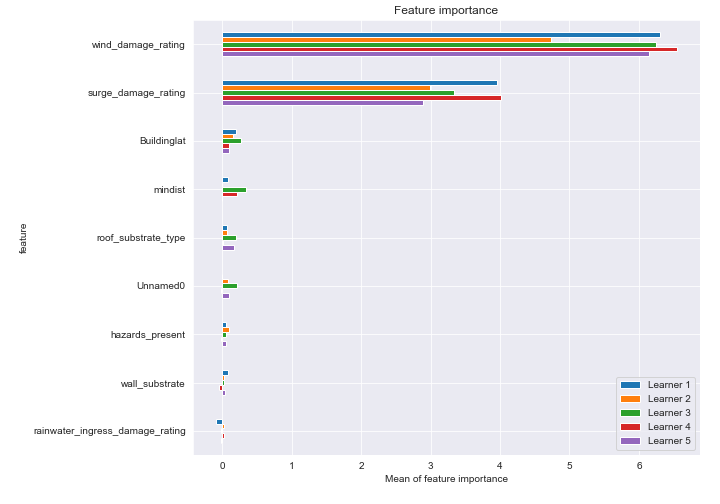

# Summary of 14_NeuralNetwork_SelectedFeatures

[<< Go back](../README.md)

## Neural Network
- **n_jobs**: -1
- **dense_1_size**: 64
- **dense_2_size**: 16
- **learning_rate**: 0.05
- **num_class**: 5
- **explain_level**: 2

## Validation
 - **validation_type**: kfold
 - **k_folds**: 5
 - **shuffle**: True
 - **stratify**: True

## Optimized metric
logloss

## Training time

123.8 seconds

### Metric details
|           |         0 |          1 |          2 |         3 |          4 |   accuracy |   macro avg |   weighted avg |   logloss |
|:----------|----------:|-----------:|-----------:|----------:|-----------:|-----------:|------------:|---------------:|----------:|
| precision |  0.931034 |   0.889535 |   0.836257 |  0.752381 |   0.947826 |   0.863176 |    0.871407 |       0.867623 |  0.705352 |
| recall    |  0.771429 |   0.884393 |   0.856287 |  0.849462 |   0.879032 |   0.863176 |    0.848121 |       0.863176 |  0.705352 |
| f1-score  |  0.84375  |   0.886957 |   0.846154 |  0.79798  |   0.912134 |   0.863176 |    0.857395 |       0.864188 |  0.705352 |
| support   | 35        | 173        | 167        | 93        | 124        |   0.863176 |  592        |     592        |  0.705352 |

## Confusion matrix
|              |   Predicted as 0 |   Predicted as 1 |   Predicted as 2 |   Predicted as 3 |   Predicted as 4 |
|:-------------|-----------------:|-----------------:|-----------------:|-----------------:|-----------------:|
| Labeled as 0 |               27 |                7 |                0 |                1 |                0 |
| Labeled as 1 |                2 |              153 |               16 |                2 |                0 |
| Labeled as 2 |                0 |                9 |              143 |               10 |                5 |
| Labeled as 3 |                0 |                3 |               10 |               79 |                1 |
| Labeled as 4 |                0 |                0 |                2 |               13 |              109 |

## Learning curves

## Permutation-based Importance

## Confusion Matrix

## Normalized Confusion Matrix

## ROC Curve

## Precision Recall Curve

[<< Go back](../README.md)
