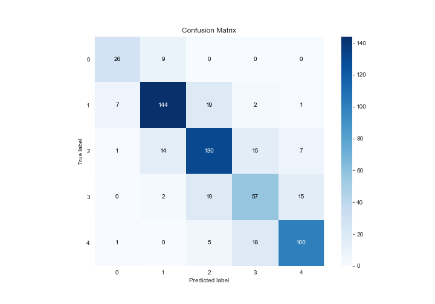

# Summary of 15_NeuralNetwork

[<< Go back](../README.md)

## Neural Network
- **n_jobs**: -1
- **dense_1_size**: 16
- **dense_2_size**: 16
- **learning_rate**: 0.05
- **num_class**: 5
- **explain_level**: 2

## Validation
 - **validation_type**: kfold
 - **k_folds**: 5
 - **shuffle**: True
 - **stratify**: True

## Optimized metric
logloss

## Training time

123.7 seconds

### Metric details
|           |         0 |          1 |          2 |         3 |          4 |   accuracy |   macro avg |   weighted avg |   logloss |
|:----------|----------:|-----------:|-----------:|----------:|-----------:|-----------:|------------:|---------------:|----------:|
| precision |  0.742857 |   0.852071 |   0.751445 |  0.619565 |   0.813008 |   0.771959 |    0.755789 |       0.772521 |   1.18993 |
| recall    |  0.742857 |   0.83237  |   0.778443 |  0.612903 |   0.806452 |   0.771959 |    0.754605 |       0.771959 |   1.18993 |
| f1-score  |  0.742857 |   0.842105 |   0.764706 |  0.616216 |   0.809717 |   0.771959 |    0.75512  |       0.772134 |   1.18993 |
| support   | 35        | 173        | 167        | 93        | 124        |   0.771959 |  592        |     592        |   1.18993 |

## Confusion matrix
|              |   Predicted as 0 |   Predicted as 1 |   Predicted as 2 |   Predicted as 3 |   Predicted as 4 |
|:-------------|-----------------:|-----------------:|-----------------:|-----------------:|-----------------:|
| Labeled as 0 |               26 |                9 |                0 |                0 |                0 |
| Labeled as 1 |                7 |              144 |               19 |                2 |                1 |
| Labeled as 2 |                1 |               14 |              130 |               15 |                7 |
| Labeled as 3 |                0 |                2 |               19 |               57 |               15 |
| Labeled as 4 |                1 |                0 |                5 |               18 |              100 |

## Learning curves

## Permutation-based Importance

## Confusion Matrix

## Normalized Confusion Matrix

## ROC Curve

## Precision Recall Curve

[<< Go back](../README.md)
