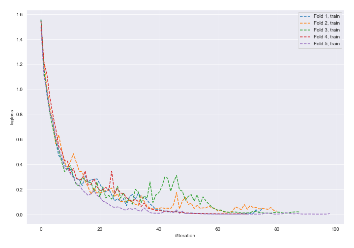
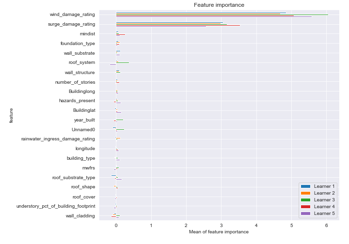
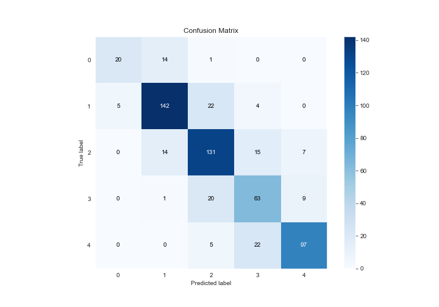
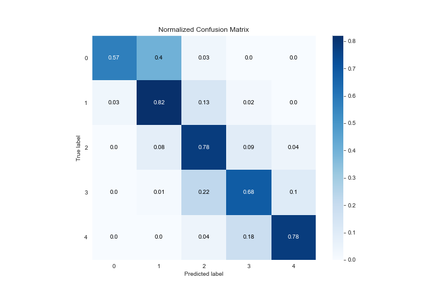
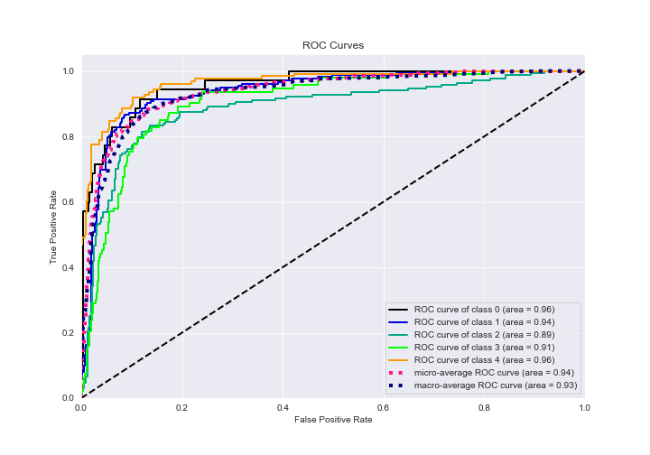
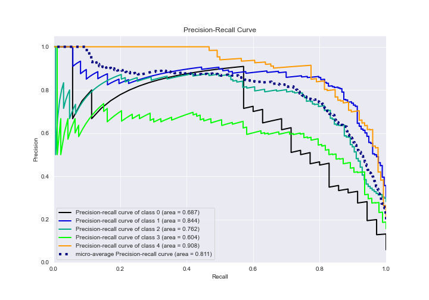

# Summary of 16_NeuralNetwork

[<< Go back](../README.md)

## Neural Network
- **n_jobs**: -1
- **dense_1_size**: 64
- **dense_2_size**: 16
- **learning_rate**: 0.05
- **num_class**: 5
- **explain_level**: 2

## Validation
 - **validation_type**: kfold
 - **k_folds**: 5
 - **shuffle**: True
 - **stratify**: True

## Optimized metric
logloss

## Training time

127.2 seconds

### Metric details
|           |         0 |          1 |          2 |         3 |          4 |   accuracy |   macro avg |   weighted avg |   logloss |
|:----------|----------:|-----------:|-----------:|----------:|-----------:|-----------:|------------:|---------------:|----------:|
| precision |  0.8      |   0.830409 |   0.731844 |  0.605769 |   0.858407 |   0.765203 |    0.765286 |       0.771381 |   1.32962 |
| recall    |  0.571429 |   0.820809 |   0.784431 |  0.677419 |   0.782258 |   0.765203 |    0.727269 |       0.765203 |   1.32962 |
| f1-score  |  0.666667 |   0.825581 |   0.757225 |  0.639594 |   0.818565 |   0.765203 |    0.741527 |       0.766216 |   1.32962 |
| support   | 35        | 173        | 167        | 93        | 124        |   0.765203 |  592        |     592        |   1.32962 |

## Confusion matrix
|              |   Predicted as 0 |   Predicted as 1 |   Predicted as 2 |   Predicted as 3 |   Predicted as 4 |
|:-------------|-----------------:|-----------------:|-----------------:|-----------------:|-----------------:|
| Labeled as 0 |               20 |               14 |                1 |                0 |                0 |
| Labeled as 1 |                5 |              142 |               22 |                4 |                0 |
| Labeled as 2 |                0 |               14 |              131 |               15 |                7 |
| Labeled as 3 |                0 |                1 |               20 |               63 |                9 |
| Labeled as 4 |                0 |                0 |                5 |               22 |               97 |

## Learning curves

## Permutation-based Importance

## Confusion Matrix

## Normalized Confusion Matrix

## ROC Curve

## Precision Recall Curve

[<< Go back](../README.md)
