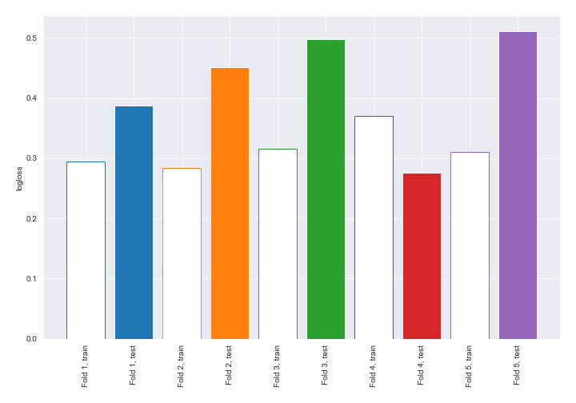
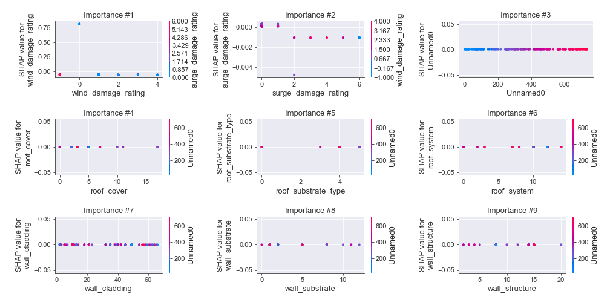
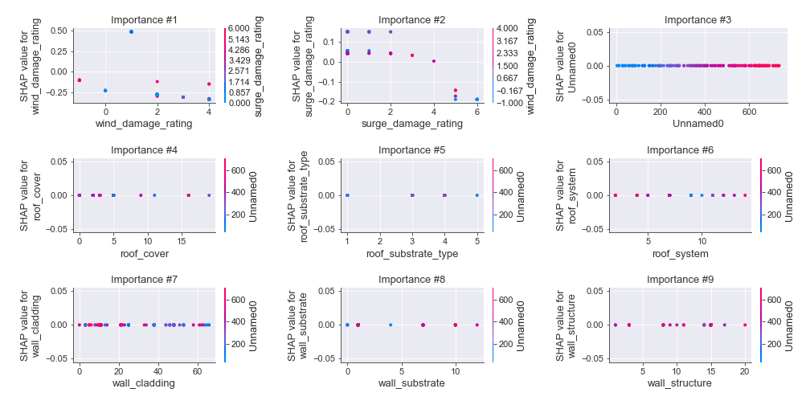

# Summary of 2_DecisionTree

[<< Go back](../README.md)

## Decision Tree
- **n_jobs**: -1
- **criterion**: gini
- **max_depth**: 3
- **num_class**: 5
- **explain_level**: 2

## Validation
 - **validation_type**: kfold
 - **k_folds**: 5
 - **shuffle**: True
 - **stratify**: True

## Optimized metric
logloss

## Training time

41.4 seconds

### Metric details
|           |         0 |          1 |          2 |         3 |          4 |   accuracy |   macro avg |   weighted avg |   logloss |
|:----------|----------:|-----------:|-----------:|----------:|-----------:|-----------:|------------:|---------------:|----------:|
| precision |  0.85     |   0.939759 |   0.919753 |  0.848485 |   0.912    |   0.907095 |    0.893999 |       0.908656 |  0.424781 |
| recall    |  0.971429 |   0.901734 |   0.892216 |  0.903226 |   0.919355 |   0.907095 |    0.917592 |       0.907095 |  0.424781 |
| f1-score  |  0.906667 |   0.920354 |   0.905775 |  0.875    |   0.915663 |   0.907095 |    0.904692 |       0.907325 |  0.424781 |
| support   | 35        | 173        | 167        | 93        | 124        |   0.907095 |  592        |     592        |  0.424781 |

## Confusion matrix
|              |   Predicted as 0 |   Predicted as 1 |   Predicted as 2 |   Predicted as 3 |   Predicted as 4 |
|:-------------|-----------------:|-----------------:|-----------------:|-----------------:|-----------------:|
| Labeled as 0 |               34 |                1 |                0 |                0 |                0 |
| Labeled as 1 |                5 |              156 |               10 |                2 |                0 |
| Labeled as 2 |                1 |                7 |              149 |                4 |                6 |
| Labeled as 3 |                0 |                2 |                2 |               84 |                5 |
| Labeled as 4 |                0 |                0 |                1 |                9 |              114 |

## Learning curves

## Decision Tree 

### Tree #1

### Rules

if (wind_damage_rating > 1.5) and (wind_damage_rating <= 2.5) and (surge_damage_rating <= 2.5) then class: 2 (proba: 91.41%) | based on 128 samples

if (wind_damage_rating <= 1.5) and (wind_damage_rating > 0.5) and (surge_damage_rating <= 1.5) then class: 1 (proba: 97.64%) | based on 127 samples

if (wind_damage_rating > 1.5) and (wind_damage_rating > 2.5) and (wind_damage_rating <= 3.5) then class: 3 (proba: 88.0%) | based on 75 samples

if (wind_damage_rating <= 1.5) and (wind_damage_rating <= 0.5) and (wind_damage_rating <= -0.5) then class: 4 (proba: 100.0%) | based on 49 samples

if (wind_damage_rating > 1.5) and (wind_damage_rating > 2.5) and (wind_damage_rating > 3.5) then class: 4 (proba: 89.58%) | based on 48 samples

if (wind_damage_rating <= 1.5) and (wind_damage_rating <= 0.5) and (wind_damage_rating > -0.5) then class: 0 (proba: 87.1%) | based on 31 samples

if (wind_damage_rating <= 1.5) and (wind_damage_rating > 0.5) and (surge_damage_rating > 1.5) then class: 2 (proba: 75.0%) | based on 8 samples

if (wind_damage_rating > 1.5) and (wind_damage_rating <= 2.5) and (surge_damage_rating > 2.5) then class: 3 (proba: 57.14%) | based on 7 samples

### Tree #2

### Rules

if (wind_damage_rating <= 1.5) and (wind_damage_rating > 0.5) and (surge_damage_rating <= 1.5) then class: 1 (proba: 96.95%) | based on 131 samples

if (wind_damage_rating > 1.5) and (wind_damage_rating <= 2.5) and (surge_damage_rating <= 2.5) then class: 2 (proba: 93.65%) | based on 126 samples

if (wind_damage_rating > 1.5) and (wind_damage_rating > 2.5) and (wind_damage_rating <= 3.5) then class: 3 (proba: 89.19%) | based on 74 samples

if (wind_damage_rating <= 1.5) and (wind_damage_rating <= 0.5) and (wind_damage_rating <= -0.5) then class: 4 (proba: 100.0%) | based on 50 samples

if (wind_damage_rating > 1.5) and (wind_damage_rating > 2.5) and (wind_damage_rating > 3.5) then class: 4 (proba: 86.96%) | based on 46 samples

if (wind_damage_rating <= 1.5) and (wind_damage_rating <= 0.5) and (wind_damage_rating > -0.5) then class: 0 (proba: 84.38%) | based on 32 samples

if (wind_damage_rating > 1.5) and (wind_damage_rating <= 2.5) and (surge_damage_rating > 2.5) then class: 4 (proba: 62.5%) | based on 8 samples

if (wind_damage_rating <= 1.5) and (wind_damage_rating > 0.5) and (surge_damage_rating > 1.5) then class: 2 (proba: 83.33%) | based on 6 samples

### Tree #3

### Rules

if (wind_damage_rating <= 1.5) and (surge_damage_rating <= 3.5) and (wind_damage_rating > 0.5) then class: 1 (proba: 93.33%) | based on 135 samples

if (wind_damage_rating > 1.5) and (wind_damage_rating <= 2.5) and (surge_damage_rating <= 2.5) then class: 2 (proba: 92.74%) | based on 124 samples

if (wind_damage_rating > 1.5) and (wind_damage_rating > 2.5) and (wind_damage_rating <= 3.5) then class: 3 (proba: 88.75%) | based on 80 samples

if (wind_damage_rating <= 1.5) and (surge_damage_rating > 3.5) then class: 4 (proba: 100.0%) | based on 51 samples

if (wind_damage_rating > 1.5) and (wind_damage_rating > 2.5) and (wind_damage_rating > 3.5) then class: 4 (proba: 86.67%) | based on 45 samples

if (wind_damage_rating <= 1.5) and (surge_damage_rating <= 3.5) and (wind_damage_rating <= 0.5) then class: 0 (proba: 84.38%) | based on 32 samples

if (wind_damage_rating > 1.5) and (wind_damage_rating <= 2.5) and (surge_damage_rating > 2.5) then class: 4 (proba: 71.43%) | based on 7 samples

### Tree #4

### Rules

if (wind_damage_rating <= 1.5) and (surge_damage_rating <= 4.0) and (wind_damage_rating > 0.5) then class: 1 (proba: 90.44%) | based on 136 samples

if (wind_damage_rating > 1.5) and (wind_damage_rating <= 2.5) and (surge_damage_rating <= 2.5) then class: 2 (proba: 91.2%) | based on 125 samples

if (wind_damage_rating > 1.5) and (wind_damage_rating > 2.5) and (wind_damage_rating <= 3.5) then class: 3 (proba: 87.01%) | based on 77 samples

if (wind_damage_rating <= 1.5) and (surge_damage_rating > 4.0) then class: 4 (proba: 100.0%) | based on 49 samples

if (wind_damage_rating > 1.5) and (wind_damage_rating > 2.5) and (wind_damage_rating > 3.5) then class: 4 (proba: 85.42%) | based on 48 samples

if (wind_damage_rating <= 1.5) and (surge_damage_rating <= 4.0) and (wind_damage_rating <= 0.5) then class: 0 (proba: 84.38%) | based on 32 samples

if (wind_damage_rating > 1.5) and (wind_damage_rating <= 2.5) and (surge_damage_rating > 2.5) then class: 4 (proba: 57.14%) | based on 7 samples

### Tree #5

### Rules

if (wind_damage_rating <= 1.5) and (surge_damage_rating <= 4.0) and (wind_damage_rating > 0.5) then class: 1 (proba: 92.54%) | based on 134 samples

if (wind_damage_rating > 1.5) and (wind_damage_rating <= 2.5) and (surge_damage_rating <= 2.5) then class: 2 (proba: 93.02%) | based on 129 samples

if (wind_damage_rating > 1.5) and (wind_damage_rating > 2.5) and (wind_damage_rating <= 3.5) then class: 3 (proba: 89.19%) | based on 74 samples

if (wind_damage_rating <= 1.5) and (surge_damage_rating > 4.0) then class: 4 (proba: 100.0%) | based on 52 samples

if (wind_damage_rating > 1.5) and (wind_damage_rating > 2.5) and (wind_damage_rating > 3.5) then class: 4 (proba: 91.11%) | based on 45 samples

if (wind_damage_rating <= 1.5) and (surge_damage_rating <= 4.0) and (wind_damage_rating <= 0.5) then class: 0 (proba: 84.85%) | based on 33 samples

if (wind_damage_rating > 1.5) and (wind_damage_rating <= 2.5) and (surge_damage_rating > 2.5) then class: 3 (proba: 57.14%) | based on 7 samples

## Permutation-based Importance

## Confusion Matrix

## Normalized Confusion Matrix

## ROC Curve

## Precision Recall Curve

## SHAP Importance

## SHAP Dependence plots

### Dependence 0 (Fold 1)

### Dependence 1 (Fold 1)

### Dependence 2 (Fold 1)

### Dependence 3 (Fold 1)

### Dependence 4 (Fold 1)

### Dependence 0 (Fold 2)

### Dependence 1 (Fold 2)

### Dependence 2 (Fold 2)

### Dependence 3 (Fold 2)

### Dependence 4 (Fold 2)

### Dependence 0 (Fold 3)

### Dependence 1 (Fold 3)

### Dependence 2 (Fold 3)

### Dependence 3 (Fold 3)

### Dependence 4 (Fold 3)

### Dependence 0 (Fold 4)

### Dependence 1 (Fold 4)

### Dependence 2 (Fold 4)

### Dependence 3 (Fold 4)

### Dependence 4 (Fold 4)

### Dependence 0 (Fold 5)

### Dependence 1 (Fold 5)

### Dependence 2 (Fold 5)

### Dependence 3 (Fold 5)

### Dependence 4 (Fold 5)

## SHAP Decision plots

### Worst decisions for selected sample 1 (Fold 1)

### Worst decisions for selected sample 1 (Fold 2)

### Worst decisions for selected sample 1 (Fold 3)

### Worst decisions for selected sample 1 (Fold 4)

### Worst decisions for selected sample 1 (Fold 5)

### Worst decisions for selected sample 2 (Fold 1)

### Worst decisions for selected sample 2 (Fold 2)

### Worst decisions for selected sample 2 (Fold 3)

### Worst decisions for selected sample 2 (Fold 4)

### Worst decisions for selected sample 2 (Fold 5)

### Worst decisions for selected sample 3 (Fold 1)

### Worst decisions for selected sample 3 (Fold 2)

### Worst decisions for selected sample 3 (Fold 3)

### Worst decisions for selected sample 3 (Fold 4)

### Worst decisions for selected sample 3 (Fold 5)

### Worst decisions for selected sample 4 (Fold 1)

### Worst decisions for selected sample 4 (Fold 2)

### Worst decisions for selected sample 4 (Fold 3)

### Worst decisions for selected sample 4 (Fold 4)

### Worst decisions for selected sample 4 (Fold 5)

### Best decisions for selected sample 1 (Fold 1)

### Best decisions for selected sample 1 (Fold 2)

### Best decisions for selected sample 1 (Fold 3)

### Best decisions for selected sample 1 (Fold 4)

### Best decisions for selected sample 1 (Fold 5)

### Best decisions for selected sample 2 (Fold 1)

### Best decisions for selected sample 2 (Fold 2)

### Best decisions for selected sample 2 (Fold 3)

### Best decisions for selected sample 2 (Fold 4)

### Best decisions for selected sample 2 (Fold 5)

### Best decisions for selected sample 3 (Fold 1)

### Best decisions for selected sample 3 (Fold 2)

### Best decisions for selected sample 3 (Fold 3)

### Best decisions for selected sample 3 (Fold 4)

### Best decisions for selected sample 3 (Fold 5)

### Best decisions for selected sample 4 (Fold 1)

### Best decisions for selected sample 4 (Fold 2)

### Best decisions for selected sample 4 (Fold 3)

### Best decisions for selected sample 4 (Fold 4)

### Best decisions for selected sample 4 (Fold 5)

[<< Go back](../README.md)
