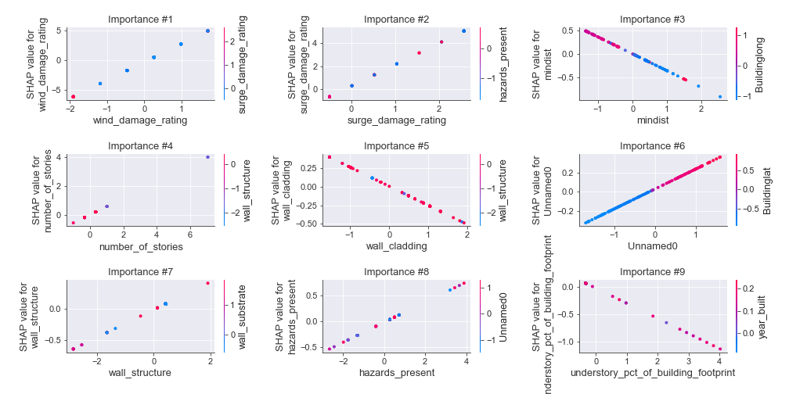
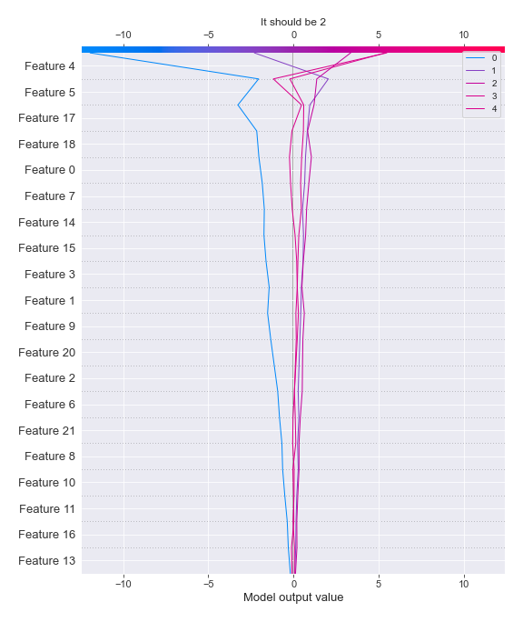
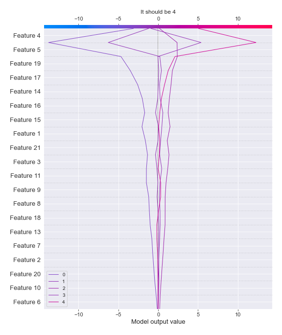
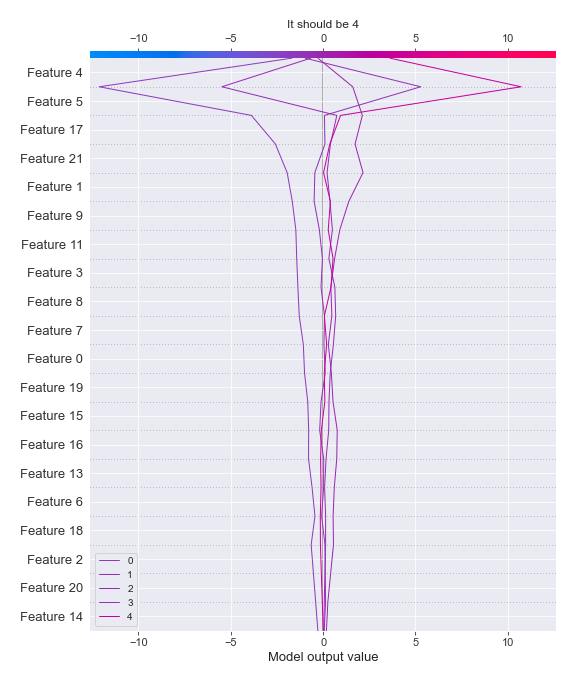

# Summary of 3_Linear

[<< Go back](../README.md)

## Logistic Regression (Linear)
- **n_jobs**: -1
- **num_class**: 5
- **explain_level**: 2

## Validation
 - **validation_type**: kfold
 - **k_folds**: 5
 - **shuffle**: True
 - **stratify**: True

## Optimized metric
logloss

## Training time

36.4 seconds

### Metric details
|           |         0 |          1 |          2 |         3 |          4 |   accuracy |   macro avg |   weighted avg |   logloss |
|:----------|----------:|-----------:|-----------:|----------:|-----------:|-----------:|------------:|---------------:|----------:|
| precision |  0.733333 |   0.792746 |   0.764045 |  0.536585 |   0.758065 |   0.739865 |    0.716955 |       0.733631 |  0.685391 |
| recall    |  0.314286 |   0.884393 |   0.814371 |  0.473118 |   0.758065 |   0.739865 |    0.648847 |       0.739865 |  0.685391 |
| f1-score  |  0.44     |   0.836066 |   0.788406 |  0.502857 |   0.758065 |   0.739865 |    0.665079 |       0.730522 |  0.685391 |
| support   | 35        | 173        | 167        | 93        | 124        |   0.739865 |  592        |     592        |  0.685391 |

## Confusion matrix
|              |   Predicted as 0 |   Predicted as 1 |   Predicted as 2 |   Predicted as 3 |   Predicted as 4 |
|:-------------|-----------------:|-----------------:|-----------------:|-----------------:|-----------------:|
| Labeled as 0 |               11 |               24 |                0 |                0 |                0 |
| Labeled as 1 |                3 |              153 |               14 |                2 |                1 |
| Labeled as 2 |                0 |               14 |              136 |                9 |                8 |
| Labeled as 3 |                0 |                2 |               26 |               44 |               21 |
| Labeled as 4 |                1 |                0 |                2 |               27 |               94 |

## Learning curves

## Coefficients

### Coefficients learner #1
|                                      |            0 |          1 |          2 |           3 |           4 |
|:-------------------------------------|-------------:|-----------:|-----------:|------------:|------------:|
| intercept                            | -3.5272      |  0.867511  |  2.03031   |  0.641804   | -0.0124226  |
| Unnamed0                             | -0.616818    | -0.0513672 |  0.510406  |  0.450049   | -0.29227    |
| Buildinglat                          |  0.658501    | -0.060927  | -0.6907    | -0.228566   |  0.321693   |
| longitude                            |  0.150222    |  0.0129849 |  0.137308  | -0.145223   | -0.155292   |
| hazards_present                      | -0.249535    |  0.173634  | -0.0367659 |  0.117583   | -0.00491645 |
| wind_damage_rating                   | -5.49468     | -2.47423   |  1.06765   |  3.13832    |  3.76294    |
| surge_damage_rating                  | -3.31257     | -2.55098   | -0.182689  |  2.02642    |  4.01981    |
| rainwater_ingress_damage_rating      | -0.0298102   |  0.138434  | -0.0333505 | -0.103813   |  0.0285397  |
| building_type                        |  0.0117716   |  0.184393  |  0.113714  | -0.131415   | -0.178464   |
| number_of_stories                    | -0.343309    |  0.39563   |  0.383686  |  0.408436   | -0.844443   |
| understory_pct_of_building_footprint |  0.294114    |  0.0113473 |  0.0261757 | -0.293069   | -0.0385675  |
| year_built                           |  0.0262397   |  0.472908  | -0.297833  | -0.00410775 | -0.197207   |
| roof_shape                           |  0.0794803   |  0.0471994 |  0.122193  | -0.195899   | -0.0529739  |
| mwfrs                                |  0.173179    | -0.108606  |  0.122212  | -0.195832   |  0.00904658 |
| foundation_type                      |  0.226488    | -0.140703  | -0.259372  |  0.289439   | -0.115852   |
| wall_structure                       |  0.252209    | -0.20111   | -0.0567297 |  0.242119   | -0.236488   |
| wall_substrate                       | -0.00713547  |  0.0543984 | -0.0872832 | -0.0832719  |  0.123292   |
| wall_cladding                        |  0.0637043   | -0.0402895 | -0.100148  | -0.0939549  |  0.170688   |
| roof_system                          | -0.584877    |  0.0532677 |  0.171755  |  0.00609549 |  0.353759   |
| roof_substrate_type                  | -7.87921e-06 |  0.0354894 | -0.23183   |  0.0687641  |  0.127584   |
| roof_cover                           | -0.132118    |  0.0422738 |  0.194856  | -0.170127   |  0.0651151  |
| Buildinglong                         |  0.150266    |  0.0164624 |  0.128196  | -0.139652   | -0.155273   |
| mindist                              |  0.239078    | -0.261583  |  0.192295  | -0.184636   |  0.0148455  |

### Coefficients learner #2
|                                      |           0 |          1 |          2 |          3 |          4 |
|:-------------------------------------|------------:|-----------:|-----------:|-----------:|-----------:|
| intercept                            | -3.50211    |  0.74089   |  2.04571   |  0.786236  | -0.070728  |
| Unnamed0                             | -0.577918   |  0.0814665 |  0.573847  |  0.374437  | -0.451833  |
| Buildinglat                          |  0.661258   |  0.0540679 | -0.820922  | -0.176993  |  0.28259   |
| longitude                            |  0.199883   |  0.0191879 |  0.0989976 | -0.120213  | -0.197855  |
| hazards_present                      | -0.0641317  |  0.0983268 |  0.0254328 |  0.0902645 | -0.149892  |
| wind_damage_rating                   | -5.50817    | -2.7163    |  1.23113   |  3.20139   |  3.79195   |
| surge_damage_rating                  | -3.43496    | -2.51207   | -0.0665098 |  2.03843   |  3.97511   |
| rainwater_ingress_damage_rating      | -0.00173737 |  0.0678451 | -0.027379  | -0.0142103 | -0.0245184 |
| building_type                        | -0.196078   |  0.054994  |  0.226488  |  0.0224678 | -0.107872  |
| number_of_stories                    | -0.254748   |  0.329362  |  0.300257  |  0.489158  | -0.864029  |
| understory_pct_of_building_footprint |  0.240603   |  0.109529  | -0.08468   | -0.232042  | -0.0334107 |
| year_built                           | -0.0249815  |  0.394752  | -0.232767  |  0.0161238 | -0.153127  |
| roof_shape                           |  0.0815847  | -0.055002  |  0.125673  | -0.099124  | -0.0531318 |
| mwfrs                                |  0.197032   | -0.287394  |  0.0494007 |  0.0107187 |  0.0302429 |
| foundation_type                      |  0.275224   | -0.184699  | -0.241594  |  0.138203  |  0.0128663 |
| wall_structure                       |  0.0966461  |  0.158138  | -0.0275577 |  0.312548  | -0.539775  |
| wall_substrate                       | -0.0849712  | -0.0484513 |  0.049295  |  0.132724  | -0.0485961 |
| wall_cladding                        |  0.135937   |  0.0756089 |  0.0363899 | -0.206217  | -0.0417187 |
| roof_system                          | -0.365325   | -0.020627  |  0.122761  | -0.13206   |  0.39525   |
| roof_substrate_type                  |  0.415944   | -0.0395311 | -0.273229  | -0.165719  |  0.0625361 |
| roof_cover                           | -0.182095   | -0.013663  |  0.127944  | -0.0923091 |  0.160124  |
| Buildinglong                         |  0.199907   |  0.0226601 |  0.091419  | -0.116592  | -0.197394  |
| mindist                              |  0.221834   | -0.116254  |  0.267765  | -0.304366  | -0.0689775 |

### Coefficients learner #3
|                                      |          0 |          1 |          2 |          3 |           4 |
|:-------------------------------------|-----------:|-----------:|-----------:|-----------:|------------:|
| intercept                            | -3.65971   |  0.763669  |  2.11691   |  0.733197  |  0.0459323  |
| Unnamed0                             | -0.58239   |  0.188853  |  0.320394  |  0.198594  | -0.125452   |
| Buildinglat                          |  0.535708  | -0.240026  | -0.512714  | -0.0385605 |  0.255592   |
| longitude                            |  0.140721  |  0.0382576 |  0.0867194 | -0.190852  | -0.0748461  |
| hazards_present                      | -0.237241  |  0.23667   | -0.044622  |  0.167592  | -0.122399   |
| wind_damage_rating                   | -5.46541   | -2.53156   |  1.16501   |  3.1904    |  3.64155    |
| surge_damage_rating                  | -3.43021   | -2.5047    | -0.049031  |  2.06623   |  3.91771    |
| rainwater_ingress_damage_rating      | -0.05616   |  0.0683624 |  0.0625802 | -0.0771824 |  0.00239973 |
| building_type                        |  0.203729  |  0.0934945 |  0.0346777 | -0.110675  | -0.221226   |
| number_of_stories                    | -0.266634  |  0.376428  |  0.303157  |  0.44735   | -0.860302   |
| understory_pct_of_building_footprint |  0.287368  | -0.0841353 | -0.0255301 | -0.147155  | -0.0305474  |
| year_built                           |  0.115294  |  0.495889  | -0.217376  | -0.096664  | -0.297143   |
| roof_shape                           |  0.135806  |  0.138677  |  0.0887531 | -0.11902   | -0.244216   |
| mwfrs                                |  0.326497  | -0.20557   |  0.0406601 | -0.12726   | -0.0343271  |
| foundation_type                      |  0.425703  | -0.244072  | -0.286812  |  0.168322  | -0.0631415  |
| wall_structure                       |  0.370358  |  0.107782  | -0.0962719 | -0.027429  | -0.354439   |
| wall_substrate                       |  0.249327  |  0.0406059 | -0.165472  | -0.197161  |  0.0727007  |
| wall_cladding                        |  0.0815317 |  0.242478  | -0.032793  | -0.154907  | -0.13631    |
| roof_system                          | -0.505384  |  0.134107  |  0.0452325 |  0.0124298 |  0.313614   |
| roof_substrate_type                  |  0.0514586 | -0.0446858 | -0.0709663 | -0.101328  |  0.165522   |
| roof_cover                           | -0.225236  | -0.0553299 |  0.116189  | -0.0286924 |  0.193069   |
| Buildinglong                         |  0.140754  |  0.0417118 |  0.0769609 | -0.184526  | -0.0749002  |
| mindist                              |  0.0777039 | -0.0607398 |  0.246882  | -0.219402  | -0.0444438  |

### Coefficients learner #4
|                                      |          0 |           1 |           2 |          3 |          4 |
|:-------------------------------------|-----------:|------------:|------------:|-----------:|-----------:|
| intercept                            | -3.55869   |  0.952331   |  2.08259    |  0.749229  | -0.225459  |
| Unnamed0                             | -0.477007  |  0.0739601  |  0.620533   |  0.208128  | -0.425613  |
| Buildinglat                          |  0.620165  | -0.097213   | -0.794386   | -0.115254  |  0.386688  |
| longitude                            |  0.100211  |  0.089978   |  0.184564   | -0.169042  | -0.205711  |
| hazards_present                      | -0.165376  |  0.174891   |  0.0335957  |  0.19261   | -0.23572   |
| wind_damage_rating                   | -5.48655   | -2.46068    |  1.12305    |  3.0851    |  3.73908   |
| surge_damage_rating                  | -3.23098   | -2.42504    | -0.165802   |  1.84462   |  3.9772    |
| rainwater_ingress_damage_rating      |  0.0794397 |  0.0577636  | -0.00954218 | -0.100733  | -0.0269277 |
| building_type                        |  0.28926   |  0.123346   |  0.0598435  | -0.0706775 | -0.401772  |
| number_of_stories                    | -0.339918  |  0.482441   |  0.417403   |  0.565089  | -1.12502   |
| understory_pct_of_building_footprint |  0.347179  | -0.0419514  | -0.0532234  | -0.276291  |  0.024287  |
| year_built                           | -0.0242485 |  0.252259   | -0.197701   |  0.0524245 | -0.0827339 |
| roof_shape                           |  0.158198  |  0.0592742  |  0.124389   | -0.0762581 | -0.265602  |
| mwfrs                                |  0.185588  | -0.190562   |  0.111519   | -0.0798447 | -0.0267005 |
| foundation_type                      |  0.273401  | -0.213784   | -0.127593   |  0.126152  | -0.0581758 |
| wall_structure                       |  0.275166  | -0.0364242  | -0.0928013  |  0.226203  | -0.372144  |
| wall_substrate                       |  0.0191264 |  0.0571464  | -0.118594   | -0.0316805 |  0.0740014 |
| wall_cladding                        |  0.0363556 |  0.0325837  |  0.0330928  | -0.257812  |  0.15578   |
| roof_system                          | -0.489161  |  0.00545968 |  0.112283   | -0.0214916 |  0.39291   |
| roof_substrate_type                  |  0.384302  | -0.00415166 | -0.187063   | -0.140897  | -0.0521908 |
| roof_cover                           | -0.408378  |  0.0951336  |  0.200813   | -0.0532184 |  0.16565   |
| Buildinglong                         |  0.10022   |  0.0906549  |  0.181113   | -0.165858  | -0.206129  |
| mindist                              |  0.26284   | -0.0903115  |  0.2828     | -0.358373  | -0.0969564 |

### Coefficients learner #5
|                                      |           0 |           1 |          2 |           3 |           4 |
|:-------------------------------------|------------:|------------:|-----------:|------------:|------------:|
| intercept                            | -3.53143    |  0.871517   |  2.07463   |  0.682668   | -0.0973908  |
| Unnamed0                             | -0.251149   | -0.322007   |  0.630738  |  0.256671   | -0.314254   |
| Buildinglat                          |  0.129649   |  0.23854    | -0.807889  | -0.00302177 |  0.442722   |
| longitude                            |  0.117115   | -0.0112328  |  0.145528  | -0.1283     | -0.12311    |
| hazards_present                      | -0.064463   |  0.222581   | -0.0666533 | -0.0247878  | -0.0666769  |
| wind_damage_rating                   | -5.56505    | -2.50402    |  1.03846   |  3.3023     |  3.72832    |
| surge_damage_rating                  | -3.24592    | -2.51801    | -0.247344  |  2.08095    |  3.93032    |
| rainwater_ingress_damage_rating      | -0.0218378  |  0.144793   |  0.0457522 | -0.109453   | -0.0592543  |
| building_type                        | -0.10819    |  0.172886   |  0.197492  | -0.012918   | -0.24927    |
| number_of_stories                    | -0.219748   |  0.191989   |  0.330404  |  0.504299   | -0.806944   |
| understory_pct_of_building_footprint | -0.00696243 | -0.0509074  |  0.118813  | -0.0955913  |  0.034648   |
| year_built                           |  0.129127   |  0.299825   | -0.276357  | -0.0763168  | -0.0762775  |
| roof_shape                           |  0.0996157  |  0.123491   |  0.150405  | -0.163108   | -0.210403   |
| mwfrs                                |  0.320672   | -0.278944   | -0.0404668 | -0.0654683  |  0.0642072  |
| foundation_type                      |  0.161955   | -0.278096   | -0.287424  |  0.239522   |  0.164042   |
| wall_structure                       |  0.408686   | -0.139316   | -0.126301  |  0.296376   | -0.439446   |
| wall_substrate                       |  0.0691484  | -0.0143345  | -0.186151  |  0.0216951  |  0.109642   |
| wall_cladding                        |  0.189293   |  0.111384   | -0.0723248 | -0.270905   |  0.0425532  |
| roof_system                          | -0.716367   |  0.193572   |  0.190715  | -0.0396534  |  0.371733   |
| roof_substrate_type                  |  0.308823   | -0.0322809  | -0.0937625 | -0.178553   | -0.00422642 |
| roof_cover                           |  0.0030614  | -0.018941   |  0.129586  | -0.135463   |  0.0217564  |
| Buildinglong                         |  0.117144   | -0.00851641 |  0.138078  | -0.123583   | -0.123123   |
| mindist                              |  0.353553   | -0.108076   |  0.395284  | -0.386709   | -0.254053   |

## Permutation-based Importance

## Confusion Matrix

## Normalized Confusion Matrix

## ROC Curve

## Precision Recall Curve

## SHAP Importance

## SHAP Dependence plots

### Dependence 0 (Fold 1)

### Dependence 1 (Fold 1)

### Dependence 2 (Fold 1)

### Dependence 3 (Fold 1)

### Dependence 4 (Fold 1)

### Dependence 0 (Fold 2)

### Dependence 1 (Fold 2)

### Dependence 2 (Fold 2)

### Dependence 3 (Fold 2)

### Dependence 4 (Fold 2)

### Dependence 0 (Fold 3)

### Dependence 1 (Fold 3)

### Dependence 2 (Fold 3)

### Dependence 3 (Fold 3)

### Dependence 4 (Fold 3)

### Dependence 0 (Fold 4)

### Dependence 1 (Fold 4)

### Dependence 2 (Fold 4)

### Dependence 3 (Fold 4)

### Dependence 4 (Fold 4)

### Dependence 0 (Fold 5)

### Dependence 1 (Fold 5)

### Dependence 2 (Fold 5)

### Dependence 3 (Fold 5)

### Dependence 4 (Fold 5)

## SHAP Decision plots

### Worst decisions for selected sample 1 (Fold 1)

### Worst decisions for selected sample 1 (Fold 2)

### Worst decisions for selected sample 1 (Fold 3)

### Worst decisions for selected sample 1 (Fold 4)

### Worst decisions for selected sample 1 (Fold 5)

### Worst decisions for selected sample 2 (Fold 1)

### Worst decisions for selected sample 2 (Fold 2)

### Worst decisions for selected sample 2 (Fold 3)

### Worst decisions for selected sample 2 (Fold 4)

### Worst decisions for selected sample 2 (Fold 5)

### Worst decisions for selected sample 3 (Fold 1)

### Worst decisions for selected sample 3 (Fold 2)

### Worst decisions for selected sample 3 (Fold 3)

### Worst decisions for selected sample 3 (Fold 4)

### Worst decisions for selected sample 3 (Fold 5)

### Worst decisions for selected sample 4 (Fold 1)

### Worst decisions for selected sample 4 (Fold 2)

### Worst decisions for selected sample 4 (Fold 3)

### Worst decisions for selected sample 4 (Fold 4)

### Worst decisions for selected sample 4 (Fold 5)

### Best decisions for selected sample 1 (Fold 1)

### Best decisions for selected sample 1 (Fold 2)

### Best decisions for selected sample 1 (Fold 3)

### Best decisions for selected sample 1 (Fold 4)

### Best decisions for selected sample 1 (Fold 5)

### Best decisions for selected sample 2 (Fold 1)

### Best decisions for selected sample 2 (Fold 2)

### Best decisions for selected sample 2 (Fold 3)

### Best decisions for selected sample 2 (Fold 4)

### Best decisions for selected sample 2 (Fold 5)

### Best decisions for selected sample 3 (Fold 1)

### Best decisions for selected sample 3 (Fold 2)

### Best decisions for selected sample 3 (Fold 3)

### Best decisions for selected sample 3 (Fold 4)

### Best decisions for selected sample 3 (Fold 5)

### Best decisions for selected sample 4 (Fold 1)

### Best decisions for selected sample 4 (Fold 2)

### Best decisions for selected sample 4 (Fold 3)

### Best decisions for selected sample 4 (Fold 4)

### Best decisions for selected sample 4 (Fold 5)

[<< Go back](../README.md)
