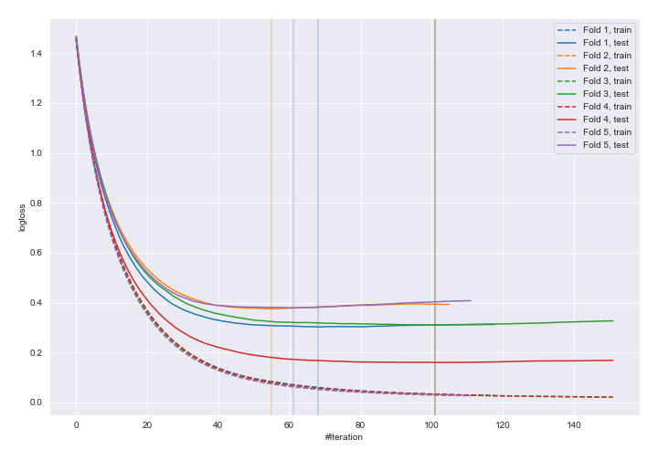
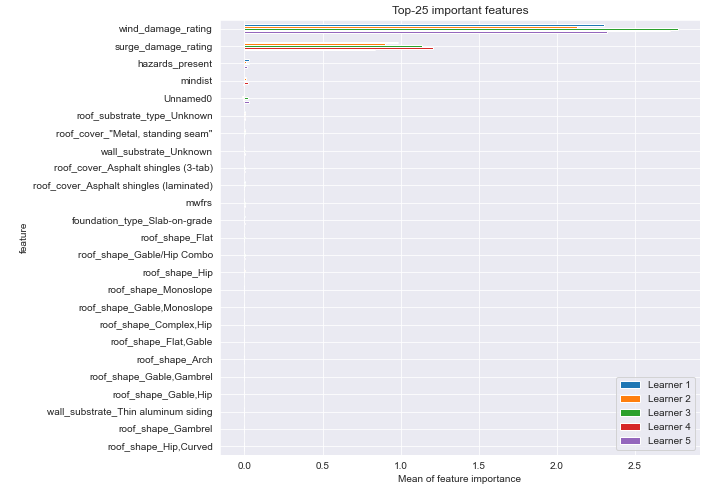
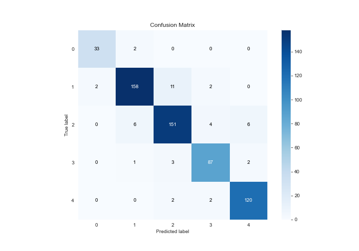
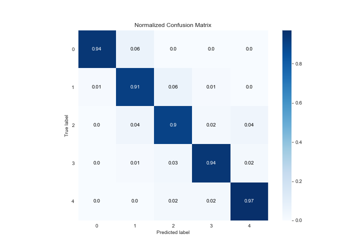
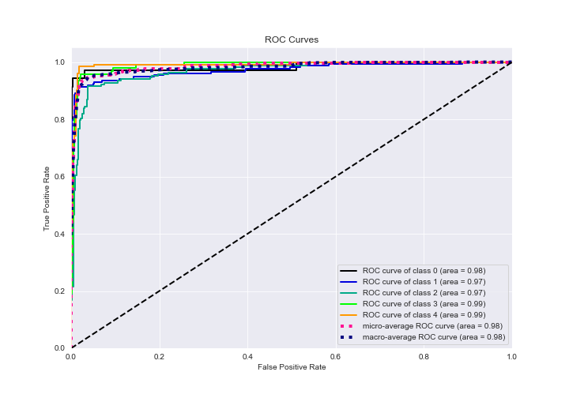
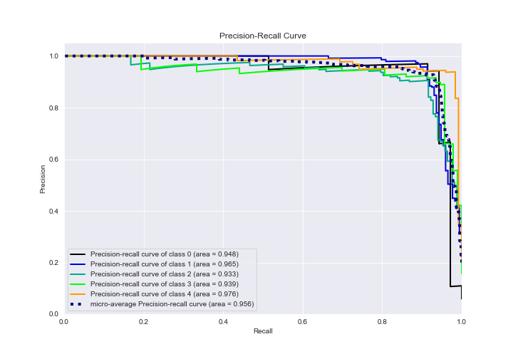

# Summary of 4_Default_Xgboost_categorical_mix

[<< Go back](../README.md)

## Extreme Gradient Boosting (Xgboost)
- **n_jobs**: -1
- **objective**: multi:softprob
- **eta**: 0.075
- **max_depth**: 6
- **min_child_weight**: 1
- **subsample**: 1.0
- **colsample_bytree**: 1.0
- **eval_metric**: mlogloss
- **num_class**: 5
- **explain_level**: 2

## Validation
 - **validation_type**: kfold
 - **k_folds**: 5
 - **shuffle**: True
 - **stratify**: True

## Optimized metric
logloss

## Training time

41.1 seconds

### Metric details
|           |         0 |          1 |          2 |         3 |          4 |   accuracy |   macro avg |   weighted avg |   logloss |
|:----------|----------:|-----------:|-----------:|----------:|-----------:|-----------:|------------:|---------------:|----------:|
| precision |  0.942857 |   0.946108 |   0.904192 |  0.915789 |   0.9375   |   0.927365 |    0.929289 |       0.927525 |  0.305642 |
| recall    |  0.942857 |   0.913295 |   0.904192 |  0.935484 |   0.967742 |   0.927365 |    0.932714 |       0.927365 |  0.305642 |
| f1-score  |  0.942857 |   0.929412 |   0.904192 |  0.925532 |   0.952381 |   0.927365 |    0.930875 |       0.927294 |  0.305642 |
| support   | 35        | 173        | 167        | 93        | 124        |   0.927365 |  592        |     592        |  0.305642 |

## Confusion matrix
|              |   Predicted as 0 |   Predicted as 1 |   Predicted as 2 |   Predicted as 3 |   Predicted as 4 |
|:-------------|-----------------:|-----------------:|-----------------:|-----------------:|-----------------:|
| Labeled as 0 |               33 |                2 |                0 |                0 |                0 |
| Labeled as 1 |                2 |              158 |               11 |                2 |                0 |
| Labeled as 2 |                0 |                6 |              151 |                4 |                6 |
| Labeled as 3 |                0 |                1 |                3 |               87 |                2 |
| Labeled as 4 |                0 |                0 |                2 |                2 |              120 |

## Learning curves

## Permutation-based Importance

## Confusion Matrix

## Normalized Confusion Matrix

## ROC Curve

## Precision Recall Curve

[<< Go back](../README.md)
