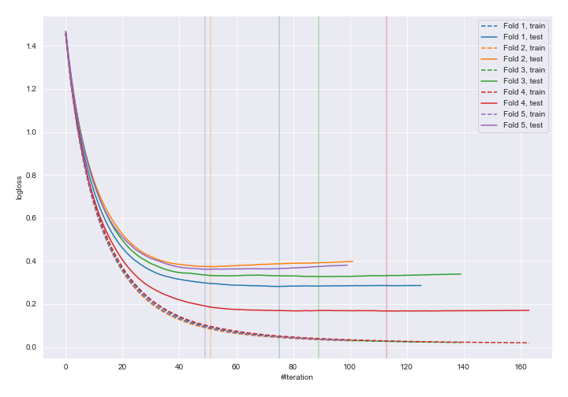
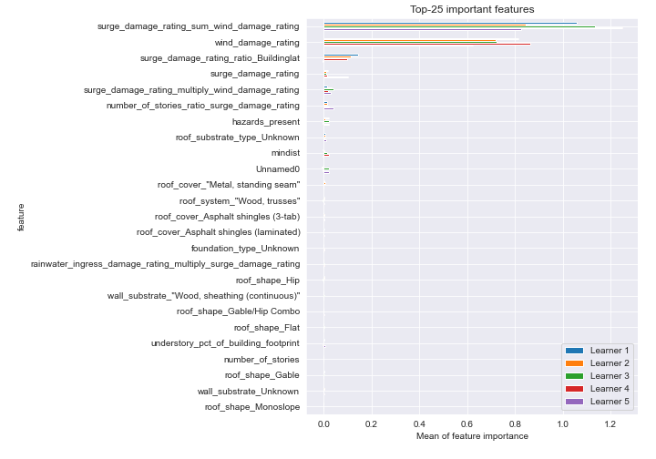
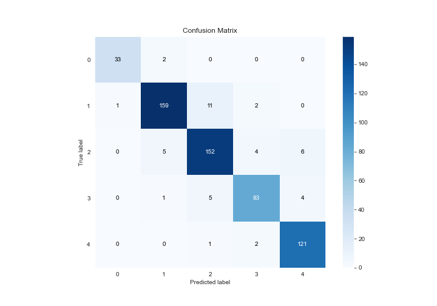
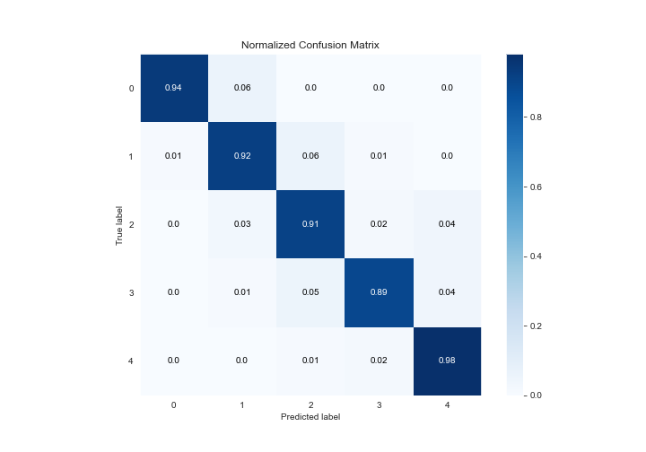
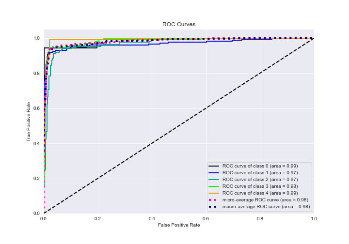
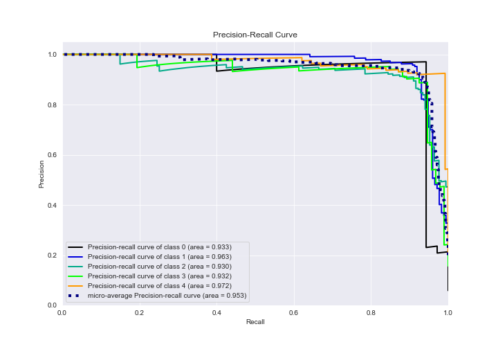

# Summary of 4_Default_Xgboost_categorical_mix_GoldenFeatures

[<< Go back](../README.md)

## Extreme Gradient Boosting (Xgboost)
- **n_jobs**: -1
- **objective**: multi:softprob
- **eta**: 0.075
- **max_depth**: 6
- **min_child_weight**: 1
- **subsample**: 1.0
- **colsample_bytree**: 1.0
- **eval_metric**: mlogloss
- **num_class**: 5
- **explain_level**: 2

## Validation
 - **validation_type**: kfold
 - **k_folds**: 5
 - **shuffle**: True
 - **stratify**: True

## Optimized metric
logloss

## Training time

65.8 seconds

### Metric details
|           |         0 |          1 |          2 |         3 |          4 |   accuracy |   macro avg |   weighted avg |   logloss |
|:----------|----------:|-----------:|-----------:|----------:|-----------:|-----------:|------------:|---------------:|----------:|
| precision |  0.970588 |   0.952096 |   0.899408 |  0.912088 |   0.923664 |   0.925676 |    0.931569 |       0.926086 |  0.302365 |
| recall    |  0.942857 |   0.919075 |   0.91018  |  0.892473 |   0.975806 |   0.925676 |    0.928078 |       0.925676 |  0.302365 |
| f1-score  |  0.956522 |   0.935294 |   0.904762 |  0.902174 |   0.94902  |   0.925676 |    0.929554 |       0.925608 |  0.302365 |
| support   | 35        | 173        | 167        | 93        | 124        |   0.925676 |  592        |     592        |  0.302365 |

## Confusion matrix
|              |   Predicted as 0 |   Predicted as 1 |   Predicted as 2 |   Predicted as 3 |   Predicted as 4 |
|:-------------|-----------------:|-----------------:|-----------------:|-----------------:|-----------------:|
| Labeled as 0 |               33 |                2 |                0 |                0 |                0 |
| Labeled as 1 |                1 |              159 |               11 |                2 |                0 |
| Labeled as 2 |                0 |                5 |              152 |                4 |                6 |
| Labeled as 3 |                0 |                1 |                5 |               83 |                4 |
| Labeled as 4 |                0 |                0 |                1 |                2 |              121 |

## Learning curves

## Permutation-based Importance

## Confusion Matrix

## Normalized Confusion Matrix

## ROC Curve

## Precision Recall Curve

[<< Go back](../README.md)
