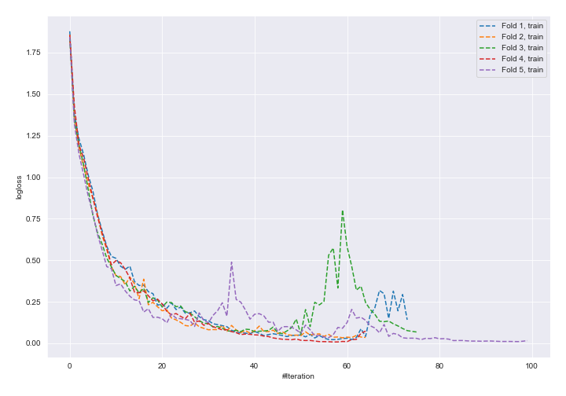
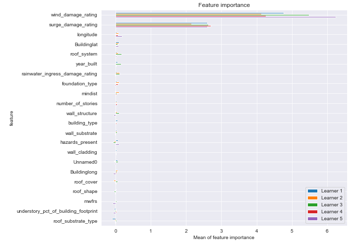
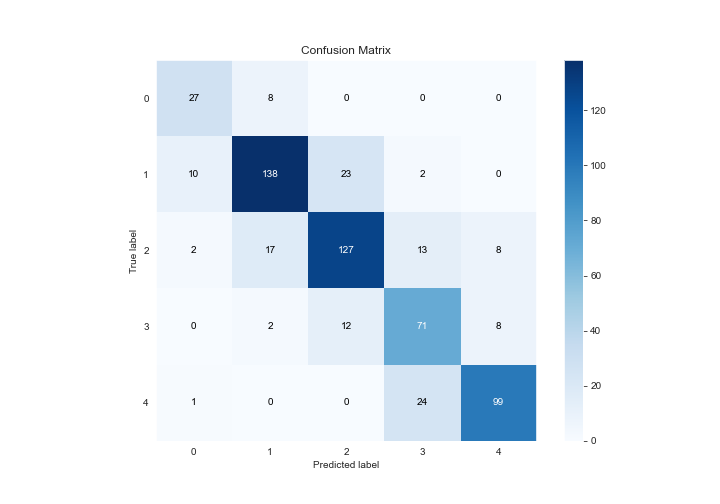
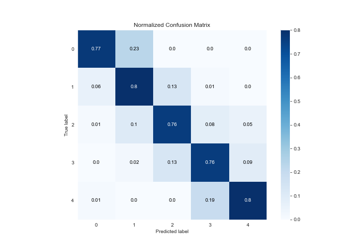
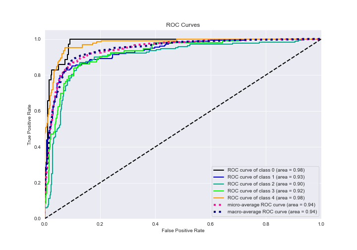
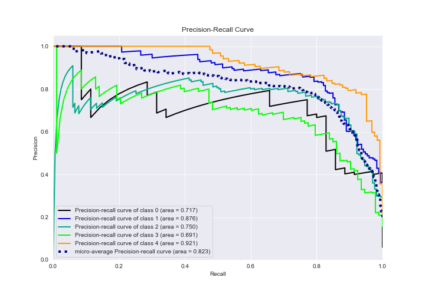

# Summary of 5_Default_NeuralNetwork

[<< Go back](../README.md)

## Neural Network
- **n_jobs**: -1
- **dense_1_size**: 32
- **dense_2_size**: 16
- **learning_rate**: 0.05
- **num_class**: 5
- **explain_level**: 2

## Validation
 - **validation_type**: kfold
 - **k_folds**: 5
 - **shuffle**: True
 - **stratify**: True

## Optimized metric
logloss

## Training time

17.3 seconds

### Metric details
|           |         0 |          1 |          2 |         3 |          4 |   accuracy |   macro avg |   weighted avg |   logloss |
|:----------|----------:|-----------:|-----------:|----------:|-----------:|-----------:|------------:|---------------:|----------:|
| precision |  0.675    |   0.836364 |   0.783951 |  0.645455 |   0.86087  |   0.780405 |    0.760328 |       0.78718  |  0.953027 |
| recall    |  0.771429 |   0.797688 |   0.760479 |  0.763441 |   0.798387 |   0.780405 |    0.778285 |       0.780405 |  0.953027 |
| f1-score  |  0.72     |   0.816568 |   0.772036 |  0.699507 |   0.828452 |   0.780405 |    0.767313 |       0.782396 |  0.953027 |
| support   | 35        | 173        | 167        | 93        | 124        |   0.780405 |  592        |     592        |  0.953027 |

## Confusion matrix
|              |   Predicted as 0 |   Predicted as 1 |   Predicted as 2 |   Predicted as 3 |   Predicted as 4 |
|:-------------|-----------------:|-----------------:|-----------------:|-----------------:|-----------------:|
| Labeled as 0 |               27 |                8 |                0 |                0 |                0 |
| Labeled as 1 |               10 |              138 |               23 |                2 |                0 |
| Labeled as 2 |                2 |               17 |              127 |               13 |                8 |
| Labeled as 3 |                0 |                2 |               12 |               71 |                8 |
| Labeled as 4 |                1 |                0 |                0 |               24 |               99 |

## Learning curves

## Permutation-based Importance

## Confusion Matrix

## Normalized Confusion Matrix

## ROC Curve

## Precision Recall Curve

[<< Go back](../README.md)
