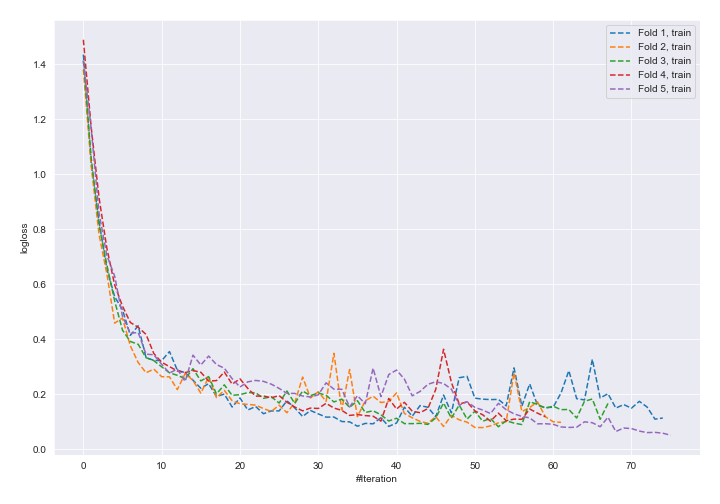
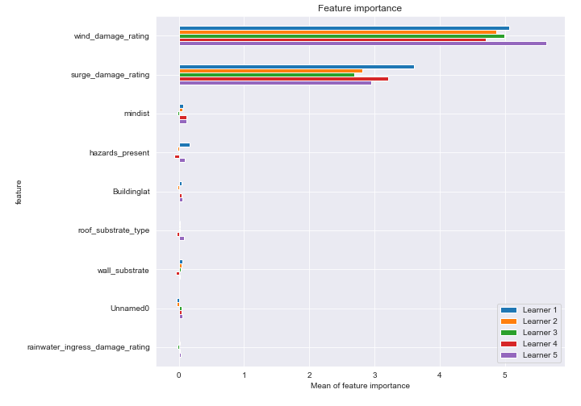
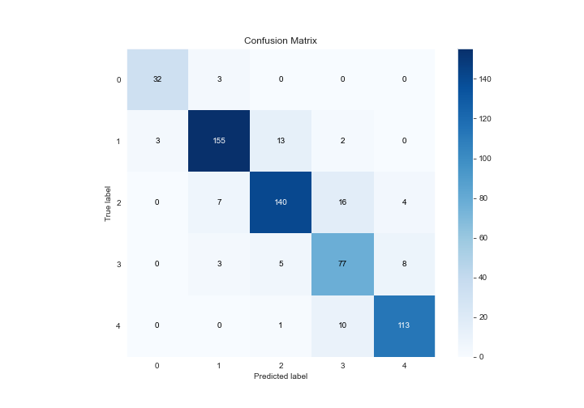
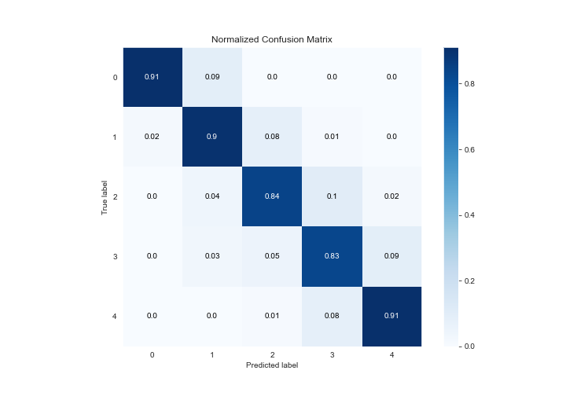
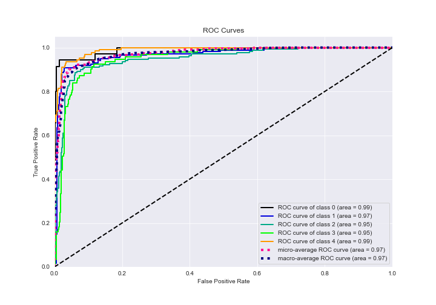
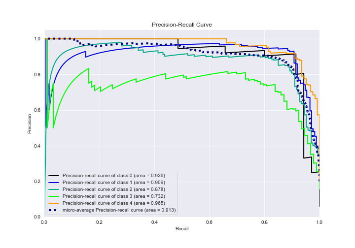

# Summary of 5_Default_NeuralNetwork_SelectedFeatures

[<< Go back](../README.md)

## Neural Network
- **n_jobs**: -1
- **dense_1_size**: 32
- **dense_2_size**: 16
- **learning_rate**: 0.05
- **num_class**: 5
- **explain_level**: 2

## Validation
 - **validation_type**: kfold
 - **k_folds**: 5
 - **shuffle**: True
 - **stratify**: True

## Optimized metric
logloss

## Training time

66.7 seconds

### Metric details
|           |         0 |          1 |          2 |         3 |          4 |   accuracy |   macro avg |   weighted avg |   logloss |
|:----------|----------:|-----------:|-----------:|----------:|-----------:|-----------:|------------:|---------------:|----------:|
| precision |  0.914286 |   0.922619 |   0.880503 |  0.733333 |   0.904    |   0.873311 |    0.870948 |       0.87661  |  0.528024 |
| recall    |  0.914286 |   0.895954 |   0.838323 |  0.827957 |   0.91129  |   0.873311 |    0.877562 |       0.873311 |  0.528024 |
| f1-score  |  0.914286 |   0.909091 |   0.858896 |  0.777778 |   0.907631 |   0.873311 |    0.873536 |       0.874304 |  0.528024 |
| support   | 35        | 173        | 167        | 93        | 124        |   0.873311 |  592        |     592        |  0.528024 |

## Confusion matrix
|              |   Predicted as 0 |   Predicted as 1 |   Predicted as 2 |   Predicted as 3 |   Predicted as 4 |
|:-------------|-----------------:|-----------------:|-----------------:|-----------------:|-----------------:|
| Labeled as 0 |               32 |                3 |                0 |                0 |                0 |
| Labeled as 1 |                3 |              155 |               13 |                2 |                0 |
| Labeled as 2 |                0 |                7 |              140 |               16 |                4 |
| Labeled as 3 |                0 |                3 |                5 |               77 |                8 |
| Labeled as 4 |                0 |                0 |                1 |               10 |              113 |

## Learning curves

## Permutation-based Importance

## Confusion Matrix

## Normalized Confusion Matrix

## ROC Curve

## Precision Recall Curve

[<< Go back](../README.md)
