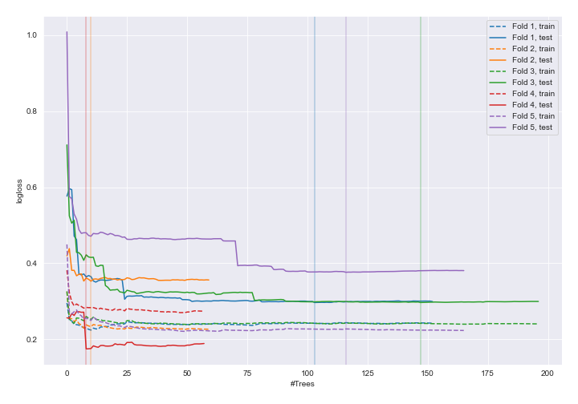
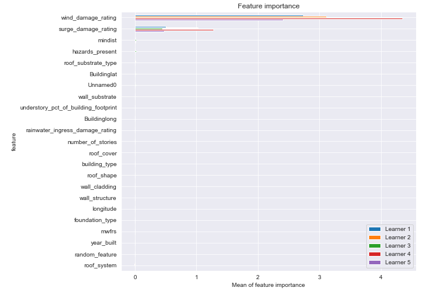
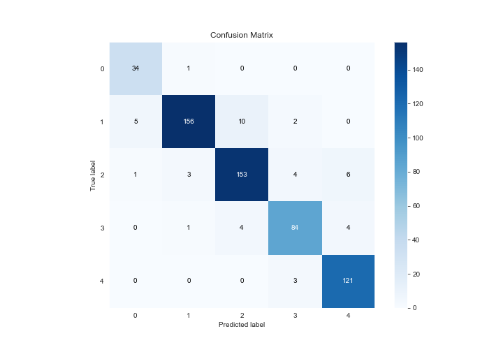
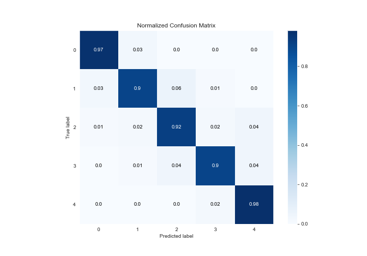
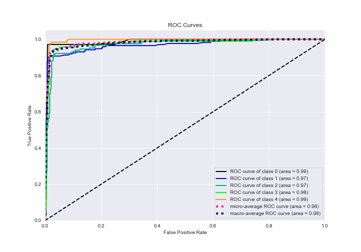
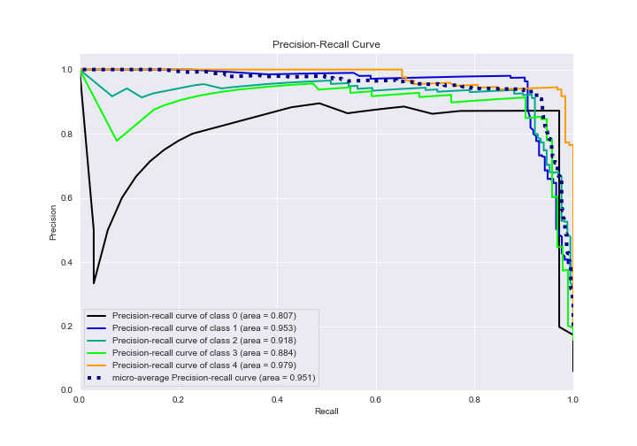

# Summary of 6_Default_RandomForest_RandomFeature

[<< Go back](../README.md)

## Random Forest
- **n_jobs**: -1
- **criterion**: gini
- **max_features**: 0.9
- **min_samples_split**: 30
- **max_depth**: 4
- **eval_metric_name**: logloss
- **num_class**: 5
- **explain_level**: 1

## Validation
 - **validation_type**: kfold
 - **k_folds**: 5
 - **shuffle**: True
 - **stratify**: True

## Optimized metric
logloss

## Training time

54.6 seconds

### Metric details
|           |         0 |          1 |          2 |         3 |          4 |   accuracy |   macro avg |   weighted avg |   logloss |
|:----------|----------:|-----------:|-----------:|----------:|-----------:|-----------:|------------:|---------------:|----------:|
| precision |  0.85     |   0.968944 |   0.916168 |  0.903226 |   0.923664 |   0.925676 |    0.9124   |       0.927216 |  0.299559 |
| recall    |  0.971429 |   0.901734 |   0.916168 |  0.903226 |   0.975806 |   0.925676 |    0.933673 |       0.925676 |  0.299559 |
| f1-score  |  0.906667 |   0.934132 |   0.916168 |  0.903226 |   0.94902  |   0.925676 |    0.921842 |       0.925704 |  0.299559 |
| support   | 35        | 173        | 167        | 93        | 124        |   0.925676 |  592        |     592        |  0.299559 |

## Confusion matrix
|              |   Predicted as 0 |   Predicted as 1 |   Predicted as 2 |   Predicted as 3 |   Predicted as 4 |
|:-------------|-----------------:|-----------------:|-----------------:|-----------------:|-----------------:|
| Labeled as 0 |               34 |                1 |                0 |                0 |                0 |
| Labeled as 1 |                5 |              156 |               10 |                2 |                0 |
| Labeled as 2 |                1 |                3 |              153 |                4 |                6 |
| Labeled as 3 |                0 |                1 |                4 |               84 |                4 |
| Labeled as 4 |                0 |                0 |                0 |                3 |              121 |

## Learning curves

## Permutation-based Importance

## Confusion Matrix

## Normalized Confusion Matrix

## ROC Curve

## Precision Recall Curve

[<< Go back](../README.md)
