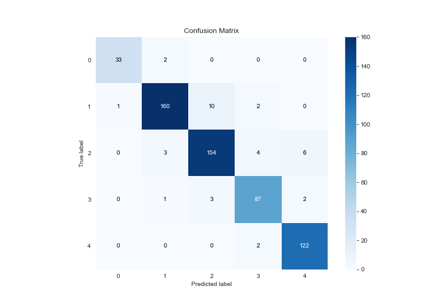

# Summary of Ensemble

[<< Go back](../README.md)

## Ensemble structure
| Model                                     |   Weight |
|:------------------------------------------|---------:|
| 12_DecisionTree                           |        4 |
| 14_NeuralNetwork_SelectedFeatures         |        1 |
| 4_Default_Xgboost                         |        1 |
| 6_Default_RandomForest                    |        1 |
| 6_Default_RandomForest_GoldenFeatures     |        1 |
| 7_RandomForest                            |        2 |
| 8_Xgboost_GoldenFeatures_SelectedFeatures |        6 |

### Metric details
|           |         0 |          1 |          2 |         3 |          4 |   accuracy |   macro avg |   weighted avg |   logloss |
|:----------|----------:|-----------:|-----------:|----------:|-----------:|-----------:|------------:|---------------:|----------:|
| precision |  0.970588 |   0.963855 |   0.922156 |  0.915789 |   0.938462 |   0.939189 |    0.94217  |       0.93962  |  0.259152 |
| recall    |  0.942857 |   0.924855 |   0.922156 |  0.935484 |   0.983871 |   0.939189 |    0.941845 |       0.939189 |  0.259152 |
| f1-score  |  0.956522 |   0.943953 |   0.922156 |  0.925532 |   0.96063  |   0.939189 |    0.941758 |       0.939146 |  0.259152 |
| support   | 35        | 173        | 167        | 93        | 124        |   0.939189 |  592        |     592        |  0.259152 |

## Confusion matrix
|              |   Predicted as 0 |   Predicted as 1 |   Predicted as 2 |   Predicted as 3 |   Predicted as 4 |
|:-------------|-----------------:|-----------------:|-----------------:|-----------------:|-----------------:|
| Labeled as 0 |               33 |                2 |                0 |                0 |                0 |
| Labeled as 1 |                1 |              160 |               10 |                2 |                0 |
| Labeled as 2 |                0 |                3 |              154 |                4 |                6 |
| Labeled as 3 |                0 |                1 |                3 |               87 |                2 |
| Labeled as 4 |                0 |                0 |                0 |                2 |              122 |

## Learning curves

## Confusion Matrix

## Normalized Confusion Matrix

## ROC Curve

## Precision Recall Curve

[<< Go back](../README.md)
