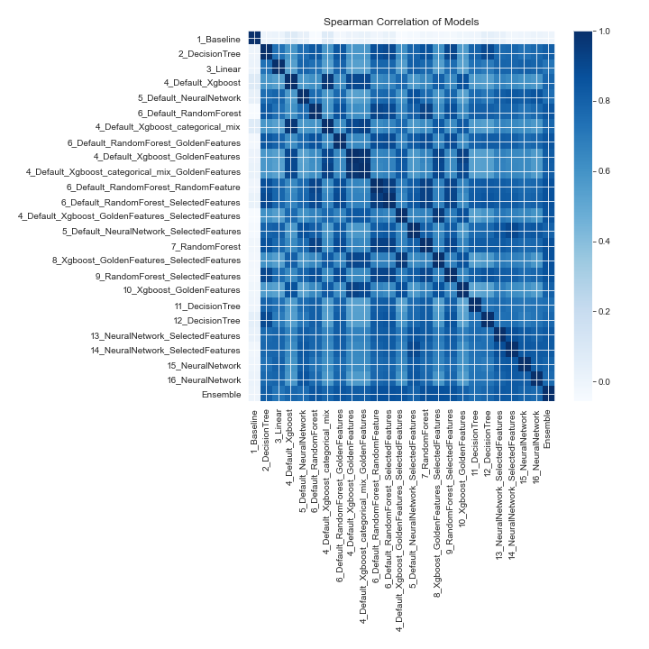

# AutoML Leaderboard

| Best model   | name                                                                                                             | model_type     | metric_type   |   metric_value |   train_time |
|:-------------|:-----------------------------------------------------------------------------------------------------------------|:---------------|:--------------|---------------:|-------------:|
|              | [1_Baseline](1_Baseline/README.md)                                                                               | Baseline       | logloss       |       1.50198  |        24.42 |
|              | [2_DecisionTree](2_DecisionTree/README.md)                                                                       | Decision Tree  | logloss       |       0.424781 |        42.03 |
|              | [3_Linear](3_Linear/README.md)                                                                                   | Linear         | logloss       |       0.685391 |        37.09 |
|              | [4_Default_Xgboost](4_Default_Xgboost/README.md)                                                                 | Xgboost        | logloss       |       0.303244 |        51.56 |
|              | [5_Default_NeuralNetwork](5_Default_NeuralNetwork/README.md)                                                     | Neural Network | logloss       |       0.953027 |        17.81 |
|              | [6_Default_RandomForest](6_Default_RandomForest/README.md)                                                       | Random Forest  | logloss       |       0.290891 |        46.39 |
|              | [4_Default_Xgboost_categorical_mix](4_Default_Xgboost_categorical_mix/README.md)                                 | Xgboost        | logloss       |       0.305642 |        41.62 |
|              | [6_Default_RandomForest_GoldenFeatures](6_Default_RandomForest_GoldenFeatures/README.md)                         | Random Forest  | logloss       |       0.311893 |        59.49 |
|              | [4_Default_Xgboost_GoldenFeatures](4_Default_Xgboost_GoldenFeatures/README.md)                                   | Xgboost        | logloss       |       0.302056 |        77.64 |
|              | [4_Default_Xgboost_categorical_mix_GoldenFeatures](4_Default_Xgboost_categorical_mix_GoldenFeatures/README.md)   | Xgboost        | logloss       |       0.302365 |        66.34 |
|              | [6_Default_RandomForest_RandomFeature](6_Default_RandomForest_RandomFeature/README.md)                           | Random Forest  | logloss       |       0.299559 |        55.16 |
|              | [6_Default_RandomForest_SelectedFeatures](6_Default_RandomForest_SelectedFeatures/README.md)                     | Random Forest  | logloss       |       0.29646  |        75.11 |
|              | [4_Default_Xgboost_GoldenFeatures_SelectedFeatures](4_Default_Xgboost_GoldenFeatures_SelectedFeatures/README.md) | Xgboost        | logloss       |       0.292667 |        94.74 |
|              | [5_Default_NeuralNetwork_SelectedFeatures](5_Default_NeuralNetwork_SelectedFeatures/README.md)                   | Neural Network | logloss       |       0.528024 |        67.15 |
|              | [7_RandomForest](7_RandomForest/README.md)                                                                       | Random Forest  | logloss       |       0.295107 |        99.58 |
|              | [8_Xgboost_GoldenFeatures_SelectedFeatures](8_Xgboost_GoldenFeatures_SelectedFeatures/README.md)                 | Xgboost        | logloss       |       0.286431 |       117.83 |
|              | [9_RandomForest_SelectedFeatures](9_RandomForest_SelectedFeatures/README.md)                                     | Random Forest  | logloss       |       0.323528 |       119.07 |
|              | [10_Xgboost_GoldenFeatures](10_Xgboost_GoldenFeatures/README.md)                                                 | Xgboost        | logloss       |       0.29773  |       142.29 |
|              | [11_DecisionTree](11_DecisionTree/README.md)                                                                     | Decision Tree  | logloss       |       0.66824  |       133.83 |
|              | [12_DecisionTree](12_DecisionTree/README.md)                                                                     | Decision Tree  | logloss       |       0.535536 |       152.96 |
|              | [13_NeuralNetwork_SelectedFeatures](13_NeuralNetwork_SelectedFeatures/README.md)                                 | Neural Network | logloss       |       0.540222 |       123.7  |
|              | [14_NeuralNetwork_SelectedFeatures](14_NeuralNetwork_SelectedFeatures/README.md)                                 | Neural Network | logloss       |       0.705352 |       124.2  |
|              | [15_NeuralNetwork](15_NeuralNetwork/README.md)                                                                   | Neural Network | logloss       |       1.18993  |       124.18 |
|              | [16_NeuralNetwork](16_NeuralNetwork/README.md)                                                                   | Neural Network | logloss       |       1.32962  |       127.73 |
| **the best** | [Ensemble](Ensemble/README.md)                                                                                   | Ensemble       | logloss       |       0.259152 |         1.24 |

### AutoML Performance

### AutoML Performance Boxplot

### Features Importance

### Spearman Correlation of Models

