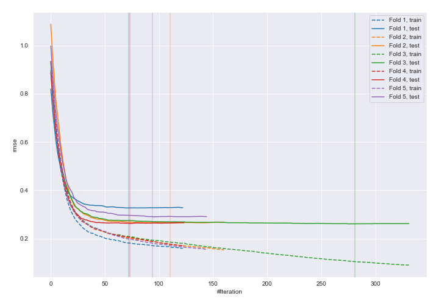
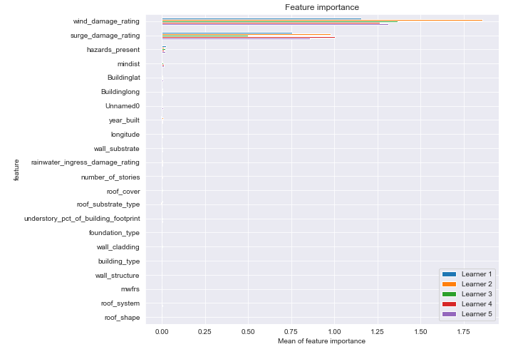
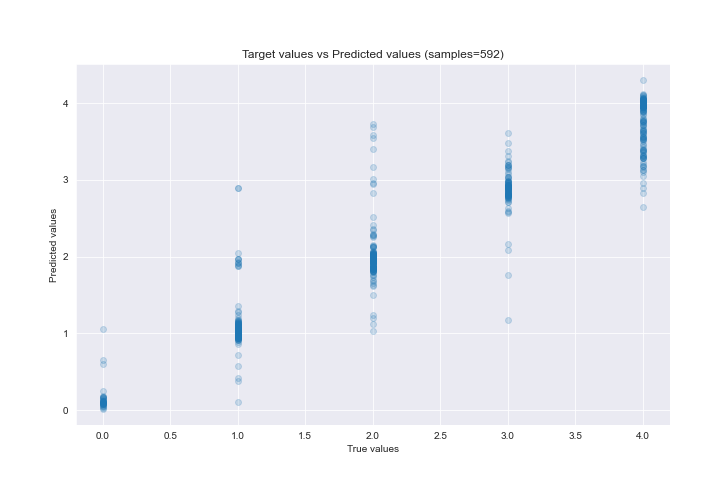
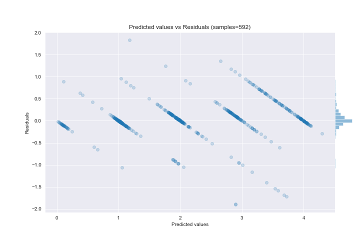

# Summary of 16_CatBoost

[<< Go back](../README.md)

## CatBoost
- **n_jobs**: -1
- **learning_rate**: 0.1
- **depth**: 7
- **rsm**: 1
- **loss_function**: RMSE
- **eval_metric**: RMSE
- **explain_level**: 2

## Validation
 - **validation_type**: kfold
 - **k_folds**: 5
 - **shuffle**: True

## Optimized metric
rmse

## Training time

14.5 seconds

### Metric details:
| Metric   |       Score |
|:---------|------------:|
| MAE      | 0.203903    |
| MSE      | 0.133624    |
| RMSE     | 0.365546    |
| R2       | 0.910694    |
| MAPE     | 4.44185e+13 |

## Learning curves

## Permutation-based Importance

## True vs Predicted

## Predicted vs Residuals

[<< Go back](../README.md)
