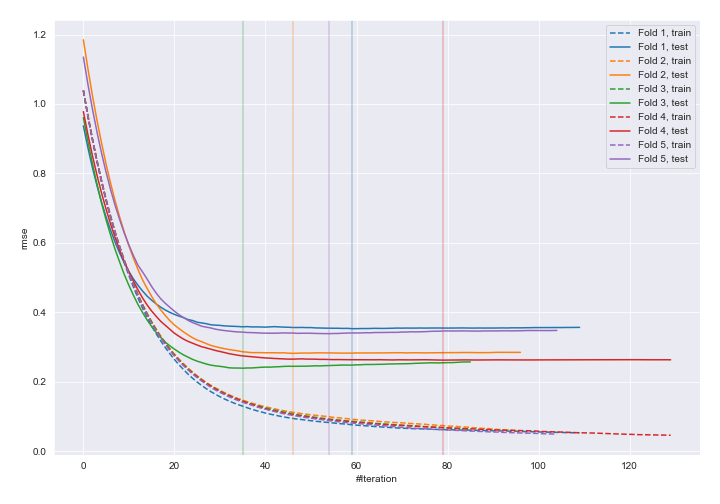
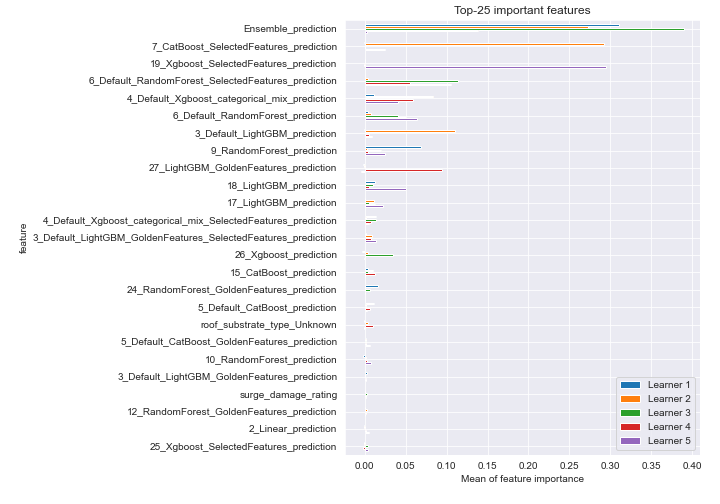
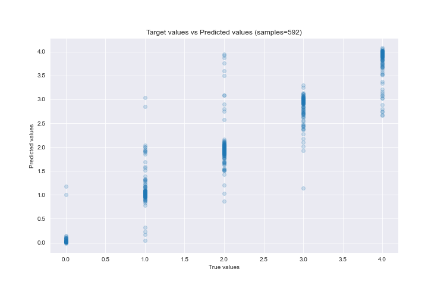
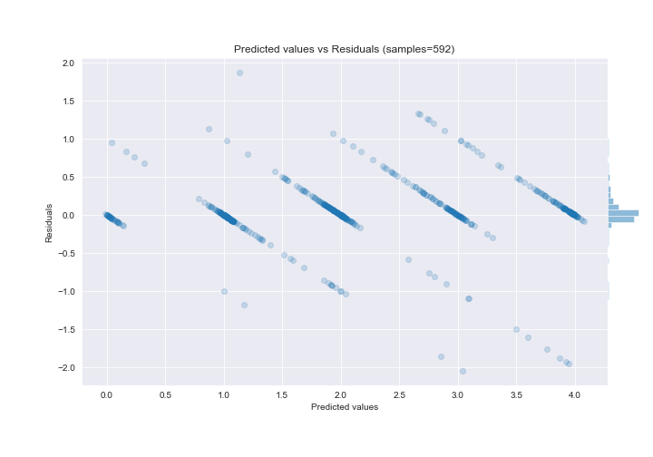

# Summary of 19_Xgboost_SelectedFeatures_Stacked

[<< Go back](../README.md)

## Extreme Gradient Boosting (Xgboost)
- **n_jobs**: -1
- **objective**: reg:squarederror
- **eta**: 0.075
- **max_depth**: 6
- **min_child_weight**: 5
- **subsample**: 1.0
- **colsample_bytree**: 1.0
- **eval_metric**: rmse
- **explain_level**: 2

## Validation
 - **validation_type**: kfold
 - **k_folds**: 5
 - **shuffle**: True

## Optimized metric
rmse

## Training time

73.2 seconds

### Metric details:
| Metric   |       Score |
|:---------|------------:|
| MAE      | 0.188445    |
| MSE      | 0.143264    |
| RMSE     | 0.378502    |
| R2       | 0.904251    |
| MAPE     | 2.83025e+13 |

## Learning curves

## Permutation-based Importance

## True vs Predicted

## Predicted vs Residuals

[<< Go back](../README.md)
