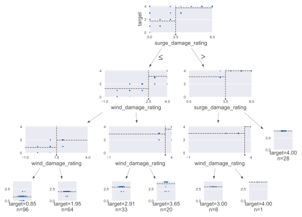

# Summary of 1_DecisionTree

[<< Go back](../README.md)

## Decision Tree
- **n_jobs**: -1
- **criterion**: mse
- **max_depth**: 3
- **explain_level**: 2

## Validation
 - **validation_type**: kfold
 - **k_folds**: 5
 - **shuffle**: True

## Optimized metric
rmse

## Training time

18.7 seconds

### Metric details:
| Metric   |       Score |
|:---------|------------:|
| MAE      | 0.209065    |
| MSE      | 0.16638     |
| RMSE     | 0.407897    |
| R2       | 0.888802    |
| MAPE     | 2.37438e+14 |

## Learning curves

## Decision Tree 

### Tree #1

### Rules

if (surge_damage_rating <= 2.5) and (wind_damage_rating <= 2.5) and (wind_damage_rating <= 1.5) then response: 0.881 | based on 168 samples

if (surge_damage_rating <= 2.5) and (wind_damage_rating <= 2.5) and (wind_damage_rating > 1.5) then response: 1.959 | based on 122 samples

if (surge_damage_rating > 2.5) and (surge_damage_rating > 3.5) then response: 4.0 | based on 71 samples

if (surge_damage_rating <= 2.5) and (wind_damage_rating > 2.5) and (wind_damage_rating <= 3.5) then response: 2.937 | based on 63 samples

if (surge_damage_rating <= 2.5) and (wind_damage_rating > 2.5) and (wind_damage_rating > 3.5) then response: 3.75 | based on 36 samples

if (surge_damage_rating > 2.5) and (surge_damage_rating <= 3.5) and (roof_substrate_type > 2.0) then response: 2.917 | based on 12 samples

if (surge_damage_rating > 2.5) and (surge_damage_rating <= 3.5) and (roof_substrate_type <= 2.0) then response: 4.0 | based on 1 samples

### Tree #2

### Rules

if (surge_damage_rating <= 2.5) and (wind_damage_rating <= 2.5) and (wind_damage_rating <= 1.5) then response: 0.906 | based on 160 samples

if (surge_damage_rating <= 2.5) and (wind_damage_rating <= 2.5) and (wind_damage_rating > 1.5) then response: 1.941 | based on 135 samples

if (surge_damage_rating <= 2.5) and (wind_damage_rating > 2.5) and (wind_damage_rating <= 3.5) then response: 2.939 | based on 66 samples

if (surge_damage_rating > 2.5) and (surge_damage_rating > 3.5) then response: 4.0 | based on 63 samples

if (surge_damage_rating <= 2.5) and (wind_damage_rating > 2.5) and (wind_damage_rating > 3.5) then response: 3.618 | based on 34 samples

if (surge_damage_rating > 2.5) and (surge_damage_rating <= 3.5) and (wind_damage_rating <= 3.5) then response: 2.923 | based on 13 samples

if (surge_damage_rating > 2.5) and (surge_damage_rating <= 3.5) and (wind_damage_rating > 3.5) then response: 4.0 | based on 2 samples

### Tree #3

### Rules

if (surge_damage_rating <= 2.5) and (wind_damage_rating <= 2.5) and (wind_damage_rating <= 1.5) then response: 0.876 | based on 169 samples

if (surge_damage_rating <= 2.5) and (wind_damage_rating <= 2.5) and (wind_damage_rating > 1.5) then response: 1.944 | based on 126 samples

if (surge_damage_rating > 2.5) and (surge_damage_rating > 3.5) then response: 4.0 | based on 69 samples

if (surge_damage_rating <= 2.5) and (wind_damage_rating > 2.5) and (wind_damage_rating <= 3.5) then response: 2.938 | based on 65 samples

if (surge_damage_rating <= 2.5) and (wind_damage_rating > 2.5) and (wind_damage_rating > 3.5) then response: 3.657 | based on 35 samples

if (surge_damage_rating > 2.5) and (surge_damage_rating <= 3.5) and (roof_shape > 0.5) then response: 2.889 | based on 9 samples

if (surge_damage_rating > 2.5) and (surge_damage_rating <= 3.5) and (roof_shape <= 0.5) then response: 4.0 | based on 1 samples

### Tree #4

### Rules

if (surge_damage_rating <= 2.5) and (wind_damage_rating <= 2.5) and (wind_damage_rating <= 1.5) then response: 0.894 | based on 170 samples

if (surge_damage_rating <= 2.5) and (wind_damage_rating <= 2.5) and (wind_damage_rating > 1.5) then response: 1.951 | based on 122 samples

if (surge_damage_rating <= 2.5) and (wind_damage_rating > 2.5) and (wind_damage_rating <= 3.5) then response: 2.942 | based on 69 samples

if (surge_damage_rating > 2.5) and (surge_damage_rating > 3.5) then response: 4.0 | based on 62 samples

if (surge_damage_rating <= 2.5) and (wind_damage_rating > 2.5) and (wind_damage_rating > 3.5) then response: 3.743 | based on 35 samples

if (surge_damage_rating > 2.5) and (surge_damage_rating <= 3.5) and (wind_damage_rating <= 3.5) then response: 3.0 | based on 14 samples

if (surge_damage_rating > 2.5) and (surge_damage_rating <= 3.5) and (wind_damage_rating > 3.5) then response: 4.0 | based on 2 samples

### Tree #5

### Rules

if (surge_damage_rating <= 2.5) and (wind_damage_rating <= 2.5) and (wind_damage_rating <= 1.5) then response: 0.888 | based on 161 samples

if (surge_damage_rating <= 2.5) and (wind_damage_rating <= 2.5) and (wind_damage_rating > 1.5) then response: 1.953 | based on 127 samples

if (surge_damage_rating <= 2.5) and (wind_damage_rating > 2.5) and (wind_damage_rating <= 3.5) then response: 2.884 | based on 69 samples

if (surge_damage_rating > 2.5) and (surge_damage_rating > 3.5) then response: 4.0 | based on 63 samples

if (surge_damage_rating <= 2.5) and (wind_damage_rating > 2.5) and (wind_damage_rating > 3.5) then response: 3.775 | based on 40 samples

if (surge_damage_rating > 2.5) and (surge_damage_rating <= 3.5) and (wind_damage_rating <= 3.5) then response: 2.917 | based on 12 samples

if (surge_damage_rating > 2.5) and (surge_damage_rating <= 3.5) and (wind_damage_rating > 3.5) then response: 4.0 | based on 2 samples

## Permutation-based Importance

## True vs Predicted

## Predicted vs Residuals

## SHAP Importance

## SHAP Dependence plots

### Dependence (Fold 1)

### Dependence (Fold 2)

### Dependence (Fold 3)

### Dependence (Fold 4)

### Dependence (Fold 5)

## SHAP Decision plots

### Top-10 Worst decisions (Fold 1)

### Top-10 Worst decisions (Fold 2)

### Top-10 Worst decisions (Fold 3)

### Top-10 Worst decisions (Fold 4)

### Top-10 Worst decisions (Fold 5)

### Top-10 Best decisions (Fold 1)

### Top-10 Best decisions (Fold 2)

### Top-10 Best decisions (Fold 3)

### Top-10 Best decisions (Fold 4)

### Top-10 Best decisions (Fold 5)

[<< Go back](../README.md)
