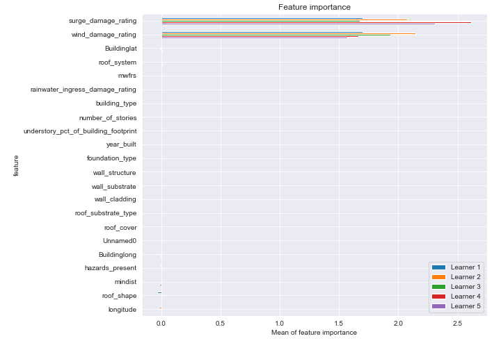
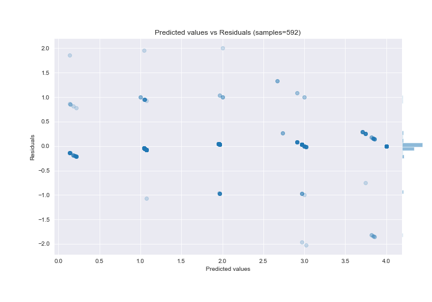

# Summary of 22_DecisionTree

[<< Go back](../README.md)

## Decision Tree
- **n_jobs**: -1
- **criterion**: mse
- **max_depth**: 4
- **explain_level**: 2

## Validation
 - **validation_type**: kfold
 - **k_folds**: 5
 - **shuffle**: True

## Optimized metric
rmse

## Training time

28.4 seconds

### Metric details:
| Metric   |       Score |
|:---------|------------:|
| MAE      | 0.165115    |
| MSE      | 0.149805    |
| RMSE     | 0.387046    |
| R2       | 0.899879    |
| MAPE     | 5.47217e+13 |

## Learning curves

## Decision Tree 

### Tree #1

### Rules

if (surge_damage_rating <= 2.5) and (wind_damage_rating <= 2.5) and (wind_damage_rating <= 1.5) and (wind_damage_rating > 0.5) then response: 1.075 | based on 133 samples

if (surge_damage_rating <= 2.5) and (wind_damage_rating <= 2.5) and (wind_damage_rating > 1.5) and (hazards_present <= 21.5) then response: 1.967 | based on 121 samples

if (surge_damage_rating > 2.5) and (surge_damage_rating > 3.5) then response: 4.0 | based on 71 samples

if (surge_damage_rating <= 2.5) and (wind_damage_rating > 2.5) and (wind_damage_rating <= 3.5) and (wall_structure > 0.5) then response: 2.968 | based on 62 samples

if (surge_damage_rating <= 2.5) and (wind_damage_rating <= 2.5) and (wind_damage_rating <= 1.5) and (wind_damage_rating <= 0.5) then response: 0.143 | based on 35 samples

if (surge_damage_rating <= 2.5) and (wind_damage_rating > 2.5) and (wind_damage_rating > 3.5) and (roof_shape <= 11.5) then response: 3.853 | based on 34 samples

if (surge_damage_rating > 2.5) and (surge_damage_rating <= 3.5) and (wall_structure > 9.0) and (hazards_present <= 18.5) then response: 3.0 | based on 11 samples

if (surge_damage_rating <= 2.5) and (wind_damage_rating > 2.5) and (wind_damage_rating > 3.5) and (roof_shape > 11.5) then response: 2.0 | based on 2 samples

if (surge_damage_rating > 2.5) and (surge_damage_rating <= 3.5) and (wall_structure > 9.0) and (hazards_present > 18.5) then response: 2.0 | based on 1 samples

if (surge_damage_rating > 2.5) and (surge_damage_rating <= 3.5) and (wall_structure <= 9.0) then response: 4.0 | based on 1 samples

if (surge_damage_rating <= 2.5) and (wind_damage_rating > 2.5) and (wind_damage_rating <= 3.5) and (wall_structure <= 0.5) then response: 1.0 | based on 1 samples

if (surge_damage_rating <= 2.5) and (wind_damage_rating <= 2.5) and (wind_damage_rating > 1.5) and (hazards_present > 21.5) then response: 1.0 | based on 1 samples

### Tree #2

### Rules

if (surge_damage_rating <= 2.5) and (wind_damage_rating <= 2.5) and (wind_damage_rating > 1.5) and (Buildinglat <= 30.454) then response: 1.955 | based on 133 samples

if (surge_damage_rating <= 2.5) and (wind_damage_rating <= 2.5) and (wind_damage_rating <= 1.5) and (wind_damage_rating > 0.5) then response: 1.053 | based on 132 samples

if (surge_damage_rating <= 2.5) and (wind_damage_rating > 2.5) and (wind_damage_rating <= 3.5) and (wall_structure > 0.5) then response: 2.969 | based on 65 samples

if (surge_damage_rating > 2.5) and (surge_damage_rating > 3.5) then response: 4.0 | based on 63 samples

if (surge_damage_rating <= 2.5) and (wind_damage_rating > 2.5) and (wind_damage_rating > 3.5) and (longitude > -85.67) then response: 3.71 | based on 31 samples

if (surge_damage_rating <= 2.5) and (wind_damage_rating <= 2.5) and (wind_damage_rating <= 1.5) and (wind_damage_rating <= 0.5) then response: 0.214 | based on 28 samples

if (surge_damage_rating > 2.5) and (surge_damage_rating <= 3.5) and (wind_damage_rating <= 3.5) and (year_built <= 2017.0) then response: 3.0 | based on 12 samples

if (surge_damage_rating <= 2.5) and (wind_damage_rating > 2.5) and (wind_damage_rating > 3.5) and (longitude <= -85.67) then response: 2.667 | based on 3 samples

if (surge_damage_rating > 2.5) and (surge_damage_rating <= 3.5) and (wind_damage_rating > 3.5) then response: 4.0 | based on 2 samples

if (surge_damage_rating <= 2.5) and (wind_damage_rating <= 2.5) and (wind_damage_rating > 1.5) and (Buildinglat > 30.454) then response: 1.0 | based on 2 samples

if (surge_damage_rating > 2.5) and (surge_damage_rating <= 3.5) and (wind_damage_rating <= 3.5) and (year_built > 2017.0) then response: 2.0 | based on 1 samples

if (surge_damage_rating <= 2.5) and (wind_damage_rating > 2.5) and (wind_damage_rating <= 3.5) and (wall_structure <= 0.5) then response: 1.0 | based on 1 samples

### Tree #3

### Rules

if (surge_damage_rating <= 2.5) and (wind_damage_rating <= 2.5) and (wind_damage_rating <= 1.5) and (wind_damage_rating > 0.5) then response: 1.044 | based on 136 samples

if (surge_damage_rating <= 2.5) and (wind_damage_rating <= 2.5) and (wind_damage_rating > 1.5) and (Buildinglat <= 30.454) then response: 1.96 | based on 124 samples

if (surge_damage_rating > 2.5) and (surge_damage_rating > 3.5) then response: 4.0 | based on 69 samples

if (surge_damage_rating <= 2.5) and (wind_damage_rating > 2.5) and (wind_damage_rating <= 3.5) and (wall_structure > 0.5) then response: 2.969 | based on 64 samples

if (surge_damage_rating <= 2.5) and (wind_damage_rating <= 2.5) and (wind_damage_rating <= 1.5) and (wind_damage_rating <= 0.5) then response: 0.182 | based on 33 samples

if (surge_damage_rating <= 2.5) and (wind_damage_rating > 2.5) and (wind_damage_rating > 3.5) and (roof_shape <= 10.5) then response: 3.75 | based on 32 samples

if (surge_damage_rating > 2.5) and (surge_damage_rating <= 3.5) and (roof_shape > 0.5) and (year_built <= 2017.0) then response: 3.0 | based on 8 samples

if (surge_damage_rating <= 2.5) and (wind_damage_rating > 2.5) and (wind_damage_rating > 3.5) and (roof_shape > 10.5) then response: 2.667 | based on 3 samples

if (surge_damage_rating <= 2.5) and (wind_damage_rating <= 2.5) and (wind_damage_rating > 1.5) and (Buildinglat > 30.454) then response: 1.0 | based on 2 samples

if (surge_damage_rating > 2.5) and (surge_damage_rating <= 3.5) and (roof_shape > 0.5) and (year_built > 2017.0) then response: 2.0 | based on 1 samples

if (surge_damage_rating > 2.5) and (surge_damage_rating <= 3.5) and (roof_shape <= 0.5) then response: 4.0 | based on 1 samples

if (surge_damage_rating <= 2.5) and (wind_damage_rating > 2.5) and (wind_damage_rating <= 3.5) and (wall_structure <= 0.5) then response: 1.0 | based on 1 samples

### Tree #4

### Rules

if (surge_damage_rating <= 2.5) and (wind_damage_rating <= 2.5) and (wind_damage_rating <= 1.5) and (wind_damage_rating > 0.5) then response: 1.074 | based on 135 samples

if (surge_damage_rating <= 2.5) and (wind_damage_rating <= 2.5) and (wind_damage_rating > 1.5) and (Buildinglat <= 30.454) then response: 1.967 | based on 120 samples

if (surge_damage_rating > 2.5) and (surge_damage_rating > 3.5) then response: 4.0 | based on 62 samples

if (surge_damage_rating <= 2.5) and (wind_damage_rating > 2.5) and (wind_damage_rating <= 3.5) and (Buildinglong <= -85.411) then response: 3.02 | based on 50 samples

if (surge_damage_rating <= 2.5) and (wind_damage_rating <= 2.5) and (wind_damage_rating <= 1.5) and (wind_damage_rating <= 0.5) then response: 0.2 | based on 35 samples

if (surge_damage_rating <= 2.5) and (wind_damage_rating > 2.5) and (wind_damage_rating > 3.5) and (roof_shape <= 12.5) then response: 3.844 | based on 32 samples

if (surge_damage_rating <= 2.5) and (wind_damage_rating > 2.5) and (wind_damage_rating <= 3.5) and (Buildinglong > -85.411) then response: 2.737 | based on 19 samples

if (surge_damage_rating > 2.5) and (surge_damage_rating <= 3.5) and (wind_damage_rating <= 3.5) then response: 3.0 | based on 14 samples

if (surge_damage_rating <= 2.5) and (wind_damage_rating > 2.5) and (wind_damage_rating > 3.5) and (roof_shape > 12.5) then response: 2.667 | based on 3 samples

if (surge_damage_rating > 2.5) and (surge_damage_rating <= 3.5) and (wind_damage_rating > 3.5) then response: 4.0 | based on 2 samples

if (surge_damage_rating <= 2.5) and (wind_damage_rating <= 2.5) and (wind_damage_rating > 1.5) and (Buildinglat > 30.454) then response: 1.0 | based on 2 samples

### Tree #5

### Rules

if (surge_damage_rating <= 2.5) and (wind_damage_rating <= 2.5) and (wind_damage_rating <= 1.5) and (wind_damage_rating > 0.5) then response: 1.053 | based on 132 samples

if (surge_damage_rating <= 2.5) and (wind_damage_rating <= 2.5) and (wind_damage_rating > 1.5) and (Buildinglat <= 30.454) then response: 1.968 | based on 125 samples

if (surge_damage_rating <= 2.5) and (wind_damage_rating > 2.5) and (wind_damage_rating <= 3.5) and (wall_structure > 0.5) then response: 2.912 | based on 68 samples

if (surge_damage_rating > 2.5) and (surge_damage_rating > 3.5) then response: 4.0 | based on 63 samples

if (surge_damage_rating <= 2.5) and (wind_damage_rating > 2.5) and (wind_damage_rating > 3.5) and (roof_system <= 11.0) then response: 3.821 | based on 39 samples

if (surge_damage_rating <= 2.5) and (wind_damage_rating <= 2.5) and (wind_damage_rating <= 1.5) and (wind_damage_rating <= 0.5) then response: 0.138 | based on 29 samples

if (surge_damage_rating > 2.5) and (surge_damage_rating <= 3.5) and (wind_damage_rating <= 3.5) and (mindist > 9.03) then response: 3.0 | based on 11 samples

if (surge_damage_rating > 2.5) and (surge_damage_rating <= 3.5) and (wind_damage_rating > 3.5) then response: 4.0 | based on 2 samples

if (surge_damage_rating <= 2.5) and (wind_damage_rating <= 2.5) and (wind_damage_rating > 1.5) and (Buildinglat > 30.454) then response: 1.0 | based on 2 samples

if (surge_damage_rating > 2.5) and (surge_damage_rating <= 3.5) and (wind_damage_rating <= 3.5) and (mindist <= 9.03) then response: 2.0 | based on 1 samples

if (surge_damage_rating <= 2.5) and (wind_damage_rating > 2.5) and (wind_damage_rating > 3.5) and (roof_system > 11.0) then response: 2.0 | based on 1 samples

if (surge_damage_rating <= 2.5) and (wind_damage_rating > 2.5) and (wind_damage_rating <= 3.5) and (wall_structure <= 0.5) then response: 1.0 | based on 1 samples

## Permutation-based Importance

## True vs Predicted

## Predicted vs Residuals

## SHAP Importance

## SHAP Dependence plots

### Dependence (Fold 1)

### Dependence (Fold 2)

### Dependence (Fold 3)

### Dependence (Fold 4)

### Dependence (Fold 5)

## SHAP Decision plots

### Top-10 Worst decisions (Fold 1)

### Top-10 Worst decisions (Fold 2)

### Top-10 Worst decisions (Fold 3)

### Top-10 Worst decisions (Fold 4)

### Top-10 Worst decisions (Fold 5)

### Top-10 Best decisions (Fold 1)

### Top-10 Best decisions (Fold 2)

### Top-10 Best decisions (Fold 3)

### Top-10 Best decisions (Fold 4)

### Top-10 Best decisions (Fold 5)

[<< Go back](../README.md)
