# Summary of 2_Linear

[<< Go back](../README.md)

## Linear Regression (Linear)
- **n_jobs**: -1
- **explain_level**: 2

## Validation
 - **validation_type**: kfold
 - **k_folds**: 5
 - **shuffle**: True

## Optimized metric
rmse

## Training time

8.6 seconds

### Metric details:
| Metric   |       Score |
|:---------|------------:|
| MAE      | 0.608238    |
| MSE      | 0.971452    |
| RMSE     | 0.985622    |
| R2       | 0.35074     |
| MAPE     | 1.61897e+14 |

## Learning curves
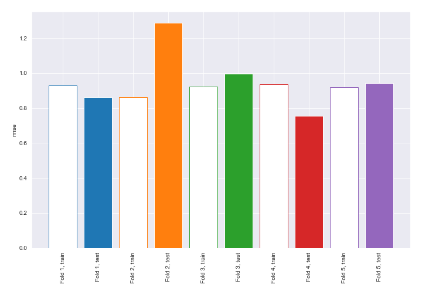

## Coefficients
| feature                              |    Learner_1 |   Learner_2 |     Learner_3 |   Learner_4 |    Learner_5 |
|:-------------------------------------|-------------:|------------:|--------------:|------------:|-------------:|
| longitude                            |  17.5517     |  5.65135    | -33.6038      |  9.17505    |  7.75538     |
| surge_damage_rating                  |   0.939343   |  0.987693   |   0.938033    |  0.880911   |  0.943153    |
| wind_damage_rating                   |   0.740771   |  0.76938    |   0.754423    |  0.723932   |  0.767474    |
| roof_system                          |   0.13631    |  0.101539   |   0.0933799   |  0.0459619  |  0.0835327   |
| hazards_present                      |   0.0638205  |  0.0345377  |   0.0460821   |  0.0326564  |  0.0387151   |
| roof_cover                           |   0.0373074  |  0.0284114  |   0.0523688   |  0.0430676  |  0.0180293   |
| Buildinglat                          |   0.125668   |  0.0983252  |  -0.0513455   | -0.00602127 |  0.00588081  |
| mindist                              |  -0.00562678 |  0.0180478  |   0.0088314   |  0.0143535  |  0.0324321   |
| roof_substrate_type                  |   0.00183607 | -0.0332561  |   0.0163204   | -0.00149337 |  0.0129318   |
| intercept                            |   0.00091932 | -0.00676525 |  -0.00219677  | -0.00112287 | -0.00214328  |
| rainwater_ingress_damage_rating      |   0.00265145 | -0.0165801  |  -0.0063492   | -0.00290842 | -0.00507957  |
| wall_substrate                       |  -0.00944533 |  0.010862   |  -0.000243544 | -0.00696915 | -0.0336991   |
| number_of_stories                    |  -0.0149788  | -0.00819616 |  -0.00489554  | -0.0206639  | -0.0219888   |
| foundation_type                      |  -0.0267001  | -0.00666646 |  -0.0089791   | -0.00696164 | -0.0236074   |
| Unnamed0                             |  -0.0834427  | -0.0814473  |   0.082081    |  0.00659758 |  0.000586789 |
| roof_shape                           |  -0.0121766  | -0.00783633 |  -0.0300961   | -0.0258705  | -0.00353907  |
| mwfrs                                |  -0.0335892  |  0.0080424  |  -0.0109708   | -0.0316771  | -0.0132263   |
| building_type                        |  -0.00681056 | -0.0165727  |   0.00182778  | -0.0293711  | -0.0380287   |
| understory_pct_of_building_footprint |  -0.00151215 | -0.0469542  |  -0.0364562   | -0.0334286  | -0.0597023   |
| wall_cladding                        |  -0.0229312  | -0.051009   |  -0.0256034   | -0.0392174  | -0.0522101   |
| year_built                           |  -0.0483297  | -0.0536035  |  -0.0482965   | -0.0232406  | -0.0371081   |
| wall_structure                       |  -0.0812646  | -0.0441908  |  -0.0636273   | -0.0311992  | -0.0683741   |
| Buildinglong                         | -17.6601     | -5.76685    |  33.5266      | -9.27466    | -7.84218     |

## Permutation-based Importance
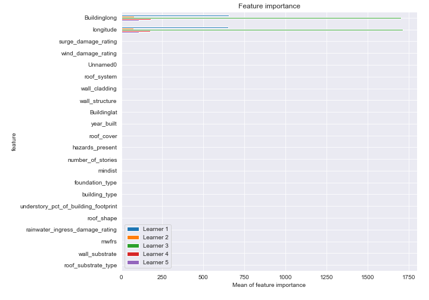
## True vs Predicted

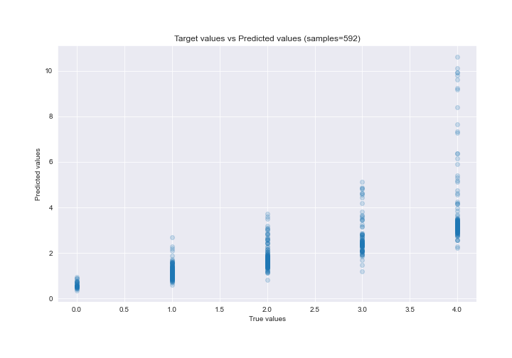

## Predicted vs Residuals

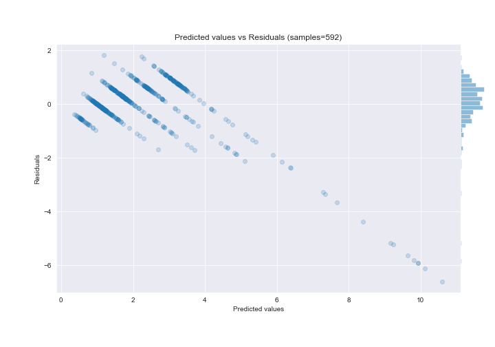

## SHAP Importance
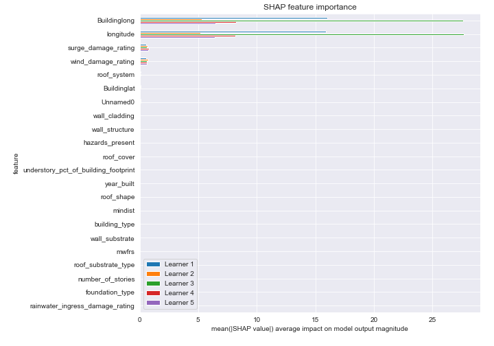

## SHAP Dependence plots

### Dependence (Fold 1)
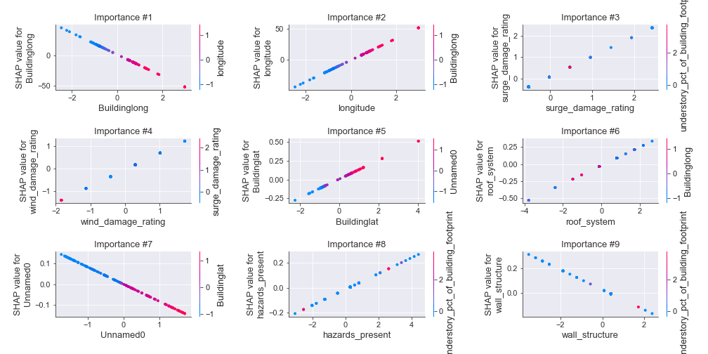
### Dependence (Fold 2)
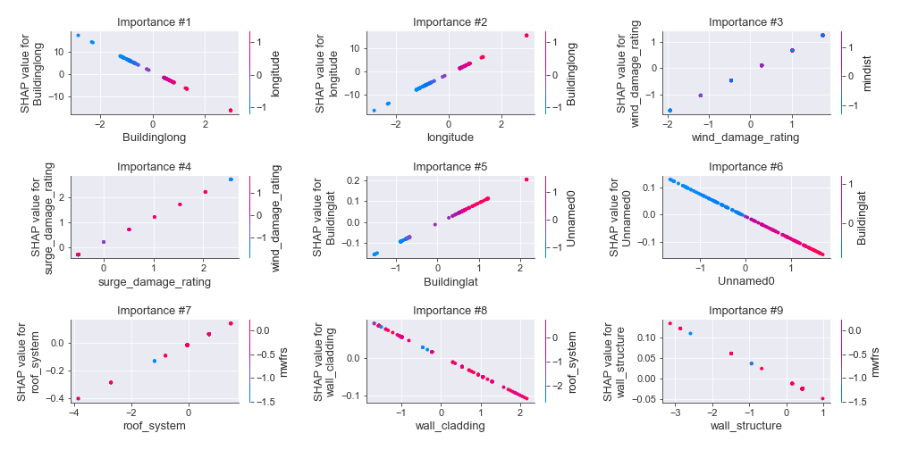
### Dependence (Fold 3)
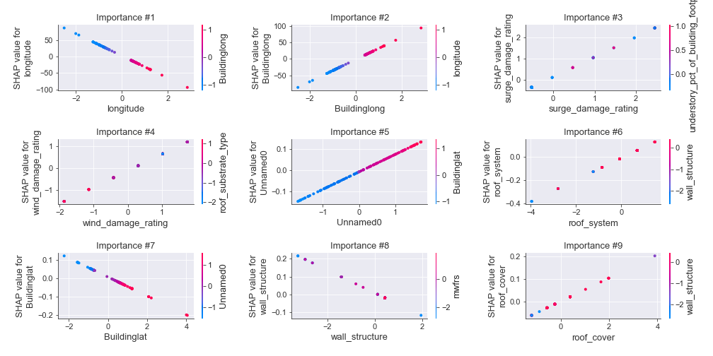
### Dependence (Fold 4)
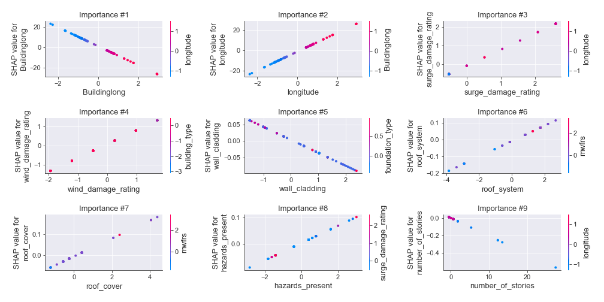
### Dependence (Fold 5)
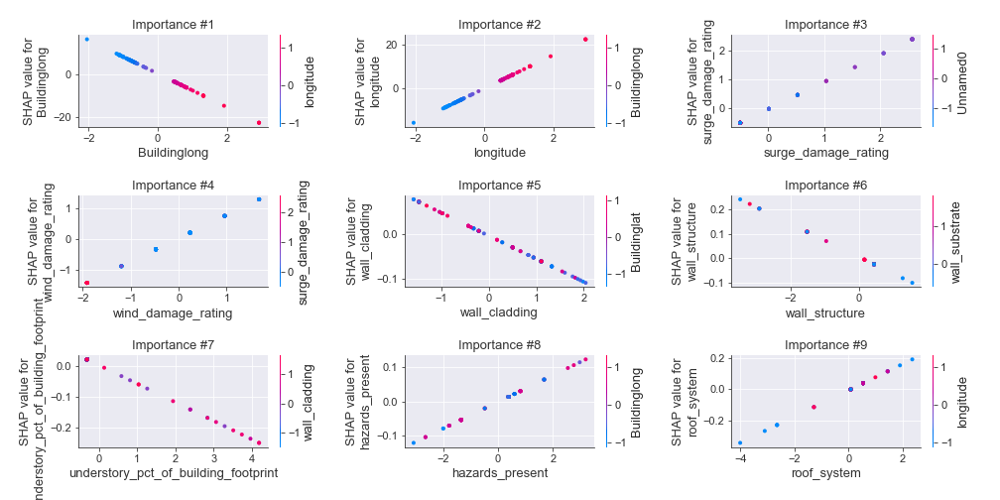

## SHAP Decision plots

### Top-10 Worst decisions (Fold 1)
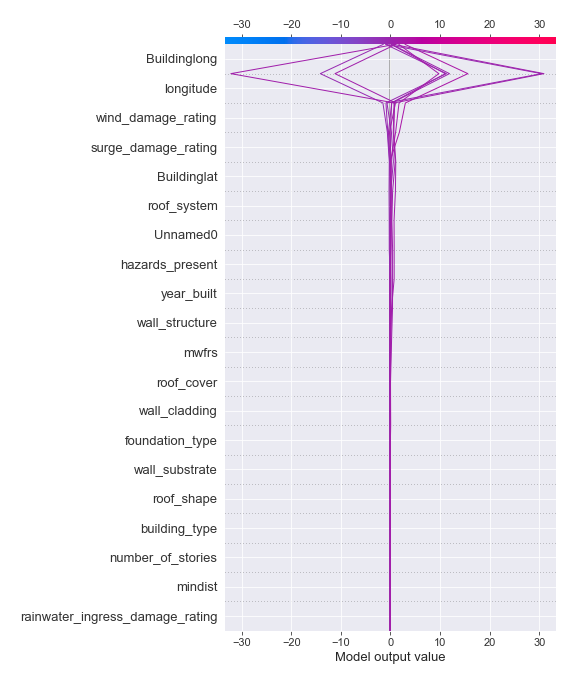
### Top-10 Worst decisions (Fold 2)
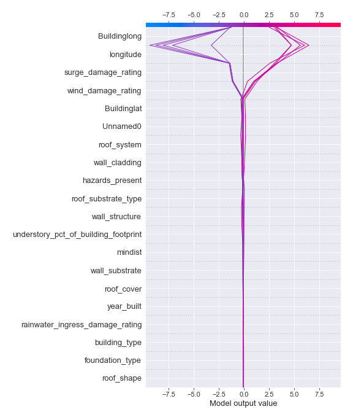
### Top-10 Worst decisions (Fold 3)
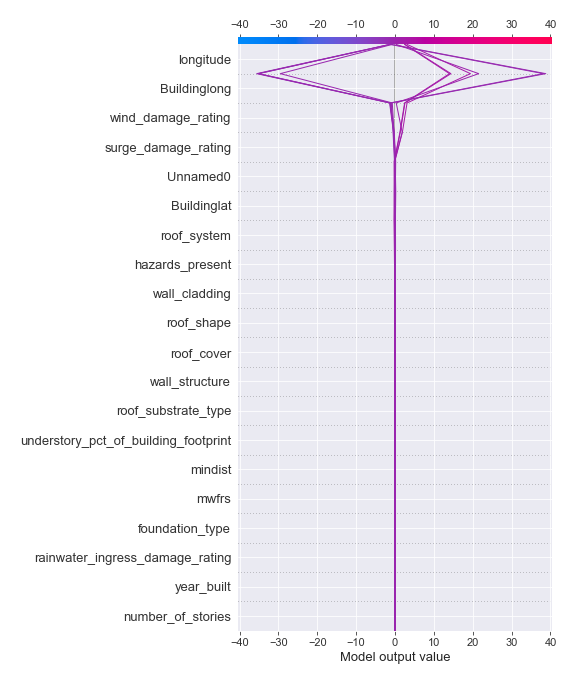
### Top-10 Worst decisions (Fold 4)
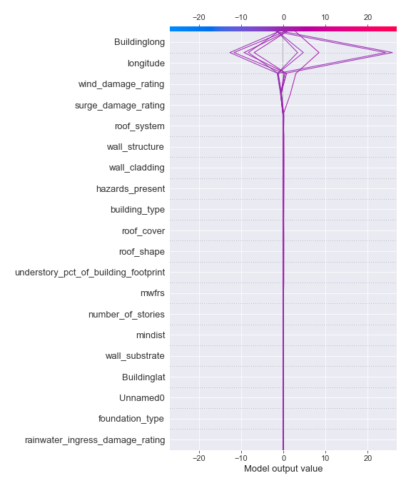
### Top-10 Worst decisions (Fold 5)
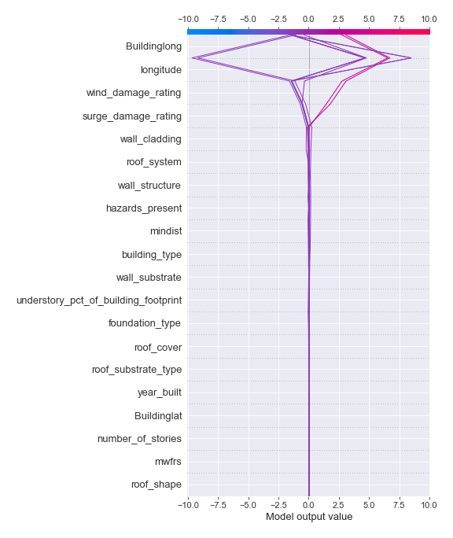
### Top-10 Best decisions (Fold 1)
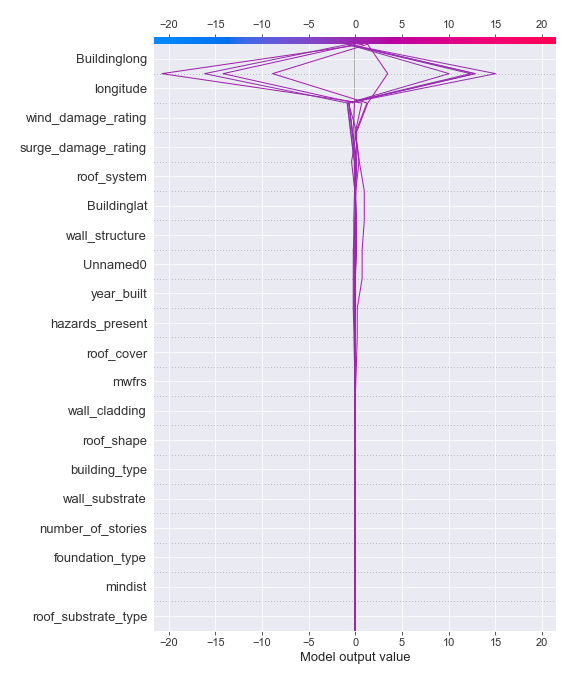
### Top-10 Best decisions (Fold 2)
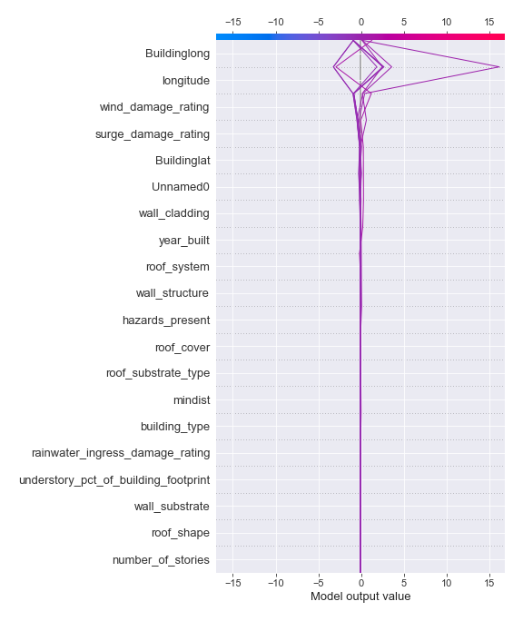
### Top-10 Best decisions (Fold 3)
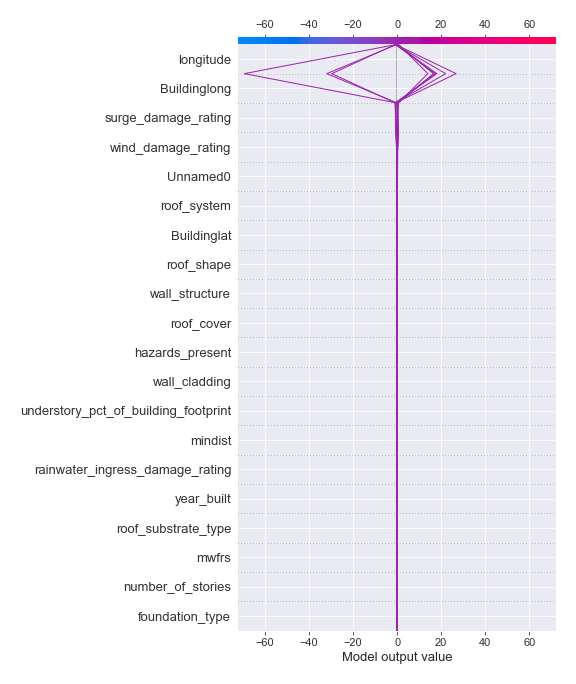
### Top-10 Best decisions (Fold 4)
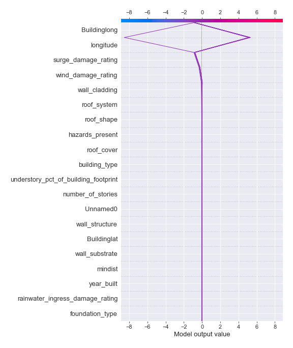
### Top-10 Best decisions (Fold 5)
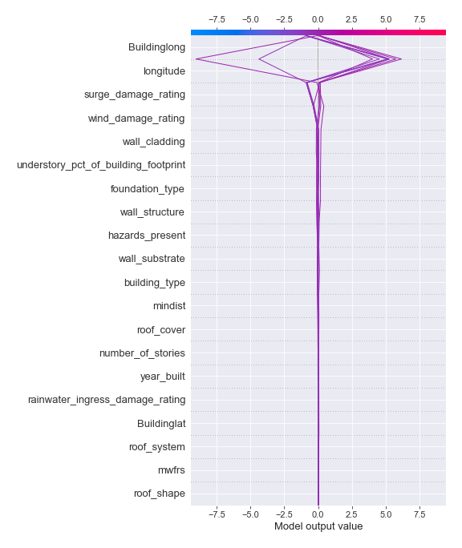

[<< Go back](../README.md)
