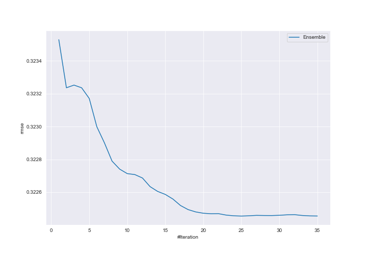
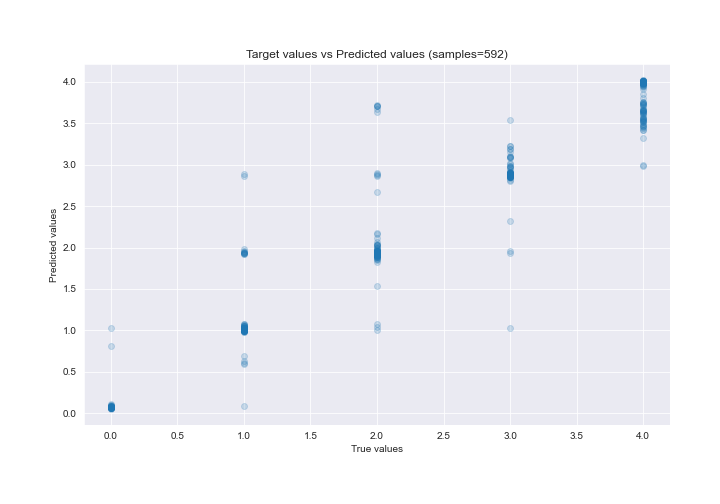
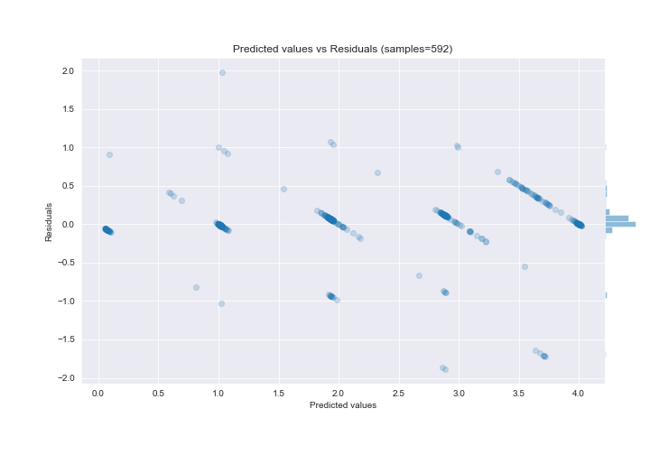

# Summary of Ensemble

[<< Go back](../README.md)

## Ensemble structure
| Model                             |   Weight |
|:----------------------------------|---------:|
| 11_RandomForest_GoldenFeatures    |        1 |
| 1_DecisionTree                    |        1 |
| 23_CatBoost_SelectedFeatures      |        6 |
| 25_Xgboost_SelectedFeatures       |        2 |
| 4_Default_Xgboost_categorical_mix |        1 |
| 7_CatBoost_SelectedFeatures       |       14 |

### Metric details:
| Metric   |       Score |
|:---------|------------:|
| MAE      | 0.145885    |
| MSE      | 0.103977    |
| RMSE     | 0.322455    |
| R2       | 0.930508    |
| MAPE     | 3.28568e+13 |

## Learning curves

## True vs Predicted

## Predicted vs Residuals

[<< Go back](../README.md)
