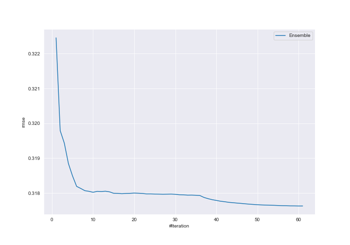
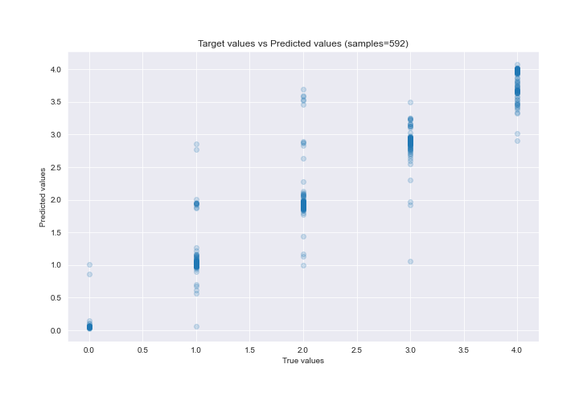
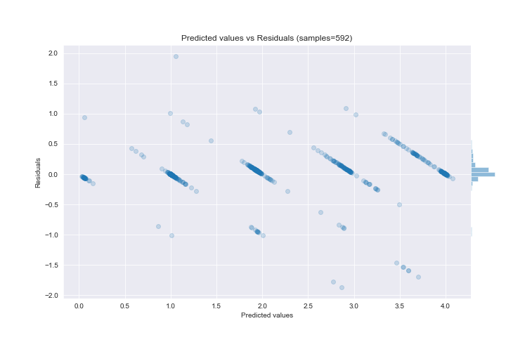

# Summary of Ensemble_Stacked

[<< Go back](../README.md)

## Ensemble structure
| Model                                       |   Weight |
|:--------------------------------------------|---------:|
| 1_DecisionTree                              |        1 |
| 23_CatBoost_SelectedFeatures                |        4 |
| 23_CatBoost_SelectedFeatures_Stacked        |        5 |
| 24_RandomForest_GoldenFeatures_Stacked      |        7 |
| 2_Linear                                    |        1 |
| 5_Default_CatBoost_SelectedFeatures_Stacked |       10 |
| 7_CatBoost_SelectedFeatures                 |       21 |
| 8_CatBoost_SelectedFeatures_Stacked         |       10 |
| Ensemble                                    |        1 |

### Metric details:
| Metric   |       Score |
|:---------|------------:|
| MAE      | 0.152724    |
| MSE      | 0.100889    |
| RMSE     | 0.31763     |
| R2       | 0.932572    |
| MAPE     | 2.96874e+13 |

## Learning curves

## True vs Predicted

## Predicted vs Residuals

[<< Go back](../README.md)
