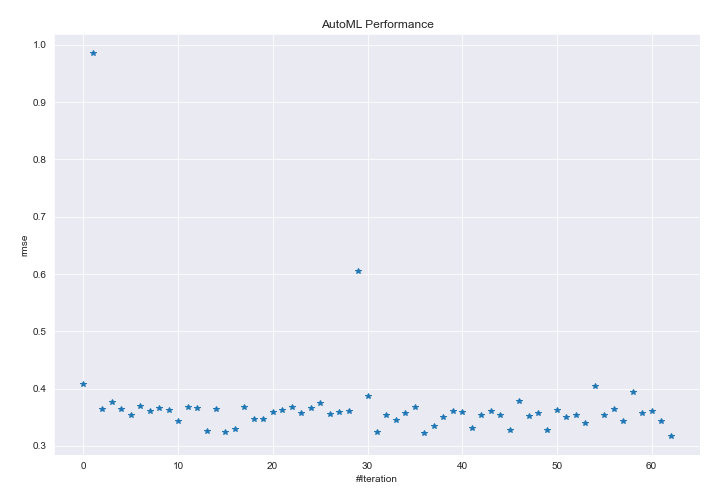
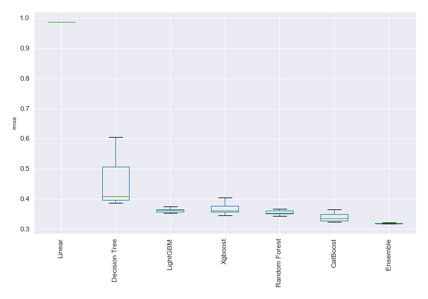
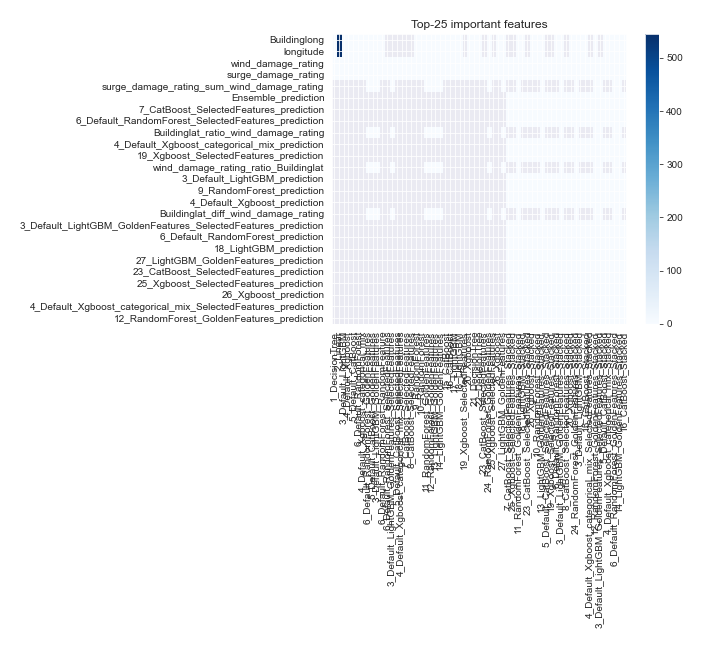
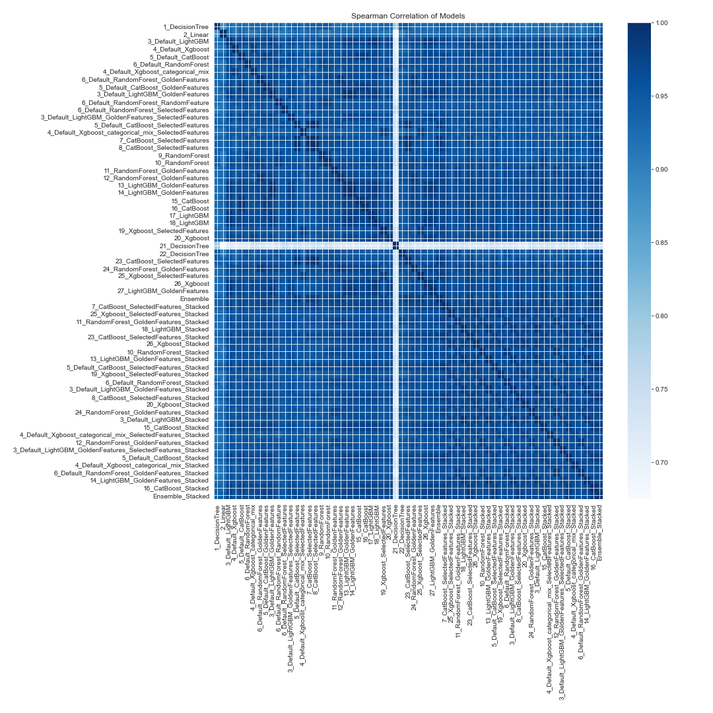

# AutoML Leaderboard

| Best model   | name                                                                                                                               | model_type    | metric_type   |   metric_value |   train_time |
|:-------------|:-----------------------------------------------------------------------------------------------------------------------------------|:--------------|:--------------|---------------:|-------------:|
|              | [1_DecisionTree](1_DecisionTree/README.md)                                                                                         | Decision Tree | rmse          |       0.407897 |        19.2  |
|              | [2_Linear](2_Linear/README.md)                                                                                                     | Linear        | rmse          |       0.985622 |         9.15 |
|              | [3_Default_LightGBM](3_Default_LightGBM/README.md)                                                                                 | LightGBM      | rmse          |       0.364385 |        11.66 |
|              | [4_Default_Xgboost](4_Default_Xgboost/README.md)                                                                                   | Xgboost       | rmse          |       0.377146 |        12.3  |
|              | [5_Default_CatBoost](5_Default_CatBoost/README.md)                                                                                 | CatBoost      | rmse          |       0.364081 |         6.46 |
|              | [6_Default_RandomForest](6_Default_RandomForest/README.md)                                                                         | Random Forest | rmse          |       0.35339  |        11.73 |
|              | [4_Default_Xgboost_categorical_mix](4_Default_Xgboost_categorical_mix/README.md)                                                   | Xgboost       | rmse          |       0.370293 |        10.13 |
|              | [6_Default_RandomForest_GoldenFeatures](6_Default_RandomForest_GoldenFeatures/README.md)                                           | Random Forest | rmse          |       0.361133 |        13.55 |
|              | [5_Default_CatBoost_GoldenFeatures](5_Default_CatBoost_GoldenFeatures/README.md)                                                   | CatBoost      | rmse          |       0.365643 |         7.58 |
|              | [3_Default_LightGBM_GoldenFeatures](3_Default_LightGBM_GoldenFeatures/README.md)                                                   | LightGBM      | rmse          |       0.36336  |        15.33 |
|              | [6_Default_RandomForest_RandomFeature](6_Default_RandomForest_RandomFeature/README.md)                                             | Random Forest | rmse          |       0.343035 |         6.95 |
|              | [6_Default_RandomForest_SelectedFeatures](6_Default_RandomForest_SelectedFeatures/README.md)                                       | Random Forest | rmse          |       0.36821  |         7.62 |
|              | [3_Default_LightGBM_GoldenFeatures_SelectedFeatures](3_Default_LightGBM_GoldenFeatures_SelectedFeatures/README.md)                 | LightGBM      | rmse          |       0.365862 |        13.04 |
|              | [5_Default_CatBoost_SelectedFeatures](5_Default_CatBoost_SelectedFeatures/README.md)                                               | CatBoost      | rmse          |       0.326238 |         6.28 |
|              | [4_Default_Xgboost_categorical_mix_SelectedFeatures](4_Default_Xgboost_categorical_mix_SelectedFeatures/README.md)                 | Xgboost       | rmse          |       0.364834 |        11.38 |
|              | [7_CatBoost_SelectedFeatures](7_CatBoost_SelectedFeatures/README.md)                                                               | CatBoost      | rmse          |       0.323529 |         5.68 |
|              | [8_CatBoost_SelectedFeatures](8_CatBoost_SelectedFeatures/README.md)                                                               | CatBoost      | rmse          |       0.329732 |         5.78 |
|              | [9_RandomForest](9_RandomForest/README.md)                                                                                         | Random Forest | rmse          |       0.367948 |        13.88 |
|              | [10_RandomForest](10_RandomForest/README.md)                                                                                       | Random Forest | rmse          |       0.346318 |        15.26 |
|              | [11_RandomForest_GoldenFeatures](11_RandomForest_GoldenFeatures/README.md)                                                         | Random Forest | rmse          |       0.346236 |        15    |
|              | [12_RandomForest_GoldenFeatures](12_RandomForest_GoldenFeatures/README.md)                                                         | Random Forest | rmse          |       0.359436 |        16.49 |
|              | [13_LightGBM_GoldenFeatures](13_LightGBM_GoldenFeatures/README.md)                                                                 | LightGBM      | rmse          |       0.363188 |        18.87 |
|              | [14_LightGBM_GoldenFeatures](14_LightGBM_GoldenFeatures/README.md)                                                                 | LightGBM      | rmse          |       0.3677   |        19.81 |
|              | [15_CatBoost](15_CatBoost/README.md)                                                                                               | CatBoost      | rmse          |       0.358025 |        12.2  |
|              | [16_CatBoost](16_CatBoost/README.md)                                                                                               | CatBoost      | rmse          |       0.365546 |        14.86 |
|              | [17_LightGBM](17_LightGBM/README.md)                                                                                               | LightGBM      | rmse          |       0.375156 |        20.69 |
|              | [18_LightGBM](18_LightGBM/README.md)                                                                                               | LightGBM      | rmse          |       0.35603  |        21.28 |
|              | [19_Xgboost_SelectedFeatures](19_Xgboost_SelectedFeatures/README.md)                                                               | Xgboost       | rmse          |       0.358543 |        17.18 |
|              | [20_Xgboost](20_Xgboost/README.md)                                                                                                 | Xgboost       | rmse          |       0.361835 |        16.87 |
|              | [21_DecisionTree](21_DecisionTree/README.md)                                                                                       | Decision Tree | rmse          |       0.604657 |        21.22 |
|              | [22_DecisionTree](22_DecisionTree/README.md)                                                                                       | Decision Tree | rmse          |       0.387046 |        28.94 |
|              | [23_CatBoost_SelectedFeatures](23_CatBoost_SelectedFeatures/README.md)                                                             | CatBoost      | rmse          |       0.323675 |        14.22 |
|              | [24_RandomForest_GoldenFeatures](24_RandomForest_GoldenFeatures/README.md)                                                         | Random Forest | rmse          |       0.354339 |        26.62 |
|              | [25_Xgboost_SelectedFeatures](25_Xgboost_SelectedFeatures/README.md)                                                               | Xgboost       | rmse          |       0.345962 |        23.92 |
|              | [26_Xgboost](26_Xgboost/README.md)                                                                                                 | Xgboost       | rmse          |       0.357982 |        23.52 |
|              | [27_LightGBM_GoldenFeatures](27_LightGBM_GoldenFeatures/README.md)                                                                 | LightGBM      | rmse          |       0.367935 |        29.11 |
|              | [Ensemble](Ensemble/README.md)                                                                                                     | Ensemble      | rmse          |       0.322455 |         1.24 |
|              | [7_CatBoost_SelectedFeatures_Stacked](7_CatBoost_SelectedFeatures_Stacked/README.md)                                               | CatBoost      | rmse          |       0.335588 |        19.63 |
|              | [25_Xgboost_SelectedFeatures_Stacked](25_Xgboost_SelectedFeatures_Stacked/README.md)                                               | Xgboost       | rmse          |       0.350759 |        26.86 |
|              | [11_RandomForest_GoldenFeatures_Stacked](11_RandomForest_GoldenFeatures_Stacked/README.md)                                         | Random Forest | rmse          |       0.360916 |        32.4  |
|              | [18_LightGBM_Stacked](18_LightGBM_Stacked/README.md)                                                                               | LightGBM      | rmse          |       0.358866 |      1061.91 |
|              | [23_CatBoost_SelectedFeatures_Stacked](23_CatBoost_SelectedFeatures_Stacked/README.md)                                             | CatBoost      | rmse          |       0.330777 |        51.38 |
|              | [26_Xgboost_Stacked](26_Xgboost_Stacked/README.md)                                                                                 | Xgboost       | rmse          |       0.354235 |        58.87 |
|              | [10_RandomForest_Stacked](10_RandomForest_Stacked/README.md)                                                                       | Random Forest | rmse          |       0.360745 |        61.37 |
|              | [13_LightGBM_GoldenFeatures_Stacked](13_LightGBM_GoldenFeatures_Stacked/README.md)                                                 | LightGBM      | rmse          |       0.353789 |        80.77 |
|              | [5_Default_CatBoost_SelectedFeatures_Stacked](5_Default_CatBoost_SelectedFeatures_Stacked/README.md)                               | CatBoost      | rmse          |       0.32843  |        66.43 |
|              | [19_Xgboost_SelectedFeatures_Stacked](19_Xgboost_SelectedFeatures_Stacked/README.md)                                               | Xgboost       | rmse          |       0.378502 |        73.65 |
|              | [6_Default_RandomForest_Stacked](6_Default_RandomForest_Stacked/README.md)                                                         | Random Forest | rmse          |       0.352433 |        93.54 |
|              | [3_Default_LightGBM_GoldenFeatures_Stacked](3_Default_LightGBM_GoldenFeatures_Stacked/README.md)                                   | LightGBM      | rmse          |       0.356836 |       532.81 |
|              | [8_CatBoost_SelectedFeatures_Stacked](8_CatBoost_SelectedFeatures_Stacked/README.md)                                               | CatBoost      | rmse          |       0.32795  |        36.79 |
|              | [20_Xgboost_Stacked](20_Xgboost_Stacked/README.md)                                                                                 | Xgboost       | rmse          |       0.362233 |       252.87 |
|              | [24_RandomForest_GoldenFeatures_Stacked](24_RandomForest_GoldenFeatures_Stacked/README.md)                                         | Random Forest | rmse          |       0.351351 |        46.36 |
|              | [3_Default_LightGBM_Stacked](3_Default_LightGBM_Stacked/README.md)                                                                 | LightGBM      | rmse          |       0.354405 |        54.83 |
|              | [15_CatBoost_Stacked](15_CatBoost_Stacked/README.md)                                                                               | CatBoost      | rmse          |       0.339379 |        44.36 |
|              | [4_Default_Xgboost_categorical_mix_SelectedFeatures_Stacked](4_Default_Xgboost_categorical_mix_SelectedFeatures_Stacked/README.md) | Xgboost       | rmse          |       0.404288 |        49.1  |
|              | [12_RandomForest_GoldenFeatures_Stacked](12_RandomForest_GoldenFeatures_Stacked/README.md)                                         | Random Forest | rmse          |       0.354067 |        56.8  |
|              | [3_Default_LightGBM_GoldenFeatures_SelectedFeatures_Stacked](3_Default_LightGBM_GoldenFeatures_SelectedFeatures_Stacked/README.md) | LightGBM      | rmse          |       0.363662 |        56.59 |
|              | [5_Default_CatBoost_Stacked](5_Default_CatBoost_Stacked/README.md)                                                                 | CatBoost      | rmse          |       0.342926 |        55.56 |
|              | [4_Default_Xgboost_categorical_mix_Stacked](4_Default_Xgboost_categorical_mix_Stacked/README.md)                                   | Xgboost       | rmse          |       0.394431 |        61.08 |
|              | [6_Default_RandomForest_GoldenFeatures_Stacked](6_Default_RandomForest_GoldenFeatures_Stacked/README.md)                           | Random Forest | rmse          |       0.358346 |        67.09 |
|              | [14_LightGBM_GoldenFeatures_Stacked](14_LightGBM_GoldenFeatures_Stacked/README.md)                                                 | LightGBM      | rmse          |       0.360273 |        70.73 |
|              | [16_CatBoost_Stacked](16_CatBoost_Stacked/README.md)                                                                               | CatBoost      | rmse          |       0.343245 |      1003.57 |
| **the best** | [Ensemble_Stacked](Ensemble_Stacked/README.md)                                                                                     | Ensemble      | rmse          |       0.31763  |         3.53 |

### AutoML Performance

### AutoML Performance Boxplot

### Features Importance

### Spearman Correlation of Models

