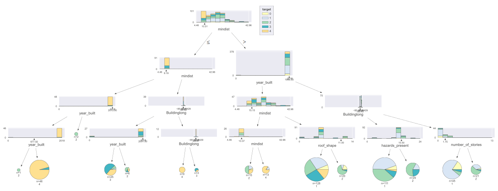
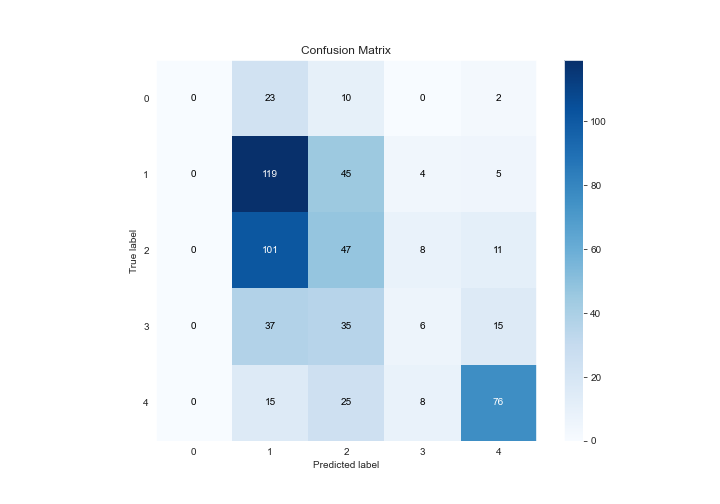
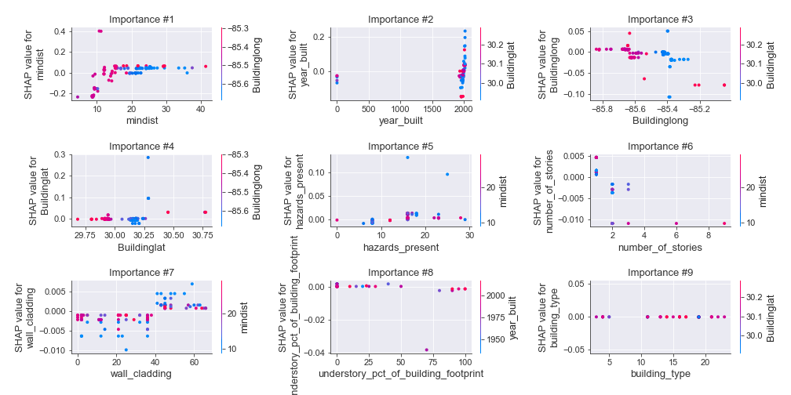
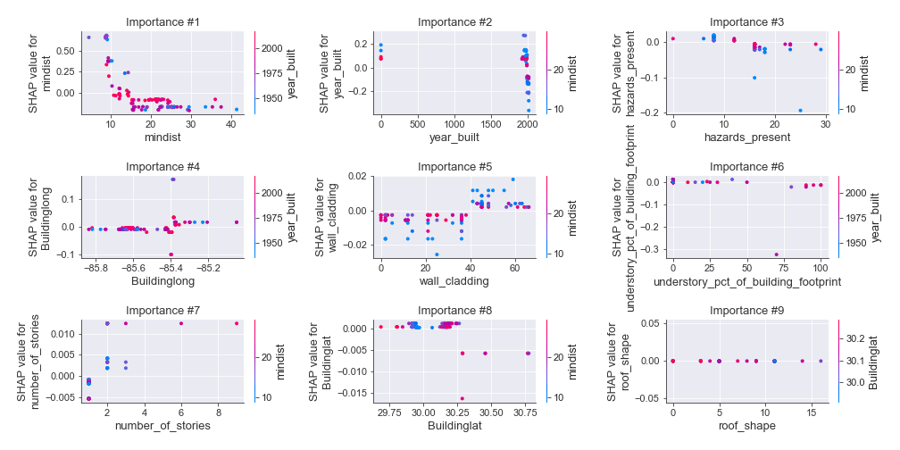
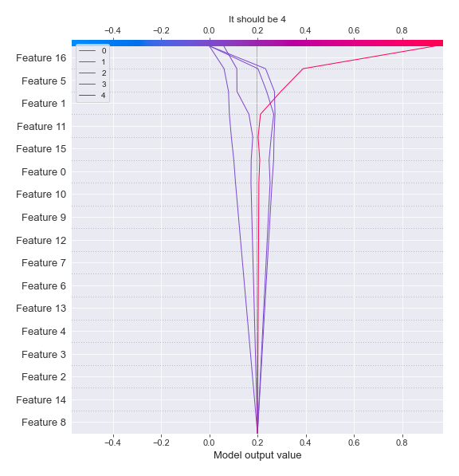

# Summary of 12_DecisionTree

[<< Go back](../README.md)

## Decision Tree
- **n_jobs**: -1
- **criterion**: gini
- **max_depth**: 4
- **num_class**: 5
- **explain_level**: 2

## Validation
 - **validation_type**: kfold
 - **k_folds**: 5
 - **shuffle**: True
 - **stratify**: True

## Optimized metric
logloss

## Training time

164.7 seconds

### Metric details
|           |   0 |          1 |          2 |          3 |          4 |   accuracy |   macro avg |   weighted avg |   logloss |
|:----------|----:|-----------:|-----------:|-----------:|-----------:|-----------:|------------:|---------------:|----------:|
| precision |   0 |   0.40339  |   0.290123 |  0.230769  |   0.697248 |   0.418919 |    0.324306 |       0.382022 |   1.90353 |
| recall    |   0 |   0.687861 |   0.281437 |  0.0645161 |   0.612903 |   0.418919 |    0.329344 |       0.418919 |   1.90353 |
| f1-score  |   0 |   0.508547 |   0.285714 |  0.10084   |   0.652361 |   0.418919 |    0.309492 |       0.381696 |   1.90353 |
| support   |  35 | 173        | 167        | 93         | 124        |   0.418919 |  592        |     592        |   1.90353 |

## Confusion matrix
|              |   Predicted as 0 |   Predicted as 1 |   Predicted as 2 |   Predicted as 3 |   Predicted as 4 |
|:-------------|-----------------:|-----------------:|-----------------:|-----------------:|-----------------:|
| Labeled as 0 |                0 |               23 |               10 |                0 |                2 |
| Labeled as 1 |                0 |              119 |               45 |                4 |                5 |
| Labeled as 2 |                0 |              101 |               47 |                8 |               11 |
| Labeled as 3 |                0 |               37 |               35 |                6 |               15 |
| Labeled as 4 |                0 |               15 |               25 |                8 |               76 |

## Learning curves

## Decision Tree 

### Tree #1

### Rules

if (mindist > 10.507) and (year_built > 1995.5) and (Buildinglat <= 30.283) and (Buildinglong > -85.626) then class: 1 (proba: 44.58%) | based on 166 samples

if (mindist > 10.507) and (year_built <= 1995.5) and (mindist > 15.143) and (Buildinglat > 29.805) then class: 2 (proba: 26.32%) | based on 133 samples

if (mindist <= 10.507) and (year_built <= 1996.5) and (roof_system > 1.5) and (hazards_present > 4.0) then class: 4 (proba: 86.15%) | based on 65 samples

if (mindist > 10.507) and (year_built > 1995.5) and (Buildinglat <= 30.283) and (Buildinglong <= -85.626) then class: 1 (proba: 69.7%) | based on 33 samples

if (mindist > 10.507) and (year_built <= 1995.5) and (mindist <= 15.143) and (mindist <= 13.625) then class: 2 (proba: 38.89%) | based on 18 samples

if (mindist > 10.507) and (year_built > 1995.5) and (Buildinglat > 30.283) and (roof_cover > 1.0) then class: 2 (proba: 91.67%) | based on 12 samples

if (mindist > 10.507) and (year_built <= 1995.5) and (mindist > 15.143) and (Buildinglat <= 29.805) then class: 2 (proba: 81.82%) | based on 11 samples

if (mindist > 10.507) and (year_built <= 1995.5) and (mindist <= 15.143) and (mindist > 13.625) then class: 4 (proba: 90.91%) | based on 11 samples

if (mindist <= 10.507) and (year_built > 1996.5) and (foundation_type <= 10.0) and (hazards_present > 11.0) then class: 2 (proba: 75.0%) | based on 8 samples

if (mindist <= 10.507) and (year_built > 1996.5) and (foundation_type <= 10.0) and (hazards_present <= 11.0) then class: 4 (proba: 66.67%) | based on 6 samples

if (mindist <= 10.507) and (year_built > 1996.5) and (foundation_type > 10.0) then class: 3 (proba: 100.0%) | based on 4 samples

if (mindist <= 10.507) and (year_built <= 1996.5) and (roof_system > 1.5) and (hazards_present <= 4.0) then class: 3 (proba: 100.0%) | based on 2 samples

if (mindist <= 10.507) and (year_built <= 1996.5) and (roof_system <= 1.5) and (Buildinglat > 30.061) then class: 3 (proba: 100.0%) | based on 2 samples

if (mindist > 10.507) and (year_built > 1995.5) and (Buildinglat > 30.283) and (roof_cover <= 1.0) then class: 3 (proba: 100.0%) | based on 1 samples

if (mindist <= 10.507) and (year_built <= 1996.5) and (roof_system <= 1.5) and (Buildinglat <= 30.061) then class: 2 (proba: 100.0%) | based on 1 samples

### Tree #2

### Rules

if (mindist > 10.316) and (year_built > 1995.75) and (hazards_present <= 17.5) and (building_type <= 19.0) then class: 1 (proba: 51.41%) | based on 177 samples

if (mindist > 10.316) and (year_built <= 1995.75) and (mindist > 15.143) and (Buildinglat > 29.802) then class: 2 (proba: 29.85%) | based on 134 samples

if (mindist <= 10.316) and (hazards_present <= 14.0) and (hazards_present > 4.5) and (wall_cladding > 2.5) then class: 4 (proba: 96.43%) | based on 56 samples

if (mindist > 10.316) and (year_built > 1995.75) and (hazards_present > 17.5) and (Buildinglat > 30.159) then class: 2 (proba: 59.09%) | based on 22 samples

if (mindist <= 10.316) and (hazards_present > 14.0) and (roof_cover <= 2.5) and (year_built <= 2016.5) then class: 3 (proba: 52.63%) | based on 19 samples

if (mindist > 10.316) and (year_built > 1995.75) and (hazards_present > 17.5) and (Buildinglat <= 30.159) then class: 1 (proba: 53.85%) | based on 13 samples

if (mindist > 10.316) and (year_built <= 1995.75) and (mindist <= 15.143) and (mindist <= 13.625) then class: 4 (proba: 38.46%) | based on 13 samples

if (mindist > 10.316) and (year_built <= 1995.75) and (mindist <= 15.143) and (mindist > 13.625) then class: 4 (proba: 90.0%) | based on 10 samples

if (mindist > 10.316) and (year_built <= 1995.75) and (mindist > 15.143) and (Buildinglat <= 29.802) then class: 2 (proba: 88.89%) | based on 9 samples

if (mindist > 10.316) and (year_built > 1995.75) and (hazards_present <= 17.5) and (building_type > 19.0) then class: 0 (proba: 33.33%) | based on 6 samples

if (mindist <= 10.316) and (hazards_present > 14.0) and (roof_cover > 2.5) and (roof_shape <= 13.0) then class: 4 (proba: 100.0%) | based on 6 samples

if (mindist <= 10.316) and (hazards_present > 14.0) and (roof_cover <= 2.5) and (year_built > 2016.5) then class: 2 (proba: 100.0%) | based on 2 samples

if (mindist <= 10.316) and (hazards_present <= 14.0) and (hazards_present <= 4.5) and (roof_system > 11.0) then class: 0 (proba: 50.0%) | based on 2 samples

if (mindist <= 10.316) and (hazards_present <= 14.0) and (hazards_present <= 4.5) and (roof_system <= 11.0) then class: 3 (proba: 100.0%) | based on 2 samples

if (mindist <= 10.316) and (hazards_present > 14.0) and (roof_cover > 2.5) and (roof_shape > 13.0) then class: 3 (proba: 100.0%) | based on 1 samples

if (mindist <= 10.316) and (hazards_present <= 14.0) and (hazards_present > 4.5) and (wall_cladding <= 2.5) then class: 3 (proba: 100.0%) | based on 1 samples

### Tree #3

### Rules

if (mindist > 10.507) and (year_built > 1995.5) and (Buildinglat <= 30.283) and (mindist > 11.441) then class: 1 (proba: 48.51%) | based on 202 samples

if (mindist > 10.507) and (year_built <= 1995.5) and (mindist > 14.949) and (number_of_stories <= 1.5) then class: 1 (proba: 31.87%) | based on 91 samples

if (mindist > 10.507) and (year_built <= 1995.5) and (mindist > 14.949) and (number_of_stories > 1.5) then class: 3 (proba: 51.28%) | based on 39 samples

if (mindist <= 10.507) and (year_built <= 1988.5) and (mindist <= 9.188) then class: 4 (proba: 100.0%) | based on 39 samples

if (mindist <= 10.507) and (year_built <= 1988.5) and (mindist > 9.188) and (understory_pct_of_building_footprint <= 62.5) then class: 4 (proba: 70.83%) | based on 24 samples

if (mindist > 10.507) and (year_built <= 1995.5) and (mindist <= 14.949) and (Buildinglong <= -85.39) then class: 2 (proba: 35.29%) | based on 17 samples

if (mindist > 10.507) and (year_built > 1995.5) and (Buildinglat > 30.283) and (Buildinglong <= -85.631) then class: 2 (proba: 78.57%) | based on 14 samples

if (mindist > 10.507) and (year_built <= 1995.5) and (mindist <= 14.949) and (Buildinglong > -85.39) then class: 4 (proba: 90.0%) | based on 10 samples

if (mindist <= 10.507) and (year_built > 1988.5) and (hazards_present <= 13.5) and (wall_cladding > 40.5) then class: 4 (proba: 80.0%) | based on 10 samples

if (mindist > 10.507) and (year_built > 1995.5) and (Buildinglat <= 30.283) and (mindist <= 11.441) then class: 2 (proba: 85.71%) | based on 7 samples

if (mindist <= 10.507) and (year_built > 1988.5) and (hazards_present > 13.5) and (year_built > 2002.5) then class: 2 (proba: 57.14%) | based on 7 samples

if (mindist <= 10.507) and (year_built > 1988.5) and (hazards_present <= 13.5) and (wall_cladding <= 40.5) then class: 3 (proba: 57.14%) | based on 7 samples

if (mindist <= 10.507) and (year_built > 1988.5) and (hazards_present > 13.5) and (year_built <= 2002.5) then class: 3 (proba: 100.0%) | based on 4 samples

if (mindist > 10.507) and (year_built > 1995.5) and (Buildinglat > 30.283) and (Buildinglong > -85.631) then class: 1 (proba: 100.0%) | based on 2 samples

if (mindist <= 10.507) and (year_built <= 1988.5) and (mindist > 9.188) and (understory_pct_of_building_footprint > 62.5) then class: 1 (proba: 100.0%) | based on 1 samples

### Tree #4

### Rules

if (mindist > 10.564) and (year_built <= 1995.5) and (Buildinglat > 29.802) and (hazards_present <= 19.5) then class: 2 (proba: 27.52%) | based on 149 samples

if (mindist > 10.564) and (year_built > 1995.5) and (year_built <= 2013.5) and (mindist <= 21.1) then class: 1 (proba: 48.24%) | based on 85 samples

if (mindist > 10.564) and (year_built > 1995.5) and (year_built <= 2013.5) and (mindist > 21.1) then class: 2 (proba: 55.38%) | based on 65 samples

if (mindist <= 10.564) and (year_built <= 1995.0) and (hazards_present <= 10.5) and (wall_cladding > 2.5) then class: 4 (proba: 94.0%) | based on 50 samples

if (mindist > 10.564) and (year_built > 1995.5) and (year_built > 2013.5) and (Buildinglong <= -85.402) then class: 1 (proba: 45.71%) | based on 35 samples

if (mindist > 10.564) and (year_built > 1995.5) and (year_built > 2013.5) and (Buildinglong > -85.402) then class: 1 (proba: 75.0%) | based on 24 samples

if (mindist > 10.564) and (year_built <= 1995.5) and (Buildinglat > 29.802) and (hazards_present > 19.5) then class: 3 (proba: 62.5%) | based on 16 samples

if (mindist <= 10.564) and (year_built <= 1995.0) and (hazards_present > 10.5) and (Buildinglong <= -85.419) then class: 4 (proba: 42.86%) | based on 14 samples

if (mindist > 10.564) and (year_built <= 1995.5) and (Buildinglat <= 29.802) and (Buildinglat <= 29.801) then class: 2 (proba: 100.0%) | based on 6 samples

if (mindist <= 10.564) and (year_built > 1995.0) and (hazards_present > 9.5) and (wall_cladding > 41.0) then class: 3 (proba: 50.0%) | based on 6 samples

if (mindist <= 10.564) and (year_built > 1995.0) and (hazards_present <= 9.5) and (year_built > 2001.0) then class: 4 (proba: 83.33%) | based on 6 samples

if (mindist > 10.564) and (year_built <= 1995.5) and (Buildinglat <= 29.802) and (Buildinglat > 29.801) then class: 2 (proba: 60.0%) | based on 5 samples

if (mindist <= 10.564) and (year_built <= 1995.0) and (hazards_present > 10.5) and (Buildinglong > -85.419) then class: 4 (proba: 100.0%) | based on 5 samples

if (mindist <= 10.564) and (year_built > 1995.0) and (hazards_present > 9.5) and (wall_cladding <= 41.0) then class: 2 (proba: 100.0%) | based on 4 samples

if (mindist <= 10.564) and (year_built > 1995.0) and (hazards_present <= 9.5) and (year_built <= 2001.0) then class: 3 (proba: 66.67%) | based on 3 samples

if (mindist <= 10.564) and (year_built <= 1995.0) and (hazards_present <= 10.5) and (wall_cladding <= 2.5) then class: 3 (proba: 100.0%) | based on 1 samples

### Tree #5

### Rules

if (mindist > 10.507) and (year_built <= 1995.5) and (mindist > 15.151) and (roof_shape <= 11.0) then class: 1 (proba: 28.12%) | based on 128 samples

if (mindist > 10.507) and (year_built > 1995.5) and (Buildinglong <= -85.399) and (hazards_present <= 15.5) then class: 1 (proba: 44.14%) | based on 111 samples

if (mindist <= 10.507) and (mindist <= 9.188) and (year_built <= 2013.0) and (year_built > 977.5) then class: 4 (proba: 95.65%) | based on 46 samples

if (mindist > 10.507) and (year_built > 1995.5) and (Buildinglong > -85.399) and (number_of_stories <= 1.75) then class: 1 (proba: 73.33%) | based on 45 samples

if (mindist > 10.507) and (year_built > 1995.5) and (Buildinglong <= -85.399) and (hazards_present > 15.5) then class: 2 (proba: 58.62%) | based on 29 samples

if (mindist <= 10.507) and (mindist > 9.188) and (Buildinglong <= -85.416) and (year_built <= 2001.0) then class: 3 (proba: 52.0%) | based on 25 samples

if (mindist > 10.507) and (year_built > 1995.5) and (Buildinglong > -85.399) and (number_of_stories > 1.75) then class: 2 (proba: 57.14%) | based on 21 samples

if (mindist > 10.507) and (year_built <= 1995.5) and (mindist > 15.151) and (roof_shape > 11.0) then class: 2 (proba: 65.0%) | based on 20 samples

if (mindist > 10.507) and (year_built <= 1995.5) and (mindist <= 15.151) and (mindist <= 13.367) then class: 2 (proba: 46.67%) | based on 15 samples

if (mindist > 10.507) and (year_built <= 1995.5) and (mindist <= 15.151) and (mindist > 13.367) then class: 4 (proba: 84.62%) | based on 13 samples

if (mindist <= 10.507) and (mindist > 9.188) and (Buildinglong > -85.416) and (Buildinglong <= -85.414) then class: 4 (proba: 100.0%) | based on 9 samples

if (mindist <= 10.507) and (mindist > 9.188) and (Buildinglong <= -85.416) and (year_built > 2001.0) then class: 2 (proba: 50.0%) | based on 6 samples

if (mindist <= 10.507) and (mindist > 9.188) and (Buildinglong > -85.416) and (Buildinglong > -85.414) then class: 3 (proba: 66.67%) | based on 3 samples

if (mindist <= 10.507) and (mindist <= 9.188) and (year_built > 2013.0) then class: 2 (proba: 100.0%) | based on 2 samples

if (mindist <= 10.507) and (mindist <= 9.188) and (year_built <= 2013.0) and (year_built <= 977.5) then class: 2 (proba: 100.0%) | based on 1 samples

## Permutation-based Importance

## Confusion Matrix

## Normalized Confusion Matrix

## ROC Curve

## Precision Recall Curve

## SHAP Importance

## SHAP Dependence plots

### Dependence 0 (Fold 1)

### Dependence 1 (Fold 1)

### Dependence 2 (Fold 1)

### Dependence 3 (Fold 1)

### Dependence 4 (Fold 1)

### Dependence 0 (Fold 2)

### Dependence 1 (Fold 2)

### Dependence 2 (Fold 2)

### Dependence 3 (Fold 2)

### Dependence 4 (Fold 2)

### Dependence 0 (Fold 3)

### Dependence 1 (Fold 3)

### Dependence 2 (Fold 3)

### Dependence 3 (Fold 3)

### Dependence 4 (Fold 3)

### Dependence 0 (Fold 4)

### Dependence 1 (Fold 4)

### Dependence 2 (Fold 4)

### Dependence 3 (Fold 4)

### Dependence 4 (Fold 4)

### Dependence 0 (Fold 5)

### Dependence 1 (Fold 5)

### Dependence 2 (Fold 5)

### Dependence 3 (Fold 5)

### Dependence 4 (Fold 5)

## SHAP Decision plots

### Worst decisions for selected sample 1 (Fold 1)

### Worst decisions for selected sample 1 (Fold 2)

### Worst decisions for selected sample 1 (Fold 3)

### Worst decisions for selected sample 1 (Fold 4)

### Worst decisions for selected sample 1 (Fold 5)

### Worst decisions for selected sample 2 (Fold 1)

### Worst decisions for selected sample 2 (Fold 2)

### Worst decisions for selected sample 2 (Fold 3)

### Worst decisions for selected sample 2 (Fold 4)

### Worst decisions for selected sample 2 (Fold 5)

### Worst decisions for selected sample 3 (Fold 1)

### Worst decisions for selected sample 3 (Fold 2)

### Worst decisions for selected sample 3 (Fold 3)

### Worst decisions for selected sample 3 (Fold 4)

### Worst decisions for selected sample 3 (Fold 5)

### Worst decisions for selected sample 4 (Fold 1)

### Worst decisions for selected sample 4 (Fold 2)

### Worst decisions for selected sample 4 (Fold 3)

### Worst decisions for selected sample 4 (Fold 4)

### Worst decisions for selected sample 4 (Fold 5)

### Best decisions for selected sample 1 (Fold 1)

### Best decisions for selected sample 1 (Fold 2)

### Best decisions for selected sample 1 (Fold 3)

### Best decisions for selected sample 1 (Fold 4)

### Best decisions for selected sample 1 (Fold 5)

### Best decisions for selected sample 2 (Fold 1)

### Best decisions for selected sample 2 (Fold 2)

### Best decisions for selected sample 2 (Fold 3)

### Best decisions for selected sample 2 (Fold 4)

### Best decisions for selected sample 2 (Fold 5)

### Best decisions for selected sample 3 (Fold 1)

### Best decisions for selected sample 3 (Fold 2)

### Best decisions for selected sample 3 (Fold 3)

### Best decisions for selected sample 3 (Fold 4)

### Best decisions for selected sample 3 (Fold 5)

### Best decisions for selected sample 4 (Fold 1)

### Best decisions for selected sample 4 (Fold 2)

### Best decisions for selected sample 4 (Fold 3)

### Best decisions for selected sample 4 (Fold 4)

### Best decisions for selected sample 4 (Fold 5)

[<< Go back](../README.md)
