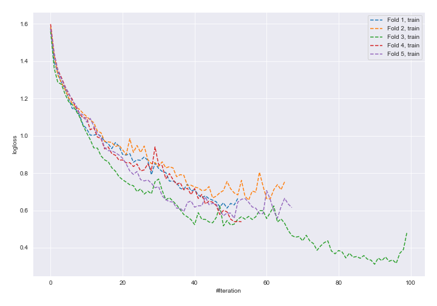
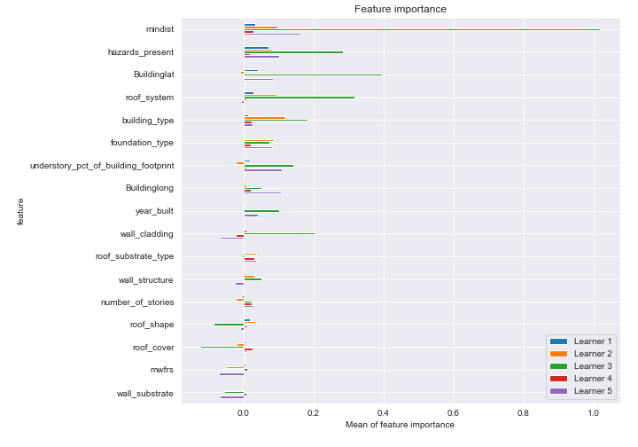
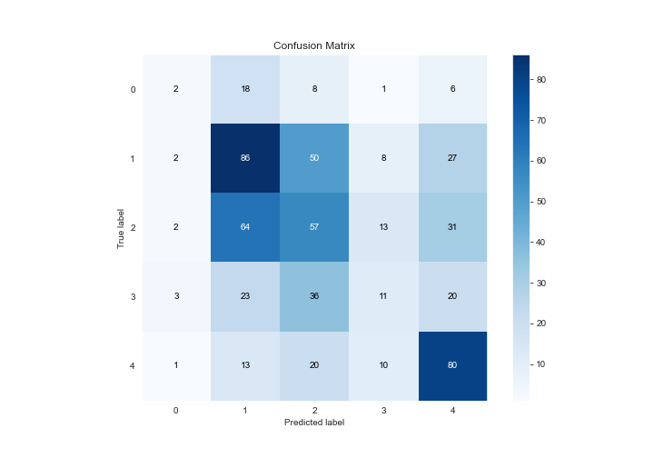
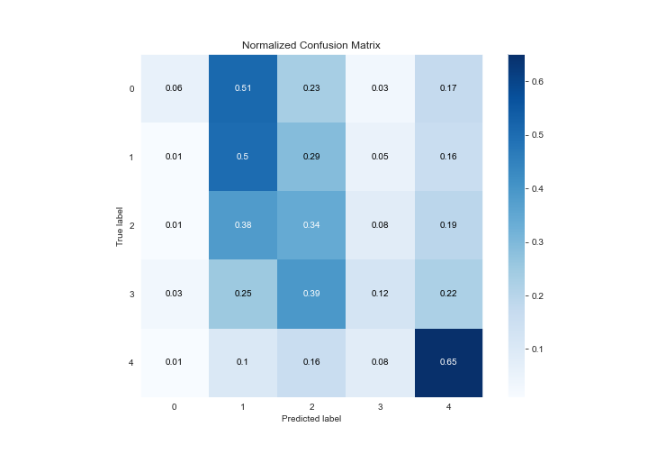
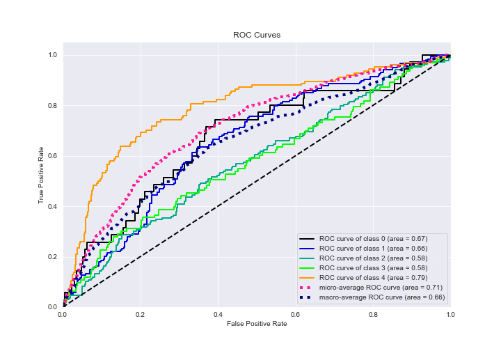
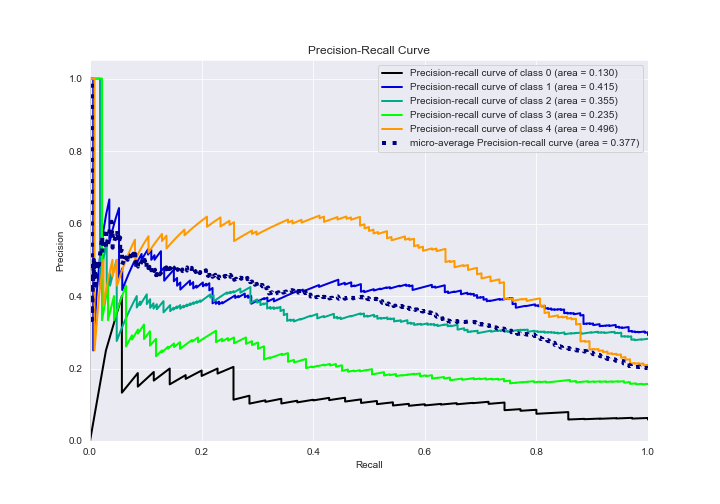

# Summary of 13_NeuralNetwork

[<< Go back](../README.md)

## Neural Network
- **n_jobs**: -1
- **dense_1_size**: 16
- **dense_2_size**: 16
- **learning_rate**: 0.05
- **num_class**: 5
- **explain_level**: 2

## Validation
 - **validation_type**: kfold
 - **k_folds**: 5
 - **shuffle**: True
 - **stratify**: True

## Optimized metric
logloss

## Training time

116.5 seconds

### Metric details
|           |          0 |          1 |          2 |         3 |          4 |   accuracy |   macro avg |   weighted avg |   logloss |
|:----------|-----------:|-----------:|-----------:|----------:|-----------:|-----------:|------------:|---------------:|----------:|
| precision |  0.2       |   0.421569 |   0.333333 |  0.255814 |   0.487805 |   0.398649 |    0.339704 |       0.371413 |    1.9169 |
| recall    |  0.0571429 |   0.49711  |   0.341317 |  0.11828  |   0.645161 |   0.398649 |    0.331802 |       0.398649 |    1.9169 |
| f1-score  |  0.0888889 |   0.456233 |   0.337278 |  0.161765 |   0.555556 |   0.398649 |    0.319944 |       0.375503 |    1.9169 |
| support   | 35         | 173        | 167        | 93        | 124        |   0.398649 |  592        |     592        |    1.9169 |

## Confusion matrix
|              |   Predicted as 0 |   Predicted as 1 |   Predicted as 2 |   Predicted as 3 |   Predicted as 4 |
|:-------------|-----------------:|-----------------:|-----------------:|-----------------:|-----------------:|
| Labeled as 0 |                2 |               18 |                8 |                1 |                6 |
| Labeled as 1 |                2 |               86 |               50 |                8 |               27 |
| Labeled as 2 |                2 |               64 |               57 |               13 |               31 |
| Labeled as 3 |                3 |               23 |               36 |               11 |               20 |
| Labeled as 4 |                1 |               13 |               20 |               10 |               80 |

## Learning curves

## Permutation-based Importance

## Confusion Matrix

## Normalized Confusion Matrix

## ROC Curve

## Precision Recall Curve

[<< Go back](../README.md)
