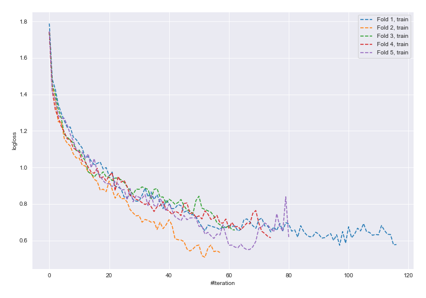
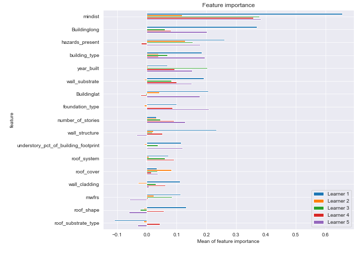
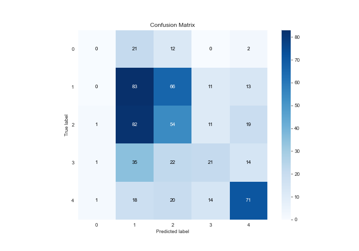
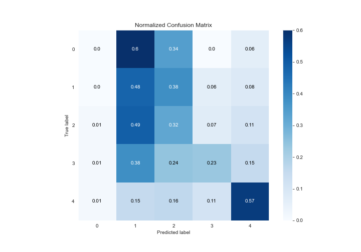
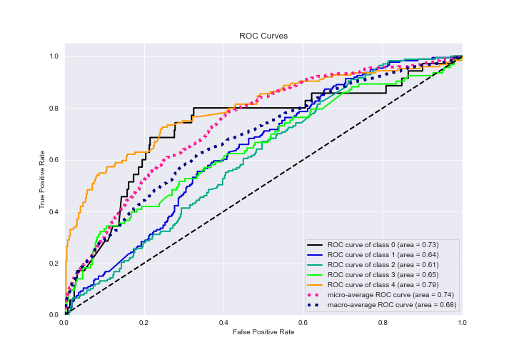
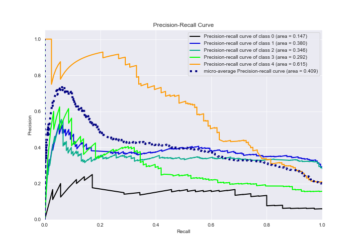

# Summary of 14_NeuralNetwork

[<< Go back](../README.md)

## Neural Network
- **n_jobs**: -1
- **dense_1_size**: 64
- **dense_2_size**: 16
- **learning_rate**: 0.05
- **num_class**: 5
- **explain_level**: 2

## Validation
 - **validation_type**: kfold
 - **k_folds**: 5
 - **shuffle**: True
 - **stratify**: True

## Optimized metric
logloss

## Training time

129.4 seconds

### Metric details
|           |   0 |          1 |          2 |         3 |          4 |   accuracy |   macro avg |   weighted avg |   logloss |
|:----------|----:|-----------:|-----------:|----------:|-----------:|-----------:|------------:|---------------:|----------:|
| precision |   0 |   0.34728  |   0.310345 |  0.368421 |   0.596639 |   0.386824 |    0.324537 |       0.371881 |   1.76558 |
| recall    |   0 |   0.479769 |   0.323353 |  0.225806 |   0.572581 |   0.386824 |    0.320302 |       0.386824 |   1.76558 |
| f1-score  |   0 |   0.402913 |   0.316716 |  0.28     |   0.584362 |   0.386824 |    0.316798 |       0.373473 |   1.76558 |
| support   |  35 | 173        | 167        | 93        | 124        |   0.386824 |  592        |     592        |   1.76558 |

## Confusion matrix
|              |   Predicted as 0 |   Predicted as 1 |   Predicted as 2 |   Predicted as 3 |   Predicted as 4 |
|:-------------|-----------------:|-----------------:|-----------------:|-----------------:|-----------------:|
| Labeled as 0 |                0 |               21 |               12 |                0 |                2 |
| Labeled as 1 |                0 |               83 |               66 |               11 |               13 |
| Labeled as 2 |                1 |               82 |               54 |               11 |               19 |
| Labeled as 3 |                1 |               35 |               22 |               21 |               14 |
| Labeled as 4 |                1 |               18 |               20 |               14 |               71 |

## Learning curves

## Permutation-based Importance

## Confusion Matrix

## Normalized Confusion Matrix

## ROC Curve

## Precision Recall Curve

[<< Go back](../README.md)
