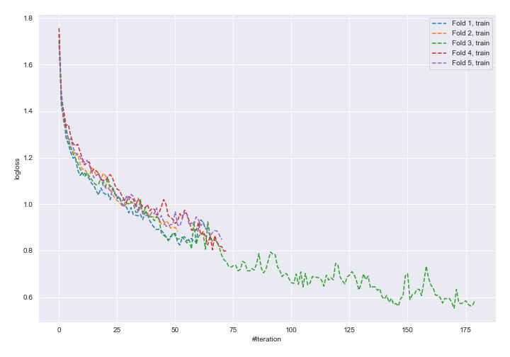
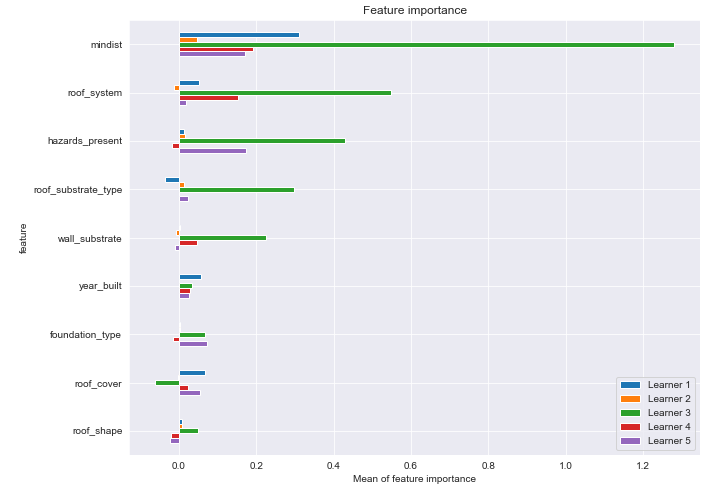
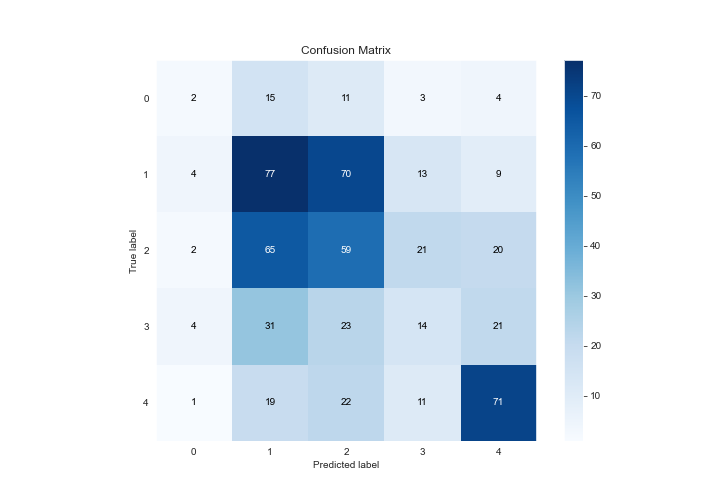
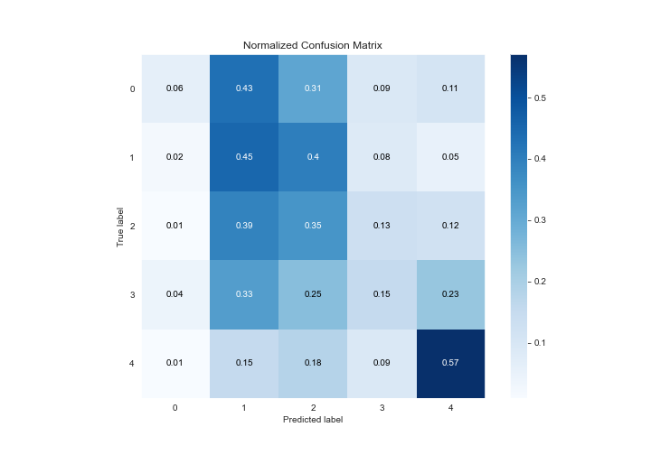
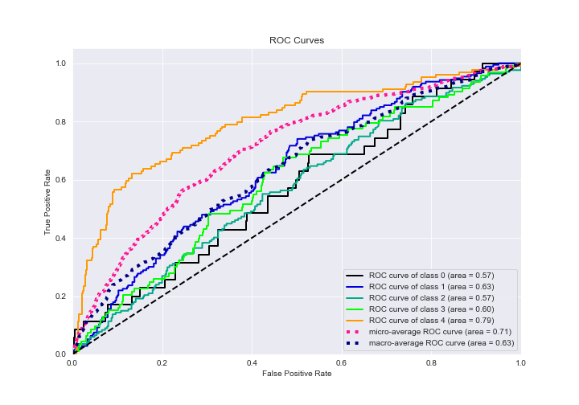
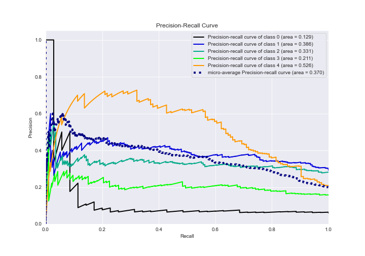

# Summary of 15_NeuralNetwork_SelectedFeatures

[<< Go back](../README.md)

## Neural Network
- **n_jobs**: -1
- **dense_1_size**: 16
- **dense_2_size**: 16
- **learning_rate**: 0.05
- **num_class**: 5
- **explain_level**: 2

## Validation
 - **validation_type**: kfold
 - **k_folds**: 5
 - **shuffle**: True
 - **stratify**: True

## Optimized metric
logloss

## Training time

125.7 seconds

### Metric details
|           |          0 |          1 |          2 |         3 |          4 |   accuracy |   macro avg |   weighted avg |   logloss |
|:----------|-----------:|-----------:|-----------:|----------:|-----------:|-----------:|------------:|---------------:|----------:|
| precision |  0.153846  |   0.371981 |   0.318919 |  0.225806 |   0.568    |   0.376689 |    0.32771  |       0.362211 |   1.88145 |
| recall    |  0.0571429 |   0.445087 |   0.353293 |  0.150538 |   0.572581 |   0.376689 |    0.315728 |       0.376689 |   1.88145 |
| f1-score  |  0.0833333 |   0.405263 |   0.335227 |  0.180645 |   0.570281 |   0.376689 |    0.31495  |       0.365752 |   1.88145 |
| support   | 35         | 173        | 167        | 93        | 124        |   0.376689 |  592        |     592        |   1.88145 |

## Confusion matrix
|              |   Predicted as 0 |   Predicted as 1 |   Predicted as 2 |   Predicted as 3 |   Predicted as 4 |
|:-------------|-----------------:|-----------------:|-----------------:|-----------------:|-----------------:|
| Labeled as 0 |                2 |               15 |               11 |                3 |                4 |
| Labeled as 1 |                4 |               77 |               70 |               13 |                9 |
| Labeled as 2 |                2 |               65 |               59 |               21 |               20 |
| Labeled as 3 |                4 |               31 |               23 |               14 |               21 |
| Labeled as 4 |                1 |               19 |               22 |               11 |               71 |

## Learning curves

## Permutation-based Importance

## Confusion Matrix

## Normalized Confusion Matrix

## ROC Curve

## Precision Recall Curve

[<< Go back](../README.md)
