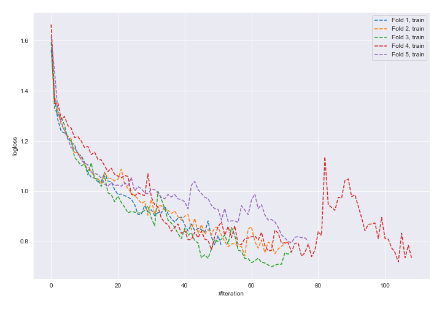
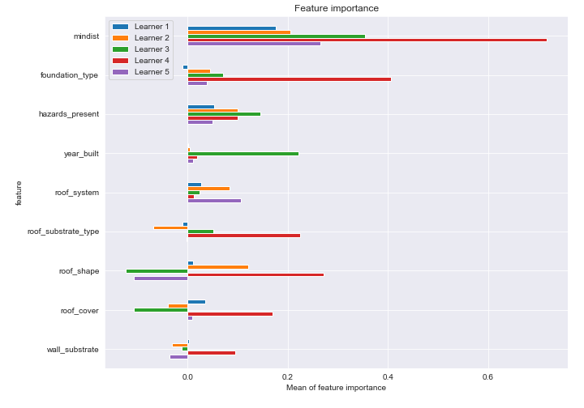
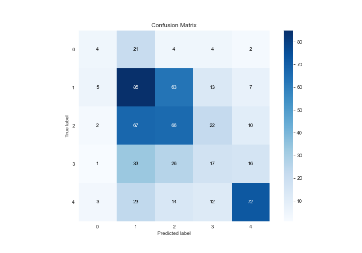
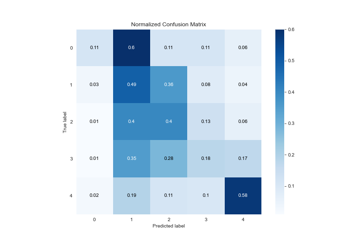
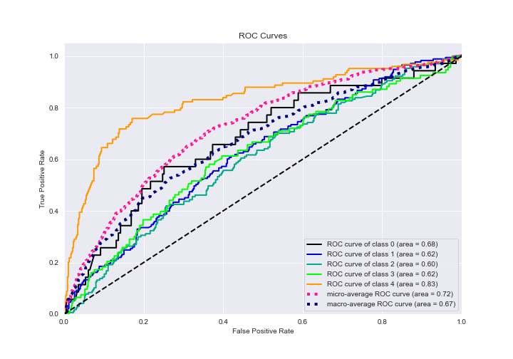
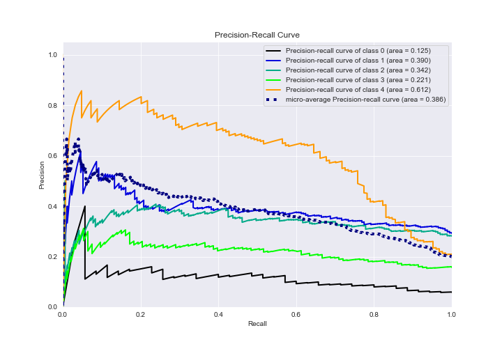

# Summary of 16_NeuralNetwork_SelectedFeatures

[<< Go back](../README.md)

## Neural Network
- **n_jobs**: -1
- **dense_1_size**: 64
- **dense_2_size**: 16
- **learning_rate**: 0.05
- **num_class**: 5
- **explain_level**: 2

## Validation
 - **validation_type**: kfold
 - **k_folds**: 5
 - **shuffle**: True
 - **stratify**: True

## Optimized metric
logloss

## Training time

116.0 seconds

### Metric details
|           |         0 |          1 |          2 |         3 |          4 |   accuracy |   macro avg |   weighted avg |   logloss |
|:----------|----------:|-----------:|-----------:|----------:|-----------:|-----------:|------------:|---------------:|----------:|
| precision |  0.266667 |   0.371179 |   0.381503 |  0.25     |   0.672897 |   0.412162 |    0.388449 |       0.412074 |   1.82885 |
| recall    |  0.114286 |   0.491329 |   0.39521  |  0.182796 |   0.580645 |   0.412162 |    0.352853 |       0.412162 |   1.82885 |
| f1-score  |  0.16     |   0.422886 |   0.388235 |  0.21118  |   0.623377 |   0.412162 |    0.361136 |       0.406306 |   1.82885 |
| support   | 35        | 173        | 167        | 93        | 124        |   0.412162 |  592        |     592        |   1.82885 |

## Confusion matrix
|              |   Predicted as 0 |   Predicted as 1 |   Predicted as 2 |   Predicted as 3 |   Predicted as 4 |
|:-------------|-----------------:|-----------------:|-----------------:|-----------------:|-----------------:|
| Labeled as 0 |                4 |               21 |                4 |                4 |                2 |
| Labeled as 1 |                5 |               85 |               63 |               13 |                7 |
| Labeled as 2 |                2 |               67 |               66 |               22 |               10 |
| Labeled as 3 |                1 |               33 |               26 |               17 |               16 |
| Labeled as 4 |                3 |               23 |               14 |               12 |               72 |

## Learning curves

## Permutation-based Importance

## Confusion Matrix

## Normalized Confusion Matrix

## ROC Curve

## Precision Recall Curve

[<< Go back](../README.md)
