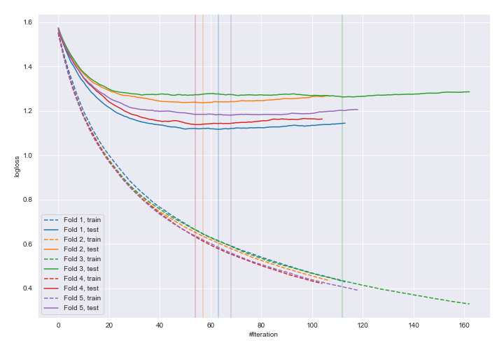
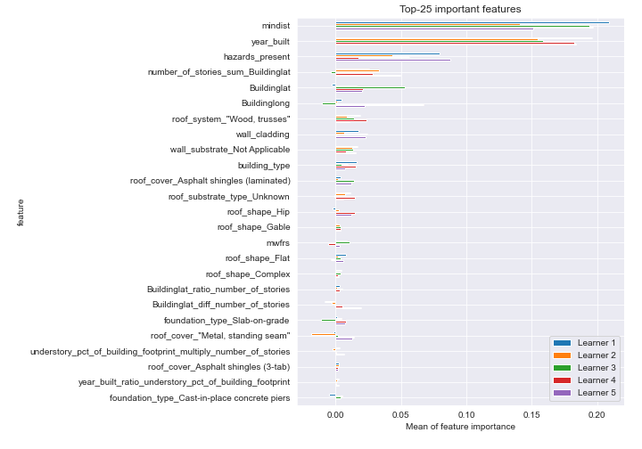
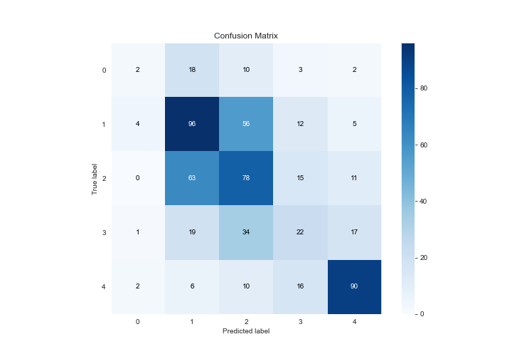
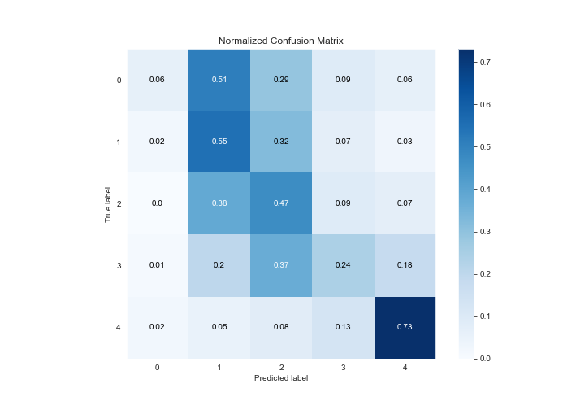
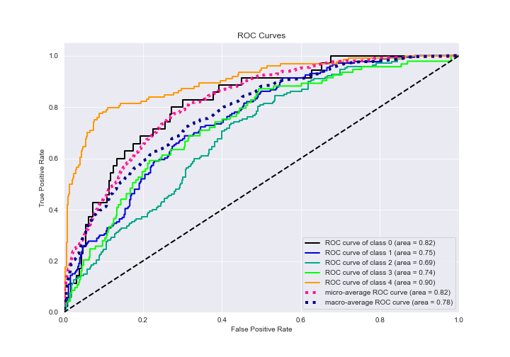
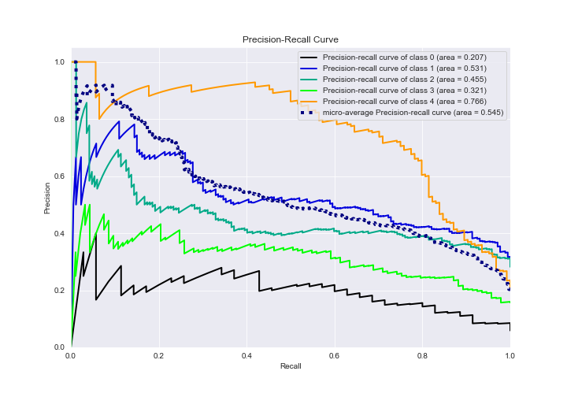

# Summary of 17_Xgboost_GoldenFeatures

[<< Go back](../README.md)

## Extreme Gradient Boosting (Xgboost)
- **n_jobs**: -1
- **objective**: multi:softprob
- **eta**: 0.075
- **max_depth**: 6
- **min_child_weight**: 5
- **subsample**: 1.0
- **colsample_bytree**: 0.9
- **eval_metric**: mlogloss
- **num_class**: 5
- **explain_level**: 2

## Validation
 - **validation_type**: kfold
 - **k_folds**: 5
 - **shuffle**: True
 - **stratify**: True

## Optimized metric
logloss

## Training time

132.6 seconds

### Metric details
|           |          0 |          1 |          2 |         3 |          4 |   accuracy |   macro avg |   weighted avg |   logloss |
|:----------|-----------:|-----------:|-----------:|----------:|-----------:|-----------:|------------:|---------------:|----------:|
| precision |  0.222222  |   0.475248 |   0.414894 |  0.323529 |   0.72     |   0.486486 |    0.431179 |       0.470694 |   1.18695 |
| recall    |  0.0571429 |   0.554913 |   0.467066 |  0.236559 |   0.725806 |   0.486486 |    0.408298 |       0.486486 |   1.18695 |
| f1-score  |  0.0909091 |   0.512    |   0.439437 |  0.273292 |   0.722892 |   0.486486 |    0.407706 |       0.473308 |   1.18695 |
| support   | 35         | 173        | 167        | 93        | 124        |   0.486486 |  592        |     592        |   1.18695 |

## Confusion matrix
|              |   Predicted as 0 |   Predicted as 1 |   Predicted as 2 |   Predicted as 3 |   Predicted as 4 |
|:-------------|-----------------:|-----------------:|-----------------:|-----------------:|-----------------:|
| Labeled as 0 |                2 |               18 |               10 |                3 |                2 |
| Labeled as 1 |                4 |               96 |               56 |               12 |                5 |
| Labeled as 2 |                0 |               63 |               78 |               15 |               11 |
| Labeled as 3 |                1 |               19 |               34 |               22 |               17 |
| Labeled as 4 |                2 |                6 |               10 |               16 |               90 |

## Learning curves

## Permutation-based Importance

## Confusion Matrix

## Normalized Confusion Matrix

## ROC Curve

## Precision Recall Curve

[<< Go back](../README.md)
