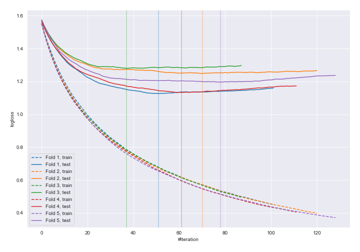
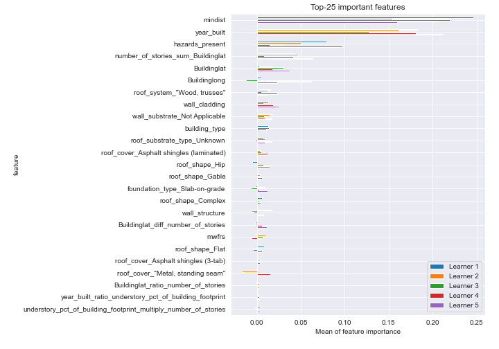
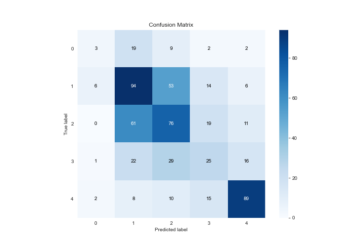
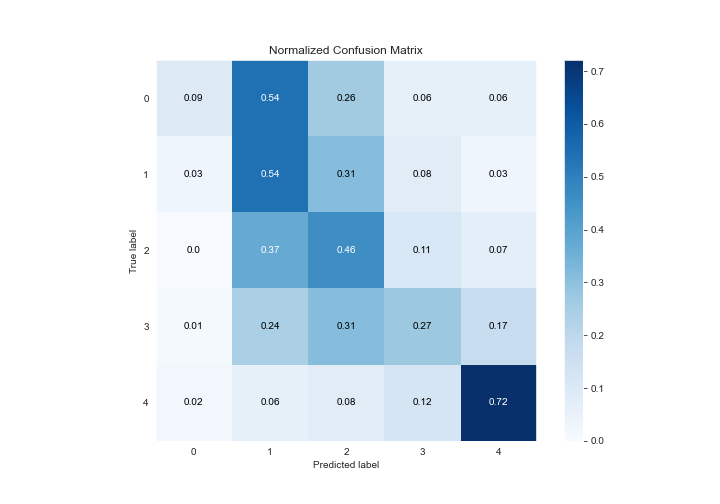
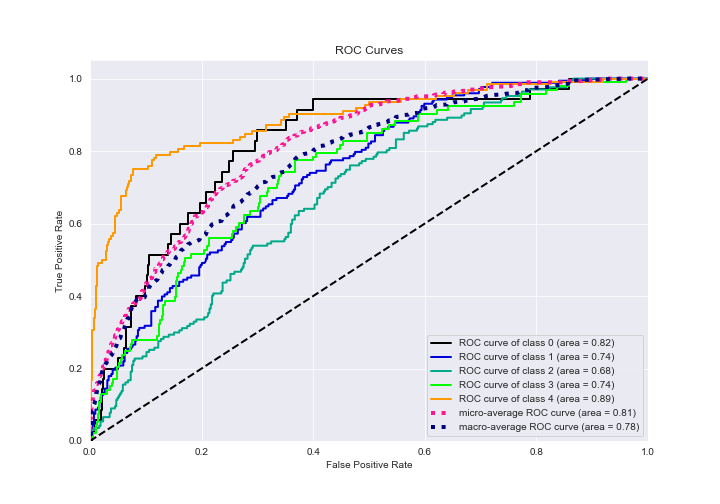
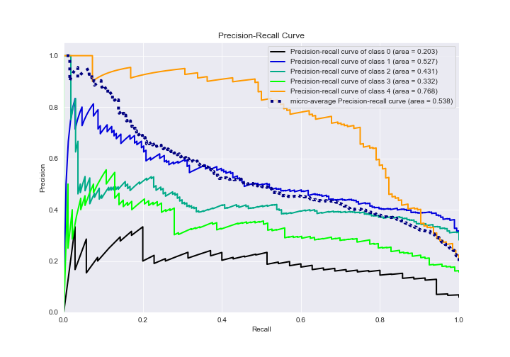

# Summary of 18_Xgboost_GoldenFeatures

[<< Go back](../README.md)

## Extreme Gradient Boosting (Xgboost)
- **n_jobs**: -1
- **objective**: multi:softprob
- **eta**: 0.075
- **max_depth**: 6
- **min_child_weight**: 5
- **subsample**: 1.0
- **colsample_bytree**: 1.0
- **eval_metric**: mlogloss
- **num_class**: 5
- **explain_level**: 2

## Validation
 - **validation_type**: kfold
 - **k_folds**: 5
 - **shuffle**: True
 - **stratify**: True

## Optimized metric
logloss

## Training time

131.5 seconds

### Metric details
|           |          0 |          1 |          2 |         3 |          4 |   accuracy |   macro avg |   weighted avg |   logloss |
|:----------|-----------:|-----------:|-----------:|----------:|-----------:|-----------:|------------:|---------------:|----------:|
| precision |  0.25      |   0.460784 |   0.429379 |  0.333333 |   0.717742 |   0.484797 |    0.438248 |       0.473263 |   1.19632 |
| recall    |  0.0857143 |   0.543353 |   0.45509  |  0.268817 |   0.717742 |   0.484797 |    0.414143 |       0.484797 |   1.19632 |
| f1-score  |  0.12766   |   0.498674 |   0.44186  |  0.297619 |   0.717742 |   0.484797 |    0.416711 |       0.475013 |   1.19632 |
| support   | 35         | 173        | 167        | 93        | 124        |   0.484797 |  592        |     592        |   1.19632 |

## Confusion matrix
|              |   Predicted as 0 |   Predicted as 1 |   Predicted as 2 |   Predicted as 3 |   Predicted as 4 |
|:-------------|-----------------:|-----------------:|-----------------:|-----------------:|-----------------:|
| Labeled as 0 |                3 |               19 |                9 |                2 |                2 |
| Labeled as 1 |                6 |               94 |               53 |               14 |                6 |
| Labeled as 2 |                0 |               61 |               76 |               19 |               11 |
| Labeled as 3 |                1 |               22 |               29 |               25 |               16 |
| Labeled as 4 |                2 |                8 |               10 |               15 |               89 |

## Learning curves

## Permutation-based Importance

## Confusion Matrix

## Normalized Confusion Matrix

## ROC Curve

## Precision Recall Curve

[<< Go back](../README.md)
