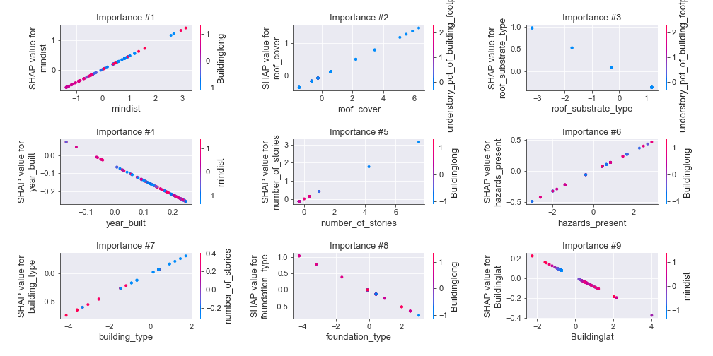
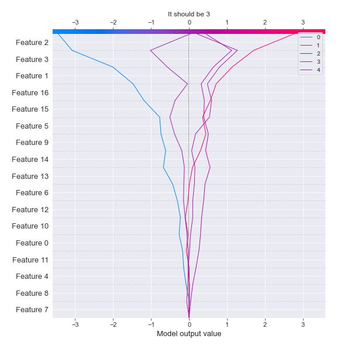

# Summary of 3_Linear

[<< Go back](../README.md)

## Logistic Regression (Linear)
- **n_jobs**: -1
- **num_class**: 5
- **explain_level**: 2

## Validation
 - **validation_type**: kfold
 - **k_folds**: 5
 - **shuffle**: True
 - **stratify**: True

## Optimized metric
logloss

## Training time

38.8 seconds

### Metric details
|           |         0 |          1 |          2 |         3 |          4 |   accuracy |   macro avg |   weighted avg |   logloss |
|:----------|----------:|-----------:|-----------:|----------:|-----------:|-----------:|------------:|---------------:|----------:|
| precision |  0.3125   |   0.376569 |   0.288591 |  0.269231 |   0.580882 |   0.390203 |    0.365555 |       0.373896 |   1.39066 |
| recall    |  0.142857 |   0.520231 |   0.257485 |  0.150538 |   0.637097 |   0.390203 |    0.341642 |       0.390203 |   1.39066 |
| f1-score  |  0.196078 |   0.436893 |   0.272152 |  0.193103 |   0.607692 |   0.390203 |    0.341184 |       0.373661 |   1.39066 |
| support   | 35        | 173        | 167        | 93        | 124        |   0.390203 |  592        |     592        |   1.39066 |

## Confusion matrix
|              |   Predicted as 0 |   Predicted as 1 |   Predicted as 2 |   Predicted as 3 |   Predicted as 4 |
|:-------------|-----------------:|-----------------:|-----------------:|-----------------:|-----------------:|
| Labeled as 0 |                5 |               14 |               10 |                1 |                5 |
| Labeled as 1 |                6 |               90 |               57 |                7 |               13 |
| Labeled as 2 |                3 |               91 |               43 |               10 |               20 |
| Labeled as 3 |                1 |               36 |               23 |               14 |               19 |
| Labeled as 4 |                1 |                8 |               16 |               20 |               79 |

## Learning curves

## Coefficients

### Coefficients learner #1
|                                      |          0 |           1 |          2 |          3 |           4 |
|:-------------------------------------|-----------:|------------:|-----------:|-----------:|------------:|
| intercept                            | -1.36405   |  0.577301   |  0.845401  | -0.0843553 |  0.025705   |
| Buildinglat                          | -0.0859765 | -0.135952   | -0.119908  |  0.344542  | -0.00270584 |
| hazards_present                      | -0.525125  |  0.238519   |  0.159561  |  0.395659  | -0.268614   |
| building_type                        |  0.182907  |  0.356537   |  0.160163  | -0.339238  | -0.360369   |
| number_of_stories                    | -1.25878   |  0.507985   |  0.482017  |  0.406506  | -0.137729   |
| understory_pct_of_building_footprint |  0.0836175 | -0.0667814  | -0.0266934 | -0.0885121 |  0.0983694  |
| year_built                           |  0.118968  |  1.50624    | -0.798937  | -0.35966   | -0.466614   |
| roof_shape                           |  0.0743004 |  0.0049848  |  0.111364  | -0.227998  |  0.0373491  |
| mwfrs                                |  0.0405943 | -0.165526   |  0.0166972 | -0.131479  |  0.239713   |
| foundation_type                      | -0.048291  | -0.12322    | -0.301851  |  0.426397  |  0.0469647  |
| wall_structure                       |  0.27184   |  0.0208851  |  0.0381878 |  0.20403   | -0.534943   |
| wall_substrate                       | -0.0387927 | -0.00382251 | -0.0627407 | -0.0513254 |  0.156681   |
| wall_cladding                        |  0.141811  | -0.00676359 | -0.0825705 | -0.0904902 |  0.0380132  |
| roof_system                          | -0.354933  |  0.253481   |  0.123986  | -0.258104  |  0.23557    |
| roof_substrate_type                  |  0.294297  |  0.171196   | -0.29905   | -0.105     | -0.0614434  |
| roof_cover                           | -0.0924696 |  0.130473   |  0.221708  | -0.398612  |  0.1389     |
| Buildinglong                         |  0.393574  | -0.0181032  |  0.142335  | -0.354323  | -0.163482   |
| mindist                              |  0.711733  |  0.439153   |  0.452494  | -0.391884  | -1.2115     |

### Coefficients learner #2
|                                      |          0 |           1 |          2 |          3 |           4 |
|:-------------------------------------|-----------:|------------:|-----------:|-----------:|------------:|
| intercept                            | -1.36646   |  0.540242   |  0.862267  |  0.0450332 | -0.0810867  |
| Buildinglat                          | -0.0416236 | -0.00578079 | -0.0964048 |  0.363551  | -0.219742   |
| hazards_present                      | -0.270242  |  0.179049   |  0.162617  |  0.252646  | -0.32407    |
| building_type                        |  0.0693057 |  0.270105   |  0.181941  | -0.261728  | -0.259624   |
| number_of_stories                    | -0.954063  |  0.427384   |  0.414595  |  0.543437  | -0.431353   |
| understory_pct_of_building_footprint | -0.0703167 |  0.0387509  | -0.0954124 |  0.0106432 |  0.116335   |
| year_built                           |  0.246686  |  1.55399    | -0.806408  | -0.429629  | -0.564643   |
| roof_shape                           |  0.156082  | -0.0640556  |  0.0649053 | -0.129222  | -0.0277095  |
| mwfrs                                |  0.294833  | -0.284816   | -0.0301294 | -0.0212525 |  0.0413654  |
| foundation_type                      |  0.123246  | -0.0598547  | -0.250022  |  0.124006  |  0.0626249  |
| wall_structure                       | -0.112037  |  0.217335   |  0.0527415 |  0.400016  | -0.558056   |
| wall_substrate                       | -0.208987  | -0.0501733  |  0.0442359 |  0.131344  |  0.0835804  |
| wall_cladding                        |  0.102701  |  0.00842409 |  0.0427964 | -0.150411  | -0.00351045 |
| roof_system                          | -0.0531521 |  0.19116    |  0.0022777 | -0.429598  |  0.289313   |
| roof_substrate_type                  |  0.602646  |  0.0467314  | -0.30423   | -0.286957  | -0.0581899  |
| roof_cover                           | -0.202836  |  0.15898    |  0.235322  | -0.284396  |  0.0929301  |
| Buildinglong                         |  0.55065   | -0.0513103  |  0.064345  | -0.332868  | -0.230817   |
| mindist                              |  0.654071  |  0.447429   |  0.439985  | -0.483713  | -1.05777    |

### Coefficients learner #3
|                                      |          0 |           1 |           2 |          3 |          4 |
|:-------------------------------------|-----------:|------------:|------------:|-----------:|-----------:|
| intercept                            | -1.46398   |  0.630841   |  0.873215   |  0.060001  | -0.100075  |
| Buildinglat                          | -0.0436266 | -0.00419638 | -0.0827687  |  0.156609  | -0.0260173 |
| hazards_present                      | -0.444603  |  0.3347     |  0.120788   |  0.353959  | -0.364843  |
| building_type                        |  0.378142  |  0.273742   |  0.0571202  | -0.303738  | -0.405266  |
| number_of_stories                    | -1.30206   |  0.510279   |  0.513257   |  0.509637  | -0.231113  |
| understory_pct_of_building_footprint |  0.103606  | -0.1634     | -0.00947106 |  0.0241349 |  0.0451303 |
| year_built                           |  0.566909  |  1.35165    | -0.730431   | -0.530986  | -0.657143  |
| roof_shape                           |  0.0347796 |  0.0473524  |  0.0623636  | -0.104648  | -0.0398473 |
| mwfrs                                |  0.353472  | -0.202422   | -0.0784343  | -0.160058  |  0.0874426 |
| foundation_type                      |  0.0497776 | -0.129477   | -0.249159   |  0.284711  |  0.0441468 |
| wall_structure                       |  0.270661  |  0.0650642  |  0.0171232  |  0.0558052 | -0.408654  |
| wall_substrate                       |  0.0789085 | -0.0749955  | -0.124646   | -0.0721226 |  0.192856  |
| wall_cladding                        |  0.0760059 |  0.146554   | -0.0653057  | -0.0738697 | -0.0833843 |
| roof_system                          | -0.425039  |  0.325331   |  0.0171758  | -0.122423  |  0.204956  |
| roof_substrate_type                  |  0.332989  |  0.0500435  | -0.1489     | -0.280402  |  0.0462704 |
| roof_cover                           | -0.126929  |  0.04065    |  0.173541   | -0.255678  |  0.168416  |
| Buildinglong                         |  0.416835  |  0.00538181 |  0.0153432  | -0.472015  |  0.034455  |
| mindist                              |  0.522675  |  0.428592   |  0.46839    | -0.28051   | -1.13915   |

### Coefficients learner #4
|                                      |          0 |          1 |          2 |          3 |          4 |
|:-------------------------------------|-----------:|-----------:|-----------:|-----------:|-----------:|
| intercept                            | -1.48253   |  0.661859  |  0.841044  |  0.0353985 | -0.0557744 |
| Buildinglat                          |  0.0386356 | -0.088769  | -0.144244  |  0.224534  | -0.0301576 |
| hazards_present                      | -0.440789  |  0.221964  |  0.182398  |  0.411693  | -0.375266  |
| building_type                        |  0.375673  |  0.292325  |  0.0857466 | -0.260831  | -0.492914  |
| number_of_stories                    | -1.11541   |  0.516877  |  0.44865   |  0.490054  | -0.340174  |
| understory_pct_of_building_footprint |  0.0898413 | -0.091092  | -0.0290052 | -0.0754015 |  0.105657  |
| year_built                           |  0.465522  |  1.2199    | -0.72271   | -0.437516  | -0.525196  |
| roof_shape                           |  0.120721  | -0.0407596 |  0.0679974 | -0.0710583 | -0.0769008 |
| mwfrs                                |  0.216613  | -0.174771  |  0.0343559 | -0.1449    |  0.0687022 |
| foundation_type                      |  0.0431868 | -0.11019   | -0.0727708 |  0.186191  | -0.0464166 |
| wall_structure                       |  0.100417  |  0.0567943 |  0.0681044 |  0.250494  | -0.475809  |
| wall_substrate                       | -0.0941498 | -0.0311883 | -0.0829047 |  0.0528768 |  0.155366  |
| wall_cladding                        |  0.0986625 |  0.0288422 |  0.0289049 | -0.215228  |  0.0588184 |
| roof_system                          | -0.228986  |  0.183853  |  0.0322147 | -0.230452  |  0.243371  |
| roof_substrate_type                  |  0.52445   |  0.0967331 | -0.223214  | -0.263346  | -0.134624  |
| roof_cover                           | -0.349606  |  0.168255  |  0.210504  | -0.224184  |  0.195031  |
| Buildinglong                         |  0.383966  |  0.0583159 |  0.0907027 | -0.416898  | -0.116087  |
| mindist                              |  0.579519  |  0.434281  |  0.524978  | -0.441034  | -1.09774   |

### Coefficients learner #5
|                                      |          0 |          1 |          2 |          3 |          4 |
|:-------------------------------------|-----------:|-----------:|-----------:|-----------:|-----------:|
| intercept                            | -1.42082   |  0.643527  |  0.83235   |  0.0792107 | -0.134268  |
| Buildinglat                          | -0.322036  | -0.0982871 | -0.138831  |  0.323813  |  0.235342  |
| hazards_present                      | -0.276709  |  0.313582  |  0.145909  |  0.148099  | -0.330881  |
| building_type                        |  0.209619  |  0.253677  |  0.163138  | -0.226077  | -0.400356  |
| number_of_stories                    | -0.93459   |  0.264401  |  0.471328  |  0.546734  | -0.347874  |
| understory_pct_of_building_footprint | -0.0846017 | -0.142485  |  0.0535643 |  0.0394267 |  0.134095  |
| year_built                           |  0.409672  |  1.10149   | -0.732067  | -0.461937  | -0.317156  |
| roof_shape                           | -0.0325416 |  0.0789041 |  0.19407   | -0.138628  | -0.101804  |
| mwfrs                                |  0.36292   | -0.239849  | -0.0562111 | -0.139029  |  0.0721693 |
| foundation_type                      | -0.0412441 | -0.165566  | -0.23972   |  0.296108  |  0.150422  |
| wall_structure                       |  0.445607  | -0.0790571 | -0.0524763 |  0.264641  | -0.578715  |
| wall_substrate                       |  0.0835516 | -0.0771177 | -0.149247  |  0.0324926 |  0.110321  |
| wall_cladding                        |  0.116507  |  0.0961087 | -0.0566838 | -0.193754  |  0.0378229 |
| roof_system                          | -0.459977  |  0.353443  |  0.114336  | -0.250898  |  0.243097  |
| roof_substrate_type                  |  0.49023   |  0.0245287 | -0.206044  | -0.272936  | -0.035779  |
| roof_cover                           | -0.100325  |  0.0681525 |  0.182036  | -0.238239  |  0.0883753 |
| Buildinglong                         |  0.328485  |  0.0245084 |  0.0997294 | -0.271252  | -0.18147   |
| mindist                              |  0.760964  |  0.459527  |  0.65737   | -0.458384  | -1.41948   |

## Permutation-based Importance

## Confusion Matrix

## Normalized Confusion Matrix

## ROC Curve

## Precision Recall Curve

## SHAP Importance

## SHAP Dependence plots

### Dependence 0 (Fold 1)

### Dependence 1 (Fold 1)

### Dependence 2 (Fold 1)

### Dependence 3 (Fold 1)

### Dependence 4 (Fold 1)

### Dependence 0 (Fold 2)

### Dependence 1 (Fold 2)

### Dependence 2 (Fold 2)

### Dependence 3 (Fold 2)

### Dependence 4 (Fold 2)

### Dependence 0 (Fold 3)

### Dependence 1 (Fold 3)

### Dependence 2 (Fold 3)

### Dependence 3 (Fold 3)

### Dependence 4 (Fold 3)

### Dependence 0 (Fold 4)

### Dependence 1 (Fold 4)

### Dependence 2 (Fold 4)

### Dependence 3 (Fold 4)

### Dependence 4 (Fold 4)

### Dependence 0 (Fold 5)

### Dependence 1 (Fold 5)

### Dependence 2 (Fold 5)

### Dependence 3 (Fold 5)

### Dependence 4 (Fold 5)

## SHAP Decision plots

### Worst decisions for selected sample 1 (Fold 1)

### Worst decisions for selected sample 1 (Fold 2)

### Worst decisions for selected sample 1 (Fold 3)

### Worst decisions for selected sample 1 (Fold 4)

### Worst decisions for selected sample 1 (Fold 5)

### Worst decisions for selected sample 2 (Fold 1)

### Worst decisions for selected sample 2 (Fold 2)

### Worst decisions for selected sample 2 (Fold 3)

### Worst decisions for selected sample 2 (Fold 4)

### Worst decisions for selected sample 2 (Fold 5)

### Worst decisions for selected sample 3 (Fold 1)

### Worst decisions for selected sample 3 (Fold 2)

### Worst decisions for selected sample 3 (Fold 3)

### Worst decisions for selected sample 3 (Fold 4)

### Worst decisions for selected sample 3 (Fold 5)

### Worst decisions for selected sample 4 (Fold 1)

### Worst decisions for selected sample 4 (Fold 2)

### Worst decisions for selected sample 4 (Fold 3)

### Worst decisions for selected sample 4 (Fold 4)

### Worst decisions for selected sample 4 (Fold 5)

### Best decisions for selected sample 1 (Fold 1)

### Best decisions for selected sample 1 (Fold 2)

### Best decisions for selected sample 1 (Fold 3)

### Best decisions for selected sample 1 (Fold 4)

### Best decisions for selected sample 1 (Fold 5)

### Best decisions for selected sample 2 (Fold 1)

### Best decisions for selected sample 2 (Fold 2)

### Best decisions for selected sample 2 (Fold 3)

### Best decisions for selected sample 2 (Fold 4)

### Best decisions for selected sample 2 (Fold 5)

### Best decisions for selected sample 3 (Fold 1)

### Best decisions for selected sample 3 (Fold 2)

### Best decisions for selected sample 3 (Fold 3)

### Best decisions for selected sample 3 (Fold 4)

### Best decisions for selected sample 3 (Fold 5)

### Best decisions for selected sample 4 (Fold 1)

### Best decisions for selected sample 4 (Fold 2)

### Best decisions for selected sample 4 (Fold 3)

### Best decisions for selected sample 4 (Fold 4)

### Best decisions for selected sample 4 (Fold 5)

[<< Go back](../README.md)
