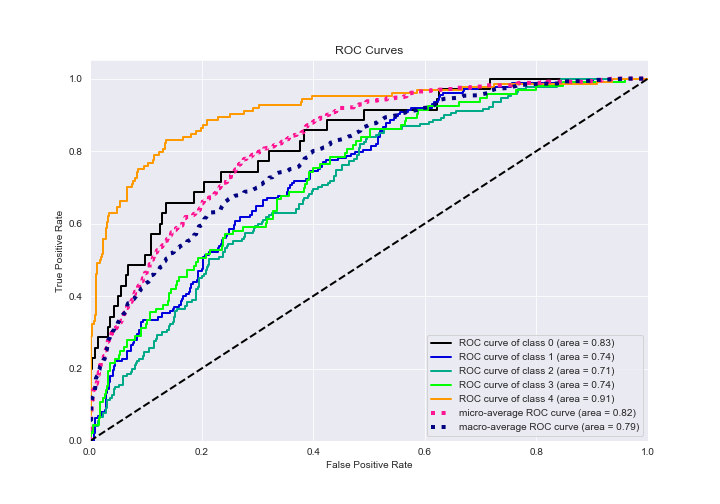

# Summary of 4_Default_Xgboost_categorical_mix_GoldenFeatures_RandomFeature

[<< Go back](../README.md)

## Extreme Gradient Boosting (Xgboost)
- **n_jobs**: -1
- **objective**: multi:softprob
- **eta**: 0.075
- **max_depth**: 6
- **min_child_weight**: 1
- **subsample**: 1.0
- **colsample_bytree**: 1.0
- **eval_metric**: mlogloss
- **num_class**: 5
- **explain_level**: 1

## Validation
 - **validation_type**: kfold
 - **k_folds**: 5
 - **shuffle**: True
 - **stratify**: True

## Optimized metric
logloss

## Training time

72.1 seconds

### Metric details
|           |         0 |          1 |          2 |         3 |          4 |   accuracy |   macro avg |   weighted avg |   logloss |
|:----------|----------:|-----------:|-----------:|----------:|-----------:|-----------:|------------:|---------------:|----------:|
| precision |  0.588235 |   0.465753 |   0.483871 |  0.386667 |   0.698413 |   0.513514 |    0.524588 |       0.514414 |    1.1635 |
| recall    |  0.285714 |   0.589595 |   0.449102 |  0.311828 |   0.709677 |   0.513514 |    0.469183 |       0.513514 |    1.1635 |
| f1-score  |  0.384615 |   0.520408 |   0.465839 |  0.345238 |   0.704    |   0.513514 |    0.48402  |       0.507923 |    1.1635 |
| support   | 35        | 173        | 167        | 93        | 124        |   0.513514 |  592        |     592        |    1.1635 |

## Confusion matrix
|              |   Predicted as 0 |   Predicted as 1 |   Predicted as 2 |   Predicted as 3 |   Predicted as 4 |
|:-------------|-----------------:|-----------------:|-----------------:|-----------------:|-----------------:|
| Labeled as 0 |               10 |               19 |                3 |                2 |                1 |
| Labeled as 1 |                5 |              102 |               47 |               11 |                8 |
| Labeled as 2 |                0 |               65 |               75 |               17 |               10 |
| Labeled as 3 |                1 |               24 |               20 |               29 |               19 |
| Labeled as 4 |                1 |                9 |               10 |               16 |               88 |

## Learning curves

## Permutation-based Importance

## Confusion Matrix

## Normalized Confusion Matrix

## ROC Curve

## Precision Recall Curve

[<< Go back](../README.md)
