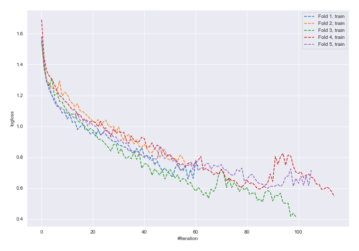
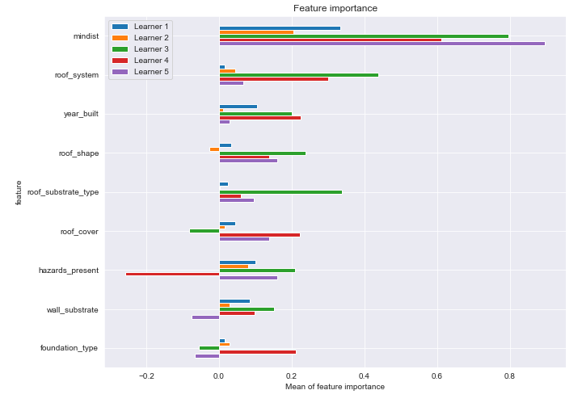
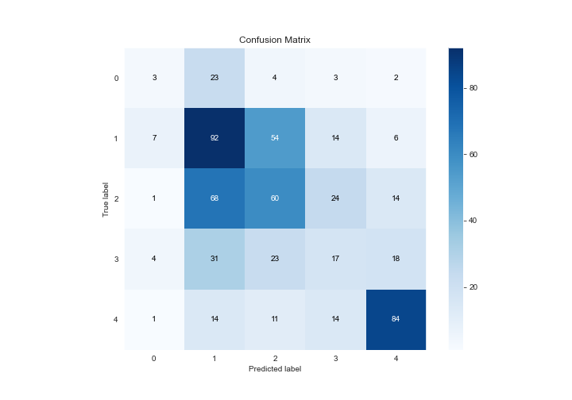
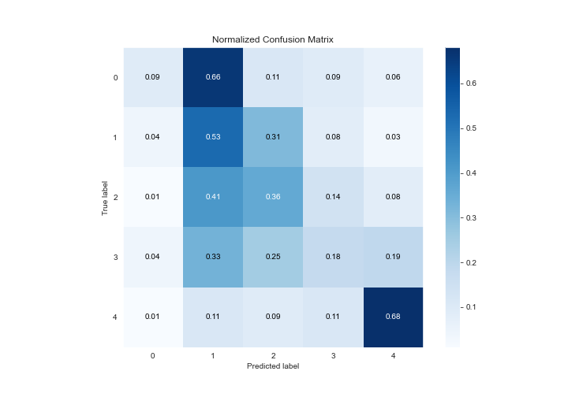
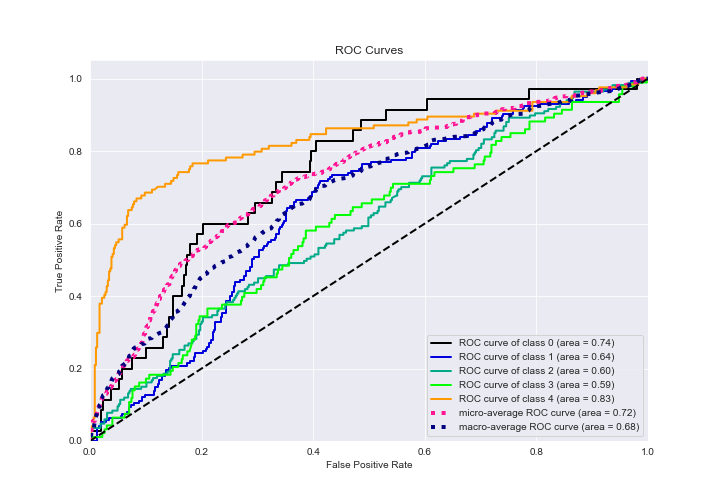
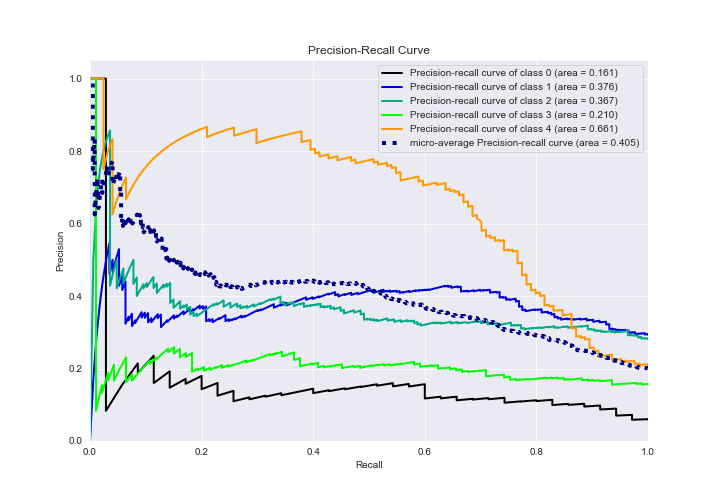

# Summary of 5_Default_NeuralNetwork_SelectedFeatures

[<< Go back](../README.md)

## Neural Network
- **n_jobs**: -1
- **dense_1_size**: 32
- **dense_2_size**: 16
- **learning_rate**: 0.05
- **num_class**: 5
- **explain_level**: 2

## Validation
 - **validation_type**: kfold
 - **k_folds**: 5
 - **shuffle**: True
 - **stratify**: True

## Optimized metric
logloss

## Training time

83.4 seconds

### Metric details
|           |          0 |          1 |          2 |         3 |          4 |   accuracy |   macro avg |   weighted avg |   logloss |
|:----------|-----------:|-----------:|-----------:|----------:|-----------:|-----------:|------------:|---------------:|----------:|
| precision |  0.1875    |   0.403509 |   0.394737 |  0.236111 |   0.677419 |   0.432432 |    0.379855 |       0.419339 |   2.10632 |
| recall    |  0.0857143 |   0.531792 |   0.359281 |  0.182796 |   0.677419 |   0.432432 |    0.367401 |       0.432432 |   2.10632 |
| f1-score  |  0.117647  |   0.458853 |   0.376176 |  0.206061 |   0.677419 |   0.432432 |    0.367231 |       0.421426 |   2.10632 |
| support   | 35         | 173        | 167        | 93        | 124        |   0.432432 |  592        |     592        |   2.10632 |

## Confusion matrix
|              |   Predicted as 0 |   Predicted as 1 |   Predicted as 2 |   Predicted as 3 |   Predicted as 4 |
|:-------------|-----------------:|-----------------:|-----------------:|-----------------:|-----------------:|
| Labeled as 0 |                3 |               23 |                4 |                3 |                2 |
| Labeled as 1 |                7 |               92 |               54 |               14 |                6 |
| Labeled as 2 |                1 |               68 |               60 |               24 |               14 |
| Labeled as 3 |                4 |               31 |               23 |               17 |               18 |
| Labeled as 4 |                1 |               14 |               11 |               14 |               84 |

## Learning curves

## Permutation-based Importance

## Confusion Matrix

## Normalized Confusion Matrix

## ROC Curve

## Precision Recall Curve

[<< Go back](../README.md)
