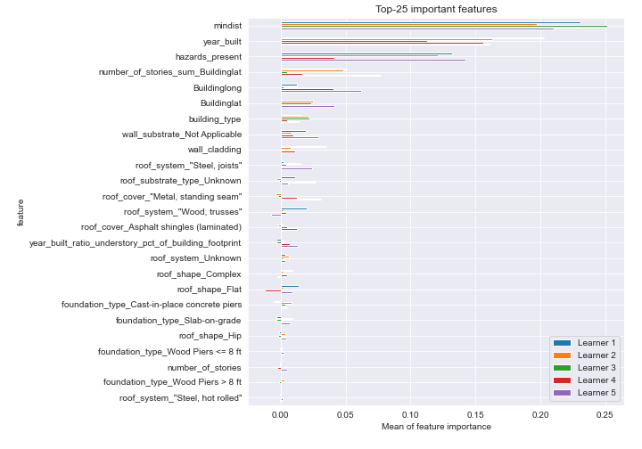

# Summary of 7_Xgboost_GoldenFeatures

[<< Go back](../README.md)

## Extreme Gradient Boosting (Xgboost)
- **n_jobs**: -1
- **objective**: multi:softprob
- **eta**: 0.075
- **max_depth**: 6
- **min_child_weight**: 1
- **subsample**: 1.0
- **colsample_bytree**: 0.9
- **eval_metric**: mlogloss
- **num_class**: 5
- **explain_level**: 2

## Validation
 - **validation_type**: kfold
 - **k_folds**: 5
 - **shuffle**: True
 - **stratify**: True

## Optimized metric
logloss

## Training time

95.9 seconds

### Metric details
|           |         0 |          1 |          2 |         3 |          4 |   accuracy |   macro avg |   weighted avg |   logloss |
|:----------|----------:|-----------:|-----------:|----------:|-----------:|-----------:|------------:|---------------:|----------:|
| precision |  0.5      |   0.47     |   0.464286 |  0.402778 |   0.686567 |   0.510135 |    0.504726 |       0.504963 |   1.15718 |
| recall    |  0.257143 |   0.543353 |   0.467066 |  0.311828 |   0.741935 |   0.510135 |    0.464265 |       0.510135 |   1.15718 |
| f1-score  |  0.339623 |   0.504021 |   0.465672 |  0.351515 |   0.713178 |   0.510135 |    0.474802 |       0.503336 |   1.15718 |
| support   | 35        | 173        | 167        | 93        | 124        |   0.510135 |  592        |     592        |   1.15718 |

## Confusion matrix
|              |   Predicted as 0 |   Predicted as 1 |   Predicted as 2 |   Predicted as 3 |   Predicted as 4 |
|:-------------|-----------------:|-----------------:|-----------------:|-----------------:|-----------------:|
| Labeled as 0 |                9 |               19 |                3 |                2 |                2 |
| Labeled as 1 |                4 |               94 |               56 |               12 |                7 |
| Labeled as 2 |                2 |               59 |               78 |               18 |               10 |
| Labeled as 3 |                2 |               19 |               20 |               29 |               23 |
| Labeled as 4 |                1 |                9 |               11 |               11 |               92 |

## Learning curves

## Permutation-based Importance

## Confusion Matrix

## Normalized Confusion Matrix

## ROC Curve

## Precision Recall Curve

[<< Go back](../README.md)
