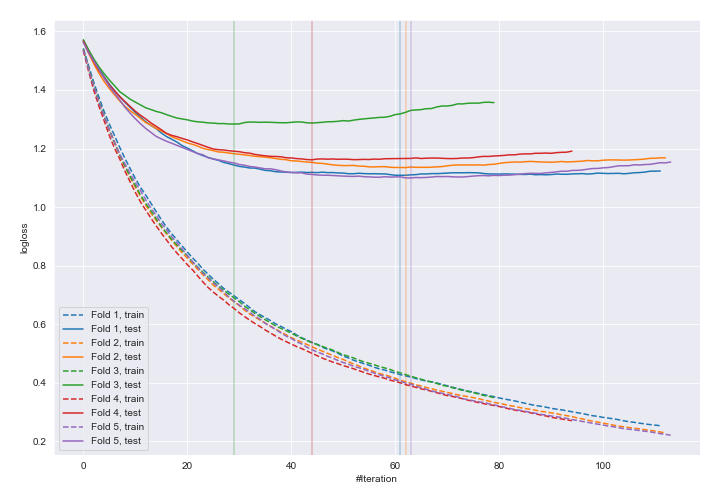
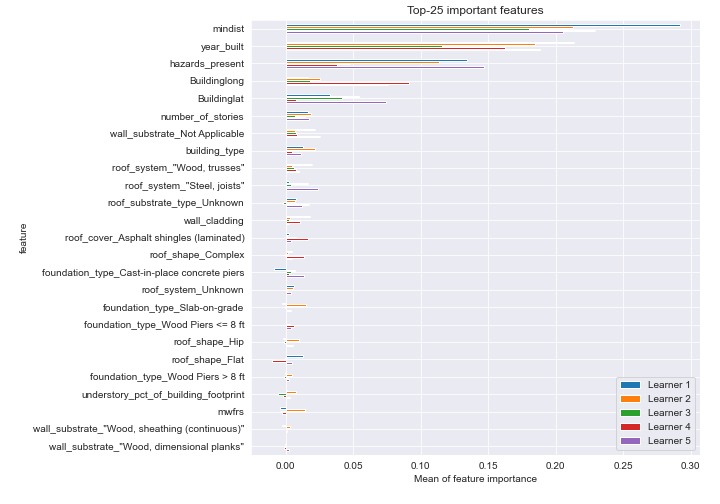
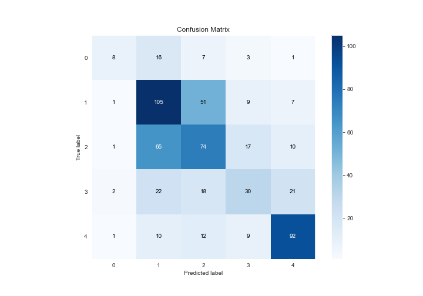
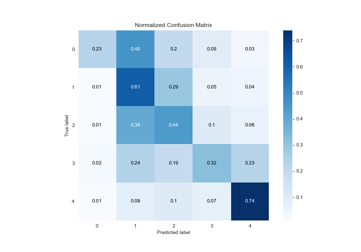
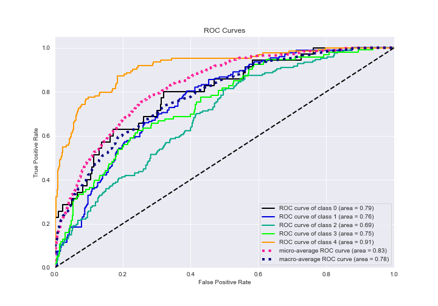
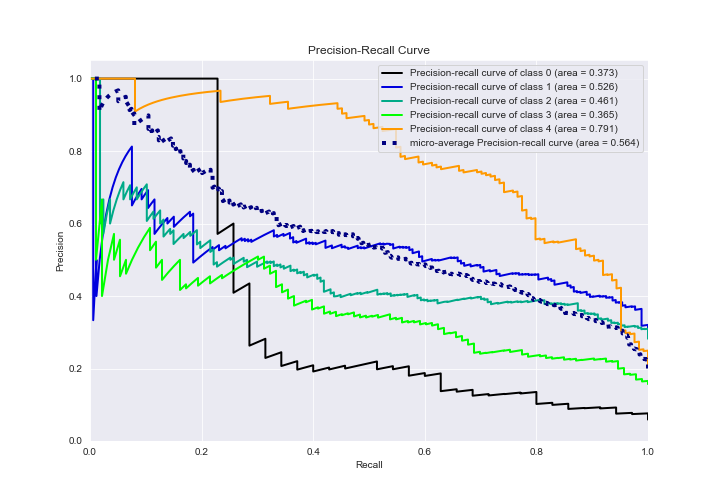

# Summary of 8_Xgboost

[<< Go back](../README.md)

## Extreme Gradient Boosting (Xgboost)
- **n_jobs**: -1
- **objective**: multi:softprob
- **eta**: 0.075
- **max_depth**: 6
- **min_child_weight**: 1
- **subsample**: 1.0
- **colsample_bytree**: 0.9
- **eval_metric**: mlogloss
- **num_class**: 5
- **explain_level**: 2

## Validation
 - **validation_type**: kfold
 - **k_folds**: 5
 - **shuffle**: True
 - **stratify**: True

## Optimized metric
logloss

## Training time

104.4 seconds

### Metric details
|           |         0 |          1 |          2 |         3 |          4 |   accuracy |   macro avg |   weighted avg |   logloss |
|:----------|----------:|-----------:|-----------:|----------:|-----------:|-----------:|------------:|---------------:|----------:|
| precision |  0.615385 |   0.481651 |   0.45679  |  0.441176 |   0.70229  |   0.521959 |    0.539459 |       0.522401 |    1.1575 |
| recall    |  0.228571 |   0.606936 |   0.443114 |  0.322581 |   0.741935 |   0.521959 |    0.468628 |       0.521959 |    1.1575 |
| f1-score  |  0.333333 |   0.537084 |   0.449848 |  0.372671 |   0.721569 |   0.521959 |    0.482901 |       0.513243 |    1.1575 |
| support   | 35        | 173        | 167        | 93        | 124        |   0.521959 |  592        |     592        |    1.1575 |

## Confusion matrix
|              |   Predicted as 0 |   Predicted as 1 |   Predicted as 2 |   Predicted as 3 |   Predicted as 4 |
|:-------------|-----------------:|-----------------:|-----------------:|-----------------:|-----------------:|
| Labeled as 0 |                8 |               16 |                7 |                3 |                1 |
| Labeled as 1 |                1 |              105 |               51 |                9 |                7 |
| Labeled as 2 |                1 |               65 |               74 |               17 |               10 |
| Labeled as 3 |                2 |               22 |               18 |               30 |               21 |
| Labeled as 4 |                1 |               10 |               12 |                9 |               92 |

## Learning curves

## Permutation-based Importance

## Confusion Matrix

## Normalized Confusion Matrix

## ROC Curve

## Precision Recall Curve

[<< Go back](../README.md)
