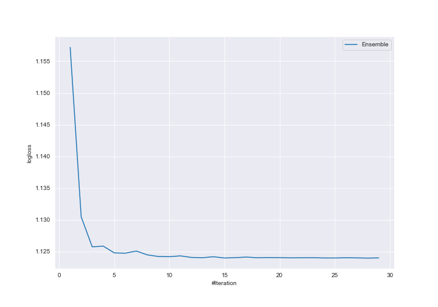
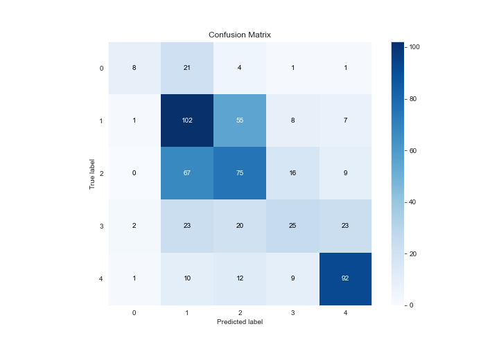
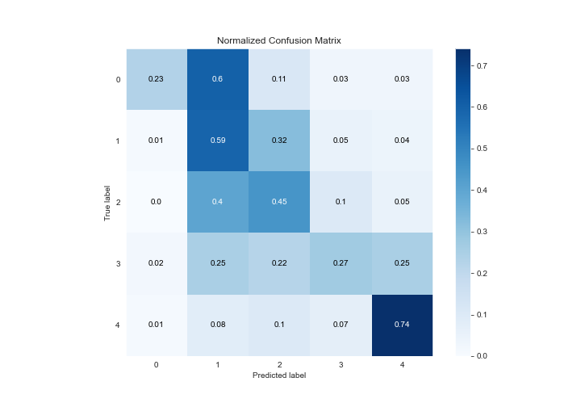
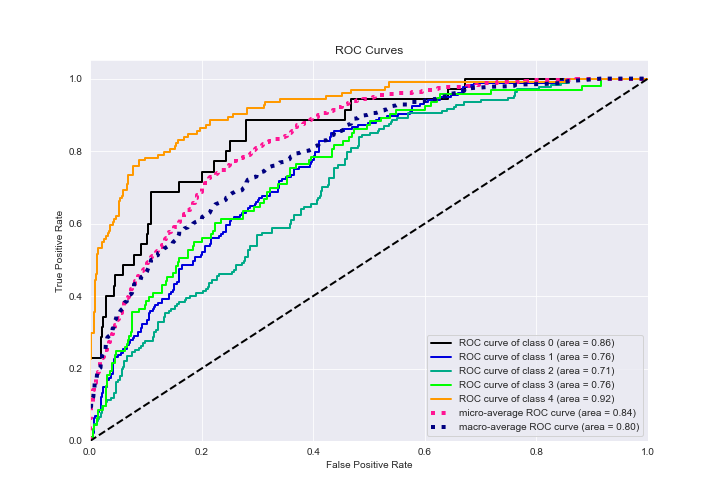
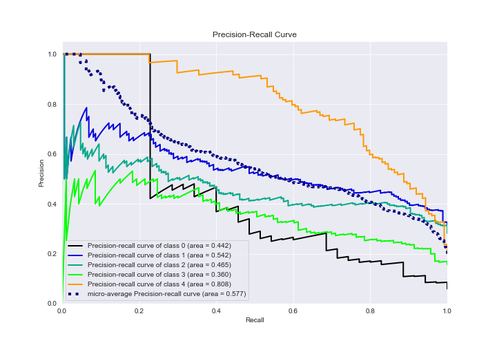

# Summary of Ensemble

[<< Go back](../README.md)

## Ensemble structure
| Model                                            |   Weight |
|:-------------------------------------------------|---------:|
| 17_Xgboost_GoldenFeatures                        |        2 |
| 20_RandomForest                                  |        2 |
| 4_Default_Xgboost_categorical_mix                |        4 |
| 4_Default_Xgboost_categorical_mix_GoldenFeatures |        6 |
| 6_Default_RandomForest_SelectedFeatures          |        7 |
| 7_Xgboost_GoldenFeatures                         |        5 |
| 8_Xgboost                                        |        2 |

### Metric details
|           |         0 |          1 |          2 |         3 |          4 |   accuracy |   macro avg |   weighted avg |   logloss |
|:----------|----------:|-----------:|-----------:|----------:|-----------:|-----------:|------------:|---------------:|----------:|
| precision |  0.666667 |   0.457399 |   0.451807 |  0.423729 |   0.69697  |   0.510135 |    0.539314 |       0.513085 |   1.12397 |
| recall    |  0.228571 |   0.589595 |   0.449102 |  0.268817 |   0.741935 |   0.510135 |    0.455604 |       0.510135 |   1.12397 |
| f1-score  |  0.340426 |   0.515152 |   0.45045  |  0.328947 |   0.71875  |   0.510135 |    0.470745 |       0.499964 |   1.12397 |
| support   | 35        | 173        | 167        | 93        | 124        |   0.510135 |  592        |     592        |   1.12397 |

## Confusion matrix
|              |   Predicted as 0 |   Predicted as 1 |   Predicted as 2 |   Predicted as 3 |   Predicted as 4 |
|:-------------|-----------------:|-----------------:|-----------------:|-----------------:|-----------------:|
| Labeled as 0 |                8 |               21 |                4 |                1 |                1 |
| Labeled as 1 |                1 |              102 |               55 |                8 |                7 |
| Labeled as 2 |                0 |               67 |               75 |               16 |                9 |
| Labeled as 3 |                2 |               23 |               20 |               25 |               23 |
| Labeled as 4 |                1 |               10 |               12 |                9 |               92 |

## Learning curves

## Confusion Matrix

## Normalized Confusion Matrix

## ROC Curve

## Precision Recall Curve

[<< Go back](../README.md)
