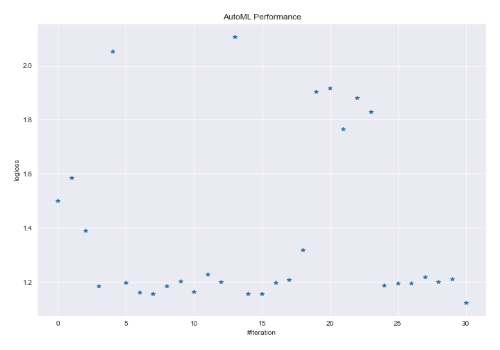
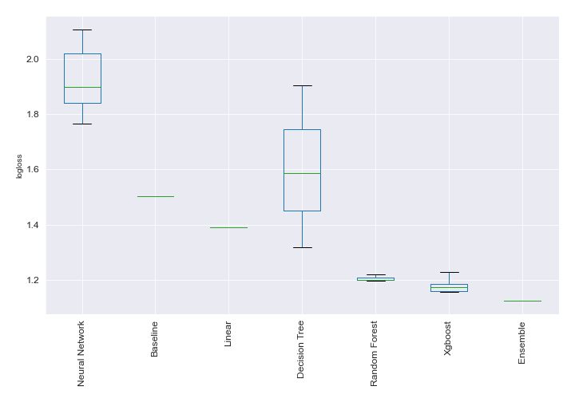
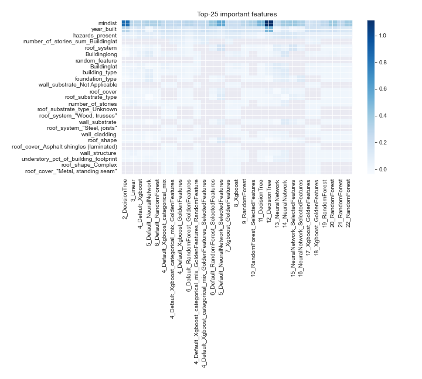
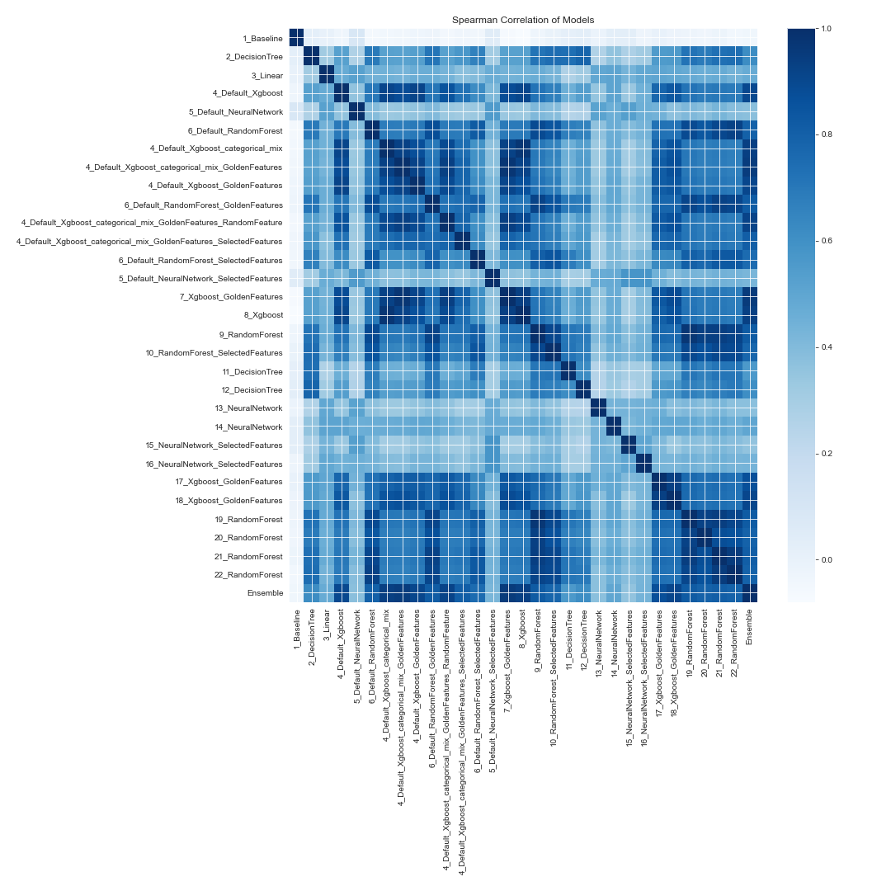

# AutoML Leaderboard

| Best model   | name                                                                                                                                             | model_type     | metric_type   |   metric_value |   train_time |
|:-------------|:-------------------------------------------------------------------------------------------------------------------------------------------------|:---------------|:--------------|---------------:|-------------:|
|              | [1_Baseline](1_Baseline/README.md)                                                                                                               | Baseline       | logloss       |        1.50198 |        25.07 |
|              | [2_DecisionTree](2_DecisionTree/README.md)                                                                                                       | Decision Tree  | logloss       |        1.5861  |        49.8  |
|              | [3_Linear](3_Linear/README.md)                                                                                                                   | Linear         | logloss       |        1.39066 |        39.45 |
|              | [4_Default_Xgboost](4_Default_Xgboost/README.md)                                                                                                 | Xgboost        | logloss       |        1.18489 |        53.94 |
|              | [5_Default_NeuralNetwork](5_Default_NeuralNetwork/README.md)                                                                                     | Neural Network | logloss       |        2.05284 |        21.48 |
|              | [6_Default_RandomForest](6_Default_RandomForest/README.md)                                                                                       | Random Forest  | logloss       |        1.19922 |        51.58 |
|              | [4_Default_Xgboost_categorical_mix](4_Default_Xgboost_categorical_mix/README.md)                                                                 | Xgboost        | logloss       |        1.16256 |        50.06 |
|              | [4_Default_Xgboost_categorical_mix_GoldenFeatures](4_Default_Xgboost_categorical_mix_GoldenFeatures/README.md)                                   | Xgboost        | logloss       |        1.1572  |        51.51 |
|              | [4_Default_Xgboost_GoldenFeatures](4_Default_Xgboost_GoldenFeatures/README.md)                                                                   | Xgboost        | logloss       |        1.18447 |        71.65 |
|              | [6_Default_RandomForest_GoldenFeatures](6_Default_RandomForest_GoldenFeatures/README.md)                                                         | Random Forest  | logloss       |        1.2033  |        72.86 |
|              | [4_Default_Xgboost_categorical_mix_GoldenFeatures_RandomFeature](4_Default_Xgboost_categorical_mix_GoldenFeatures_RandomFeature/README.md)       | Xgboost        | logloss       |        1.1635  |        72.66 |
|              | [4_Default_Xgboost_categorical_mix_GoldenFeatures_SelectedFeatures](4_Default_Xgboost_categorical_mix_GoldenFeatures_SelectedFeatures/README.md) | Xgboost        | logloss       |        1.22789 |        73.23 |
|              | [6_Default_RandomForest_SelectedFeatures](6_Default_RandomForest_SelectedFeatures/README.md)                                                     | Random Forest  | logloss       |        1.20039 |        95.38 |
|              | [5_Default_NeuralNetwork_SelectedFeatures](5_Default_NeuralNetwork_SelectedFeatures/README.md)                                                   | Neural Network | logloss       |        2.10632 |        83.93 |
|              | [7_Xgboost_GoldenFeatures](7_Xgboost_GoldenFeatures/README.md)                                                                                   | Xgboost        | logloss       |        1.15718 |        96.52 |
|              | [8_Xgboost](8_Xgboost/README.md)                                                                                                                 | Xgboost        | logloss       |        1.1575  |       104.99 |
|              | [9_RandomForest](9_RandomForest/README.md)                                                                                                       | Random Forest  | logloss       |        1.19731 |       114.14 |
|              | [10_RandomForest_SelectedFeatures](10_RandomForest_SelectedFeatures/README.md)                                                                   | Random Forest  | logloss       |        1.20813 |       121.27 |
|              | [11_DecisionTree](11_DecisionTree/README.md)                                                                                                     | Decision Tree  | logloss       |        1.31839 |       145.99 |
|              | [12_DecisionTree](12_DecisionTree/README.md)                                                                                                     | Decision Tree  | logloss       |        1.90353 |       165.44 |
|              | [13_NeuralNetwork](13_NeuralNetwork/README.md)                                                                                                   | Neural Network | logloss       |        1.9169  |       116.97 |
|              | [14_NeuralNetwork](14_NeuralNetwork/README.md)                                                                                                   | Neural Network | logloss       |        1.76558 |       130.01 |
|              | [15_NeuralNetwork_SelectedFeatures](15_NeuralNetwork_SelectedFeatures/README.md)                                                                 | Neural Network | logloss       |        1.88145 |       126.15 |
|              | [16_NeuralNetwork_SelectedFeatures](16_NeuralNetwork_SelectedFeatures/README.md)                                                                 | Neural Network | logloss       |        1.82885 |       116.41 |
|              | [17_Xgboost_GoldenFeatures](17_Xgboost_GoldenFeatures/README.md)                                                                                 | Xgboost        | logloss       |        1.18695 |       133.12 |
|              | [18_Xgboost_GoldenFeatures](18_Xgboost_GoldenFeatures/README.md)                                                                                 | Xgboost        | logloss       |        1.19632 |       132.1  |
|              | [19_RandomForest](19_RandomForest/README.md)                                                                                                     | Random Forest  | logloss       |        1.19665 |       143.41 |
|              | [20_RandomForest](20_RandomForest/README.md)                                                                                                     | Random Forest  | logloss       |        1.21943 |       150.64 |
|              | [21_RandomForest](21_RandomForest/README.md)                                                                                                     | Random Forest  | logloss       |        1.20047 |       160.3  |
|              | [22_RandomForest](22_RandomForest/README.md)                                                                                                     | Random Forest  | logloss       |        1.21195 |       224.54 |
| **the best** | [Ensemble](Ensemble/README.md)                                                                                                                   | Ensemble       | logloss       |        1.12397 |         1.19 |

### AutoML Performance

### AutoML Performance Boxplot

### Features Importance

### Spearman Correlation of Models

