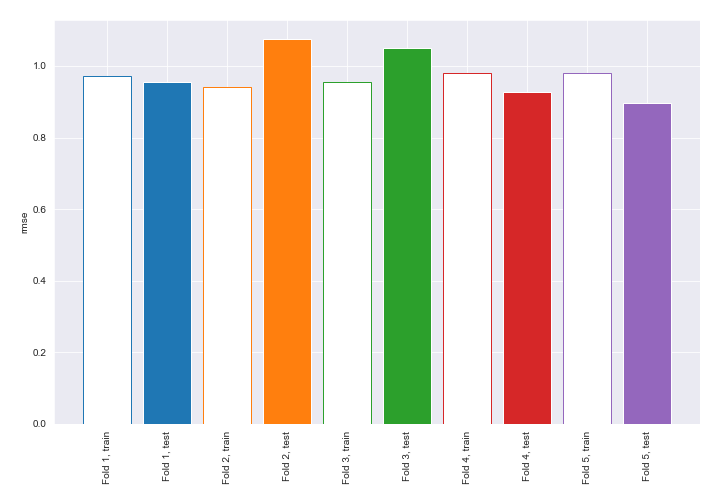
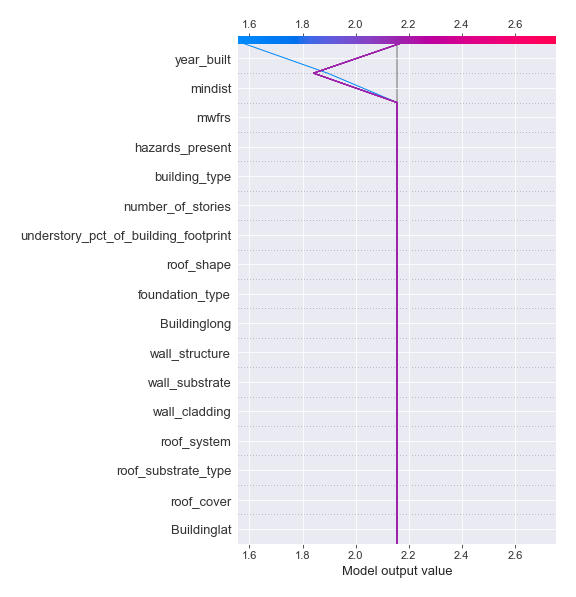

# Summary of 13_DecisionTree

[<< Go back](../README.md)

## Decision Tree
- **n_jobs**: -1
- **criterion**: mse
- **max_depth**: 2
- **explain_level**: 2

## Validation
 - **validation_type**: kfold
 - **k_folds**: 5
 - **shuffle**: True

## Optimized metric
rmse

## Training time

24.1 seconds

### Metric details:
| Metric   |       Score |
|:---------|------------:|
| MAE      | 0.78461     |
| MSE      | 0.966203    |
| RMSE     | 0.982956    |
| R2       | 0.354248    |
| MAPE     | 5.10482e+14 |

## Learning curves

## Decision Tree 

### Tree #1

### Rules

if (mindist > 10.507) and (year_built > 1995.5) then response: 1.55 | based on 218 samples

if (mindist > 10.507) and (year_built <= 1995.5) then response: 2.22 | based on 164 samples

if (mindist <= 10.507) and (year_built <= 1996.5) then response: 3.8 | based on 75 samples

if (mindist <= 10.507) and (year_built > 1996.5) then response: 2.688 | based on 16 samples

### Tree #2

### Rules

if (mindist > 10.486) and (year_built > 1995.5) then response: 1.568 | based on 220 samples

if (mindist > 10.486) and (year_built <= 1995.5) then response: 2.227 | based on 163 samples

if (mindist <= 10.486) and (year_built <= 1996.5) then response: 3.743 | based on 70 samples

if (mindist <= 10.486) and (year_built > 1996.5) then response: 2.6 | based on 20 samples

### Tree #3

### Rules

if (mindist > 10.564) and (year_built > 1995.5) then response: 1.529 | based on 210 samples

if (mindist > 10.564) and (year_built <= 1995.5) then response: 2.122 | based on 172 samples

if (mindist <= 10.564) and (hazards_present <= 12.5) then response: 3.846 | based on 65 samples

if (mindist <= 10.564) and (hazards_present > 12.5) then response: 3.037 | based on 27 samples

### Tree #4

### Rules

if (mindist > 10.507) and (year_built > 1995.5) then response: 1.581 | based on 217 samples

if (mindist > 10.507) and (year_built <= 1995.5) then response: 2.165 | based on 164 samples

if (mindist <= 10.507) and (year_built <= 1996.5) then response: 3.726 | based on 73 samples

if (mindist <= 10.507) and (year_built > 1996.5) then response: 2.6 | based on 20 samples

### Tree #5

### Rules

if (mindist > 11.174) and (year_built > 1995.5) then response: 1.588 | based on 199 samples

if (mindist > 11.174) and (year_built <= 1995.5) then response: 2.192 | based on 182 samples

if (mindist <= 11.174) and (year_built <= 1996.5) then response: 3.732 | based on 71 samples

if (mindist <= 11.174) and (year_built > 1996.5) then response: 2.545 | based on 22 samples

## Permutation-based Importance

## True vs Predicted

## Predicted vs Residuals

## SHAP Importance

## SHAP Dependence plots

### Dependence (Fold 1)

### Dependence (Fold 2)

### Dependence (Fold 3)

### Dependence (Fold 4)

### Dependence (Fold 5)

## SHAP Decision plots

### Top-10 Worst decisions (Fold 1)

### Top-10 Worst decisions (Fold 2)

### Top-10 Worst decisions (Fold 3)

### Top-10 Worst decisions (Fold 4)

### Top-10 Worst decisions (Fold 5)

### Top-10 Best decisions (Fold 1)

### Top-10 Best decisions (Fold 2)

### Top-10 Best decisions (Fold 3)

### Top-10 Best decisions (Fold 4)

### Top-10 Best decisions (Fold 5)

[<< Go back](../README.md)
