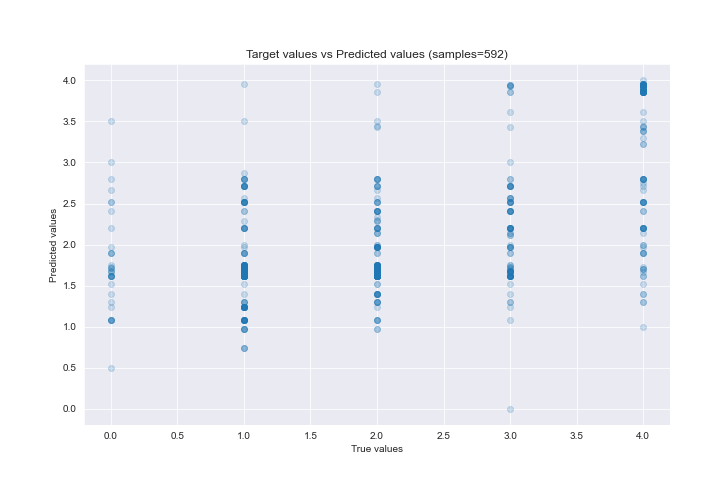

# Summary of 14_DecisionTree

[<< Go back](../README.md)

## Decision Tree
- **n_jobs**: -1
- **criterion**: mse
- **max_depth**: 4
- **explain_level**: 2

## Validation
 - **validation_type**: kfold
 - **k_folds**: 5
 - **shuffle**: True

## Optimized metric
rmse

## Training time

27.4 seconds

### Metric details:
| Metric   |       Score |
|:---------|------------:|
| MAE      | 0.768343    |
| MSE      | 1.01533     |
| RMSE     | 1.00764     |
| R2       | 0.321415    |
| MAPE     | 4.73183e+14 |

## Learning curves

## Decision Tree 

### Rules

if (mindist > 10.507) and (year_built > 1995.5) and (roof_substrate_type > 1.5) and (Buildinglong <= -85.377) then response: 1.614 | based on 176 samples

if (mindist > 10.507) and (year_built <= 1995.5) and (Buildinglong <= -85.373) and (year_built > 1964.5) then response: 2.708 | based on 89 samples

if (mindist <= 10.507) and (year_built <= 1996.5) and (wall_structure > 6.0) and (Buildinglong <= -85.423) then response: 3.957 | based on 47 samples

if (mindist > 10.507) and (year_built > 1995.5) and (roof_substrate_type > 1.5) and (Buildinglong > -85.377) then response: 0.971 | based on 35 samples

if (mindist > 10.507) and (year_built <= 1995.5) and (Buildinglong > -85.373) and (wall_structure > 12.5) then response: 1.294 | based on 34 samples

if (mindist > 10.507) and (year_built <= 1995.5) and (Buildinglong <= -85.373) and (year_built <= 1964.5) then response: 1.697 | based on 33 samples

if (mindist <= 10.507) and (year_built <= 1996.5) and (wall_structure > 6.0) and (Buildinglong > -85.423) then response: 3.615 | based on 26 samples

if (mindist > 10.507) and (year_built <= 1995.5) and (Buildinglong > -85.373) and (wall_structure <= 12.5) then response: 2.875 | based on 8 samples

if (mindist <= 10.507) and (year_built > 1996.5) and (wall_substrate <= 5.0) and (hazards_present <= 10.0) then response: 3.5 | based on 8 samples

if (mindist <= 10.507) and (year_built > 1996.5) and (wall_substrate <= 5.0) and (hazards_present > 10.0) then response: 2.143 | based on 7 samples

if (mindist > 10.507) and (year_built > 1995.5) and (roof_substrate_type <= 1.5) and (Buildinglat <= 30.432) then response: 3.5 | based on 4 samples

if (mindist > 10.507) and (year_built > 1995.5) and (roof_substrate_type <= 1.5) and (Buildinglat > 30.432) then response: 2.0 | based on 3 samples

if (mindist <= 10.507) and (year_built > 1996.5) and (wall_substrate > 5.0) then response: 0.0 | based on 1 samples

if (mindist <= 10.507) and (year_built <= 1996.5) and (wall_structure <= 6.0) and (Buildinglat > 30.062) then response: 3.0 | based on 1 samples

if (mindist <= 10.507) and (year_built <= 1996.5) and (wall_structure <= 6.0) and (Buildinglat <= 30.062) then response: 2.0 | based on 1 samples

### Tree #2

### Rules

if (mindist > 10.486) and (year_built > 1995.5) and (roof_substrate_type > 2.5) and (Buildinglong <= -85.377) then response: 1.621 | based on 174 samples

if (mindist > 10.486) and (year_built <= 1995.5) and (Buildinglong <= -85.048) and (roof_system <= 11.0) then response: 2.52 | based on 100 samples

if (mindist <= 10.486) and (year_built <= 1996.5) and (hazards_present <= 19.5) and (year_built > 970.0) then response: 3.859 | based on 64 samples

if (mindist > 10.486) and (year_built <= 1995.5) and (Buildinglong <= -85.048) and (roof_system > 11.0) then response: 1.891 | based on 55 samples

if (mindist > 10.486) and (year_built > 1995.5) and (roof_substrate_type > 2.5) and (Buildinglong > -85.377) then response: 1.079 | based on 38 samples

if (mindist <= 10.486) and (year_built > 1996.5) and (hazards_present > 1.0) and (hazards_present <= 11.0) then response: 3.3 | based on 10 samples

if (mindist <= 10.486) and (year_built > 1996.5) and (hazards_present > 1.0) and (hazards_present > 11.0) then response: 2.111 | based on 9 samples

if (mindist > 10.486) and (year_built > 1995.5) and (roof_substrate_type <= 2.5) and (building_type <= 20.0) then response: 2.333 | based on 6 samples

if (mindist > 10.486) and (year_built <= 1995.5) and (Buildinglong > -85.048) and (mindist <= 21.837) then response: 0.5 | based on 6 samples

if (mindist <= 10.486) and (year_built <= 1996.5) and (hazards_present <= 19.5) and (year_built <= 970.0) then response: 2.8 | based on 5 samples

if (mindist > 10.486) and (year_built > 1995.5) and (roof_substrate_type <= 2.5) and (building_type > 20.0) then response: 4.0 | based on 2 samples

if (mindist > 10.486) and (year_built <= 1995.5) and (Buildinglong > -85.048) and (mindist > 21.837) then response: 2.0 | based on 2 samples

if (mindist <= 10.486) and (year_built > 1996.5) and (hazards_present <= 1.0) then response: 0.0 | based on 1 samples

if (mindist <= 10.486) and (year_built <= 1996.5) and (hazards_present > 19.5) then response: 1.0 | based on 1 samples

### Rules

if (mindist > 10.564) and (year_built > 1995.5) and (Buildinglong <= -85.377) and (hazards_present > 0.5) then response: 1.675 | based on 169 samples

if (mindist > 10.564) and (year_built <= 1995.5) and (foundation_type <= 8.5) and (Buildinglong <= -85.373) then response: 2.198 | based on 121 samples

if (mindist <= 10.564) and (hazards_present <= 12.5) and (hazards_present > 3.5) and (Buildinglat > 29.945) then response: 3.933 | based on 60 samples

if (mindist > 10.564) and (year_built <= 1995.5) and (foundation_type <= 8.5) and (Buildinglong > -85.373) then response: 1.513 | based on 39 samples

if (mindist > 10.564) and (year_built > 1995.5) and (Buildinglong > -85.377) and (year_built > 2000.5) then response: 0.739 | based on 23 samples

if (mindist <= 10.564) and (hazards_present > 12.5) and (roof_cover <= 2.5) and (Buildinglat > 29.945) then response: 2.562 | based on 16 samples

if (mindist > 10.564) and (year_built > 1995.5) and (Buildinglong > -85.377) and (year_built <= 2000.5) then response: 1.4 | based on 15 samples

if (mindist <= 10.564) and (hazards_present > 12.5) and (roof_cover > 2.5) and (wall_cladding > 7.5) then response: 3.857 | based on 7 samples

if (mindist > 10.564) and (year_built <= 1995.5) and (foundation_type > 8.5) and (mindist > 15.635) then response: 2.667 | based on 6 samples

if (mindist > 10.564) and (year_built <= 1995.5) and (foundation_type > 8.5) and (mindist <= 15.635) then response: 4.0 | based on 6 samples

if (mindist > 10.564) and (year_built > 1995.5) and (Buildinglong <= -85.377) and (hazards_present <= 0.5) then response: 0.0 | based on 3 samples

if (mindist <= 10.564) and (hazards_present > 12.5) and (roof_cover > 2.5) and (wall_cladding <= 7.5) then response: 3.0 | based on 2 samples

if (mindist <= 10.564) and (hazards_present > 12.5) and (roof_cover <= 2.5) and (Buildinglat <= 29.945) then response: 4.0 | based on 2 samples

if (mindist <= 10.564) and (hazards_present <= 12.5) and (hazards_present > 3.5) and (Buildinglat <= 29.945) then response: 3.0 | based on 2 samples

if (mindist <= 10.564) and (hazards_present <= 12.5) and (hazards_present <= 3.5) and (roof_shape > 0.5) then response: 3.0 | based on 2 samples

if (mindist <= 10.564) and (hazards_present <= 12.5) and (hazards_present <= 3.5) and (roof_shape <= 0.5) then response: 2.0 | based on 1 samples

### Tree #4

### Rules

if (mindist > 10.507) and (year_built > 1995.5) and (roof_substrate_type > 3.0) and (Buildinglong <= -85.399) then response: 1.669 | based on 145 samples

if (mindist > 10.507) and (year_built > 1995.5) and (roof_substrate_type > 3.0) and (Buildinglong > -85.399) then response: 1.234 | based on 64 samples

if (mindist > 10.507) and (year_built <= 1995.5) and (Buildinglong <= -85.373) and (Buildinglong > -85.642) then response: 2.794 | based on 63 samples

if (mindist > 10.507) and (year_built <= 1995.5) and (Buildinglong <= -85.373) and (Buildinglong <= -85.642) then response: 1.965 | based on 57 samples

if (mindist <= 10.507) and (year_built <= 1996.5) and (hazards_present <= 21.0) and (hazards_present <= 13.0) then response: 3.885 | based on 52 samples

if (mindist > 10.507) and (year_built <= 1995.5) and (Buildinglong > -85.373) and (roof_system > 7.5) then response: 1.4 | based on 40 samples

if (mindist <= 10.507) and (year_built <= 1996.5) and (hazards_present <= 21.0) and (hazards_present > 13.0) then response: 3.45 | based on 20 samples

if (mindist <= 10.507) and (year_built > 1996.5) and (hazards_present > 1.0) and (hazards_present > 12.0) then response: 2.3 | based on 10 samples

if (mindist <= 10.507) and (year_built > 1996.5) and (hazards_present > 1.0) and (hazards_present <= 12.0) then response: 3.222 | based on 9 samples

if (mindist > 10.507) and (year_built > 1995.5) and (roof_substrate_type <= 3.0) and (building_type <= 20.0) then response: 2.333 | based on 6 samples

if (mindist > 10.507) and (year_built <= 1995.5) and (Buildinglong > -85.373) and (roof_system <= 7.5) then response: 2.75 | based on 4 samples

if (mindist > 10.507) and (year_built > 1995.5) and (roof_substrate_type <= 3.0) and (building_type > 20.0) then response: 4.0 | based on 2 samples

if (mindist <= 10.507) and (year_built > 1996.5) and (hazards_present <= 1.0) then response: 0.0 | based on 1 samples

if (mindist <= 10.507) and (year_built <= 1996.5) and (hazards_present > 21.0) then response: 1.0 | based on 1 samples

### Tree #5

### Rules

if (mindist > 11.174) and (year_built <= 1995.5) and (hazards_present > 0.5) and (Buildinglong <= -85.373) then response: 2.406 | based on 133 samples

if (mindist > 11.174) and (year_built > 1995.5) and (mindist > 18.747) and (building_type <= 21.0) then response: 1.756 | based on 119 samples

if (mindist > 11.174) and (year_built > 1995.5) and (mindist <= 18.747) and (number_of_stories <= 1.75) then response: 1.075 | based on 53 samples

if (mindist <= 11.174) and (year_built <= 1996.5) and (hazards_present <= 20.5) and (hazards_present <= 13.0) then response: 3.939 | based on 49 samples

if (mindist > 11.174) and (year_built <= 1995.5) and (hazards_present > 0.5) and (Buildinglong > -85.373) then response: 1.717 | based on 46 samples

if (mindist > 11.174) and (year_built > 1995.5) and (mindist <= 18.747) and (number_of_stories > 1.75) then response: 1.72 | based on 25 samples

if (mindist <= 11.174) and (year_built <= 1996.5) and (hazards_present <= 20.5) and (hazards_present > 13.0) then response: 3.381 | based on 21 samples

if (mindist <= 11.174) and (year_built > 1996.5) and (hazards_present > 1.5) and (hazards_present > 12.5) then response: 2.286 | based on 14 samples

if (mindist <= 11.174) and (year_built > 1996.5) and (hazards_present > 1.5) and (hazards_present <= 12.5) then response: 3.429 | based on 7 samples

if (mindist > 11.174) and (year_built <= 1995.5) and (hazards_present <= 0.5) then response: 0.0 | based on 3 samples

if (mindist > 11.174) and (year_built > 1995.5) and (mindist > 18.747) and (building_type > 21.0) then response: 3.5 | based on 2 samples

if (mindist <= 11.174) and (year_built > 1996.5) and (hazards_present <= 1.5) then response: 0.0 | based on 1 samples

if (mindist <= 11.174) and (year_built <= 1996.5) and (hazards_present > 20.5) then response: 1.0 | based on 1 samples

## Permutation-based Importance

## True vs Predicted

## Predicted vs Residuals

## SHAP Importance

## SHAP Dependence plots

### Dependence (Fold 1)

### Dependence (Fold 2)

### Dependence (Fold 3)

### Dependence (Fold 4)

### Dependence (Fold 5)

## SHAP Decision plots

### Top-10 Worst decisions (Fold 1)

### Top-10 Worst decisions (Fold 2)

### Top-10 Worst decisions (Fold 3)

### Top-10 Worst decisions (Fold 4)

### Top-10 Worst decisions (Fold 5)

### Top-10 Best decisions (Fold 1)

### Top-10 Best decisions (Fold 2)

### Top-10 Best decisions (Fold 3)

### Top-10 Best decisions (Fold 4)

### Top-10 Best decisions (Fold 5)

[<< Go back](../README.md)
