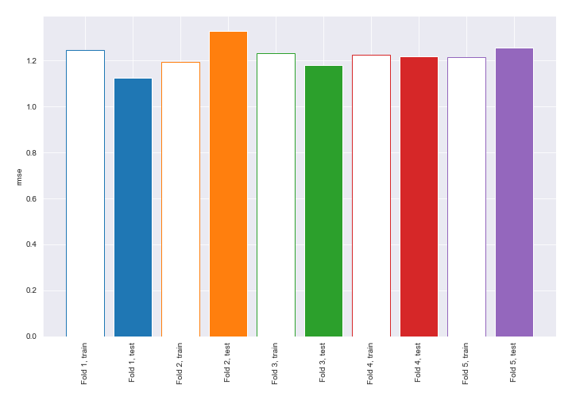
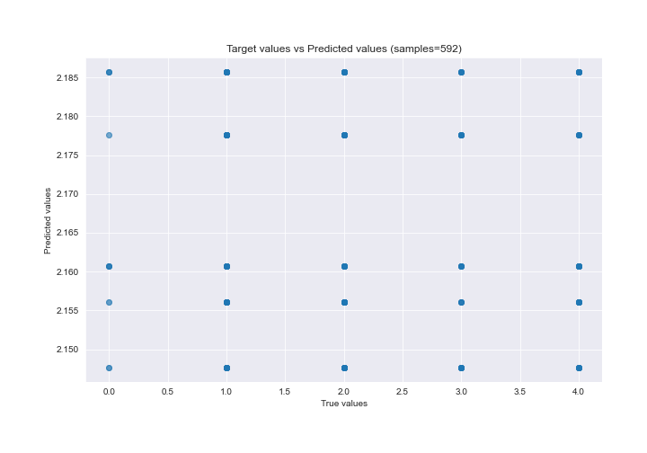
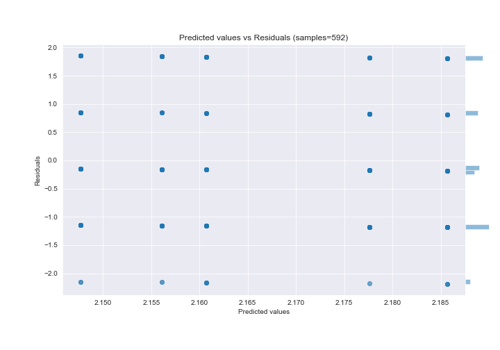

# Summary of 1_Baseline

[<< Go back](../README.md)

## Baseline Regressor (Baseline)
- **n_jobs**: -1
- **explain_level**: 2

## Validation
 - **validation_type**: kfold
 - **k_folds**: 5
 - **shuffle**: True

## Optimized metric
rmse

## Training time

8.8 seconds

### Metric details:
| Metric   |       Score |
|:---------|------------:|
| MAE      |  1.03114    |
| MSE      |  1.49801    |
| RMSE     |  1.22393    |
| R2       | -0.00118065 |
| MAPE     |  5.7676e+14 |

## Learning curves

## True vs Predicted

## Predicted vs Residuals

[<< Go back](../README.md)
