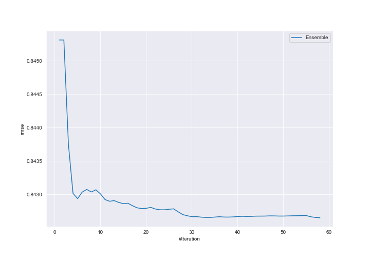
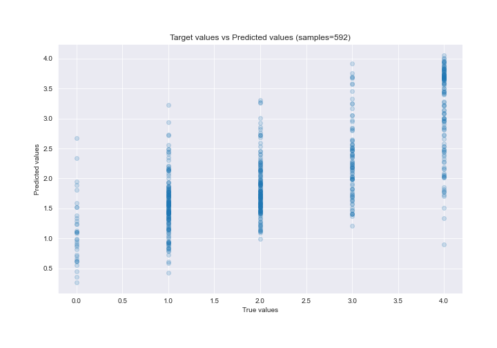
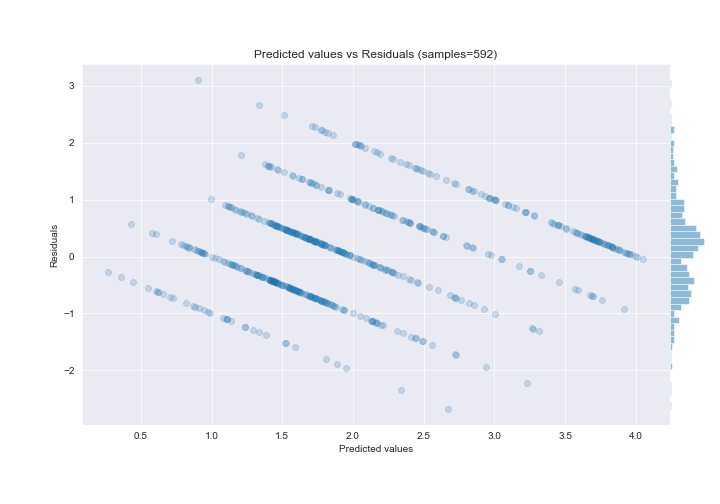

# Summary of Ensemble_Stacked

[<< Go back](../README.md)

## Ensemble structure
| Model                                                             |   Weight |
|:------------------------------------------------------------------|---------:|
| 12_RandomForest_Stacked                                           |       11 |
| 19_Xgboost_GoldenFeatures_SelectedFeatures                        |        1 |
| 4_Default_Xgboost_categorical_mix_GoldenFeatures_SelectedFeatures |        1 |
| 4_Default_Xgboost_categorical_mix_Stacked                         |        2 |
| 5_Default_NeuralNetwork_SelectedFeatures                          |        2 |
| 7_Xgboost_GoldenFeatures_SelectedFeatures                         |        2 |
| 9_RandomForest_SelectedFeatures_Stacked                           |        3 |
| Ensemble                                                          |       36 |

### Metric details:
| Metric   |       Score |
|:---------|------------:|
| MAE      | 0.662628    |
| MSE      | 0.71006     |
| RMSE     | 0.842651    |
| R2       | 0.525439    |
| MAPE     | 2.98664e+14 |

## Learning curves

## True vs Predicted

## Predicted vs Residuals

[<< Go back](../README.md)
